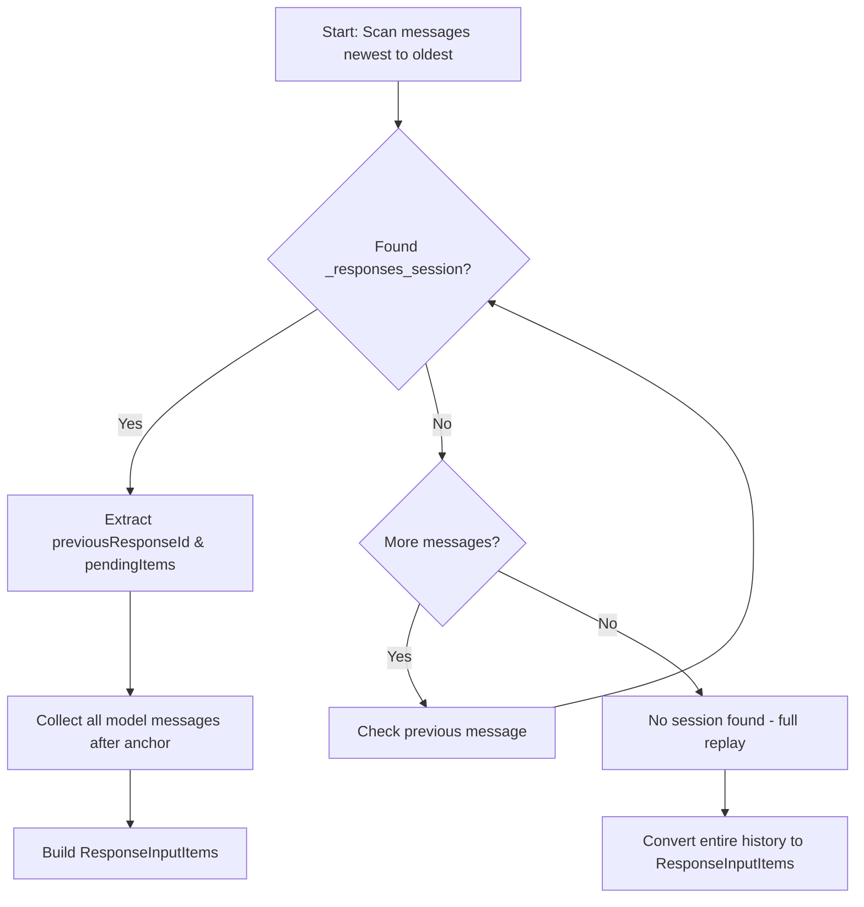
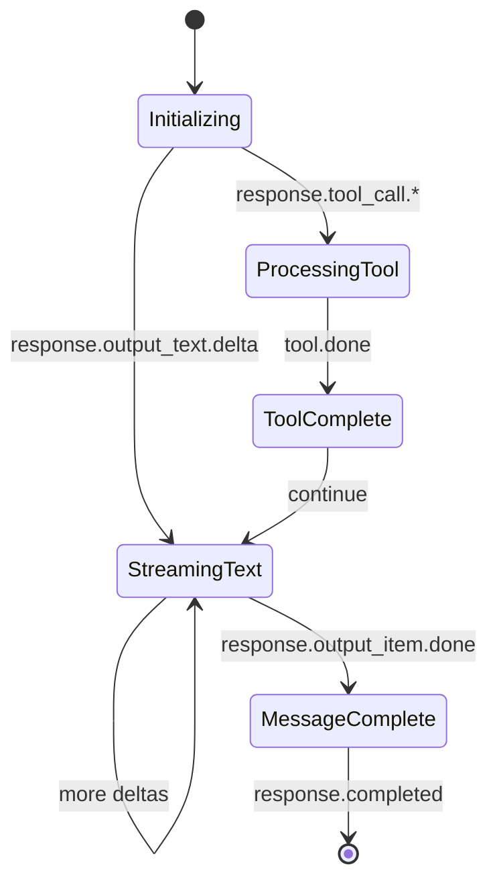

# OpenAI Responses Provider – Technical Design

## 1. Overview
This document describes how dartantic_ai will implement a first-class provider
for the OpenAI Responses API. It converts the requirements in
`wiki/Responses-API-Requirements.md` into concrete modules, data structures, and
integration steps while preserving compatibility with existing dartantic
infrastructure (providers, orchestrators, tools, and examples).

Primary goals:
- Implement a new `OpenAIResponsesProvider` backed by `openai_core`.
- Provide chat and embeddings models that plug into the existing
  `Provider`/`ChatModel` abstractions.
- Support intrinsic Responses features: multi-modal inputs, streamed reasoning,
  server-side tools, code interpreter containers, and session persistence with
  `store = true` by default.
- Maintain interoperability with dartantic’s orchestrators, message types, tool
  execution, and metadata conventions.

## 2. Module & File Layout
```
packages/dartantic_ai/lib/src/providers/
  └── openai_responses_provider.dart        # Provider implementation
packages/dartantic_ai/lib/src/chat_models/openai_responses/
  ├── openai_responses_chat_model.dart      # Chat model + session handling
  ├── openai_responses_chat_options.dart    # Chat-model options (extends ChatModelOptions)
  ├── openai_responses_message_mapper.dart  # Mapping between dartantic messages and Responses payloads
  └── openai_responses_event_mapper.dart    # Streaming event → ChatResult translation
packages/dartantic_ai/lib/src/embeddings_models/openai_responses/
  └── openai_responses_embeddings_model.dart
packages/dartantic_ai/lib/src/shared/openai_responses_metadata.dart
  # Helper for storing/retrieving metadata (session state, tool progress, files)
```
Supporting additions:
- `pubspec.yaml`: add dependency on `openai_core`.
- Provider registry: update `providers.dart` to register `openai-responses`.
- Tests under `packages/dartantic_ai/test/openai_responses/` for unit and
  integration coverage.
- Example updates in `packages/dartantic_ai/example/bin/` to use the new
  provider (thinking, server-side tools, multi-modal demo).

## 3. Provider Responsibilities
### 3.1 Provider metadata
`OpenAIResponsesProvider` extends `Provider<OpenAIResponsesChatOptions,
OpenAIEmbeddingsModelOptions>` and wires up:
- `name = 'openai-responses'`, `displayName = 'OpenAI Responses'`.
- `defaultModelNames` per requirements (`gpt-4o`, `text-embedding-3-small`).
- `caps = {chat, embeddings, multiToolCalls, typedOutput, typedOutputWithTools,
  thinking, vision}`.
- `apiKeyName = 'OPENAI_API_KEY'`, `baseUrl` resolved as with existing OpenAI
  provider.

### 3.2 Model construction
- `createChatModel`: instantiate `OpenAIResponsesChatModel` with
  `OpenAIResponsesChatOptions` merged from defaults + caller options, and map
  dartantic `Tool` list to Responses tool metadata (function tool wrappers).
- `createEmbeddingsModel`: instantiate `OpenAIEmbeddingsModel` with
  merged options.
- `listModels`: reuse `openai_core` client to fetch `/models`, mapping to
  `ModelInfo` similar to `OpenAIProvider` but without completions-specific
  heuristics. Identify vision-capable models by `modalities` or metadata if
  present.
- Factory methods must validate API keys using standard pattern:
  `if (apiKeyName != null && (apiKey == null || apiKey!.isEmpty)) throw ArgumentError(...)`

## 4. Chat Model Pipeline
### 4.1 Initialization
`OpenAIResponsesChatModel` holds:
- `OpenAIClient _client` (from `openai_core`) wrapped with `RetryHttpClient` for
  automatic retry on transient failures.
- Default options (with `store` defaulted to `true`).
- Resolved tool metadata set (function tools + server-side tools).

On `sendStream(messages, options, outputSchema)`:
1. Merge options: request-level overrides > default options > provider defaults.
2. Build `ResponsesSessionConfig` (custom struct) capturing
   - `store` (default `true` unless explicitly set `false`).
   - Model name, reasoning options, temperature/topP, truncation, etc.
   - Text format (switch to `TextFormatJsonSchema` when `outputSchema != null`).
   - `include` list derived from `OpenAIResponsesChatOptions.include` plus
     fields needed for tool metadata (`usage`, `reasoning`, etc.).
   - Intrinsic tool configs (web search, file search, computer use, etc.).
3. Construct `ResponsesSessionController` with the config and mapped tools.

### 4.2 Mapping conversation history → Responses input
Implement `OpenAIResponsesMessageMapper.toResponsesInput(List<ChatMessage>)`:
- Iterate backwards through `messages` to locate the most recent metadata entry
  containing:
  - `previousResponseId` (stored under a dedicated key, see §5).
  - Pending outputs (serialized `ResponseItem`s) if available.
- Collect all model messages after that anchor (inclusive) to be replayed as
  `ResponseInputItems` when rehydrating the controller.
- If no stored session metadata exists or `store` is `false`, convert the full
  conversation in chronological order.
- Map each `ChatMessage` part:
  - `TextPart` → `InputMessage` with `InputTextContent`.
  - `LinkPart` pointing to image/media → `InputImageContent` (`image_url`).
  - `DataPart` image bytes → `InputImageContent` (`file_data` base64) with
    detail from options (default `ImageDetail.auto`).
  - Other `DataPart` (audio, pdf, etc.) → `InputFileContent` with base64 data.
  - `ToolPart.call/result` → Responses input items only when replaying stored
    tool invocations (rare; usually handled via metadata and local execution).
- Preserve system prompts as `InputMessage(role: 'system', content: …)`.
- Build `ResponseInputItems` with `InputMessage` objects in chronological
  order.

### 4.3 Session metadata search
- Metadata stored on `ChatMessage.metadata` under namespaced key
  `'_responses_session'` containing
  ```json
  {
    "response_id": "resp_...",
    "pending_items": [ ... ],
    "timestamp": 1732231
  }
  ```
- During mapping, scan entire history (newest → oldest) for this key, even if it
  is not on the immediately preceding message, to support multi-agent or
  branching conversations.
- Stop scanning at first `_responses_session` match for performance optimization.
- Return `SessionReplayState(previousResponseId, pendingItems, replayMessages)`
  that informs controller initialization:
  - Set `previousResponseId` on controller.
  - Prepend `pendingItems` to the input if required by Responses.

#### Message History Scanning Algorithm


### 4.4 Controller configuration
- Provide callbacks to mirror `ResponsesSessionController` events into
  dartantic constructs:
  - `serverEvents` stream is consumed sequentially; `ResponseCompleted` ends
    the iteration.
  - Register handlers for intrinsic tool events (web search, file search, etc.)
    to populate metadata accumulators.
- For `store = true`, after `ResponseCompleted`, capture controller state via
  helper `SessionStateSnapshot` (id, pending outputs) and return it for metadata
  persistence (see §5).

## 5. Streaming Event Processing
`OpenAIResponsesEventMapper` handles translation to `ChatResult`:

### Streaming State Machine


1. Maintain in-flight `StreamingAccumulation` struct with:
   - Current `ChatMessage` under construction (parts list).
   - `StringBuffer` for streamed text.
   - Aggregated `thinkingBuffer` (reasoning deltas).
   - Maps for per-tool metadata (web_search, file_search, etc.).
   - `List<ChatMessage>` to emit when `response.output_item.done` occurs.
2. Event handling:
   - `response.output_text.delta`: append to stream buffer, yield `ChatResult`
     with `output` and `metadata['thinking']` (current reasoning summary). When
     typed output is active, continue streaming partial JSON fragments so
     clients receive incremental updates.
   - `response.output_item.added/done`: update ChatMessage parts; when done,
     push consolidated `ChatMessage` to `messages` list for the next yield.
   - Reasoning events (`response.reasoning_summary_text.*`, etc.): append to
     `thinkingBuffer` and track structured data (list of deltas with metadata).
   - Tool lifecycle events: update metadata maps and, when completed, emit
     `ToolPart` entries within the `ChatMessage` plus stream-level metadata.
     Preserve the Responses `call_id` when constructing `ToolPart.call` and
     carry it through to `ToolPart.result` so the orchestrator can route tool
     results correctly.
   - Image generation partial/completed: create `LinkPart`/`DataPart` appended to
     message; track metadata under `image_generation`.
3. Yield semantics:
   - Whenever text buffer changes, emit `ChatResult<String>` chunk with
     `output` text and latest metadata/usage.
   - When a message finishes (`response.output_item.done` for an
     `OutputMessage`), emit `ChatResult` with `messages` list and empty output.
     The consolidated `ChatMessage` must include every part (text, tool calls,
     media) so the orchestrator can append it to history and keep state in
     sync.
4. Usage tracking:
   - On `response.completed`, read `response.usage` and include in the final
     `ChatResult.usage`.

## 6. Metadata Persistence
After each completed turn:
- Build `SessionStateSnapshot` containing `responseId`, `pendingItems`, and any
  outstanding controller inputs.
- Store snapshot under `message.metadata['_responses_session']` (namespaced)
  in the last model message of the turn.
- Maintain public-facing metadata keys:
  - `metadata['thinking']`: human-readable reasoning string.
  - `metadata['thinking_details']`: list of reasoning events (optional).
  - `metadata['web_search']`, `metadata['code_interpreter']`, etc. for tool
    telemetry.
- All metadata values must be JSON-serializable (String, num, bool, List, Map,
  null only).

## 7. Tool Integration Details
### 7.1 Function tools
- Convert dartantic `Tool` definitions to `FunctionTool` metadata in the request
  (name, description, parameters schema).
- On `FunctionCall` events, convert to `ToolPart.call` and let orchestrator
  invoke local tool handlers.
- Capture `FunctionCallOutput` events and map them back to `ToolPart.result`.
- Use `packages/dartantic_ai/lib/src/chat_models/helpers/tool_id_helpers.dart`
  for providers that don't supply tool IDs to ensure proper tool result routing.

### 7.2 Server-side tools
For each built-in tool, accumulate metadata and produce appropriate message
parts:
- **Web Search**: maintain `WebSearchState` (current stage + preview data).
  Surface under `metadata['web_search']` with stage and condensed results.
- **File Search**: track query, results count, top snippet (limit to 200 chars).
- **Image Generation**: on `partial_image`, ignore streaming noise; on
  `completed`, extract image data (base64) → `DataPart` with MIME type and store
  metadata.
- **Computer Use**: aggregate steps (action, target) and screenshot IDs.
- **Local Shell**: collect command/status/logs.
- **MCP**: capture argument deltas, approvals, completion payloads.
- **Code Interpreter**:
  - Accumulate streamed code (`code_delta` events) for inclusion in metadata.
  - Track execution stages and result files.
  - When files produced, append metadata record to `metadata['code_interpreter']`
    and ensure container/file IDs are stored for downstream download.
  - Container file download endpoint:
    `https://api.openai.com/v1/containers/$containerId/files/$fileId/content`

## 8. Multi-modal Input Handling
- Extend message mapper to detect `LinkPart`/`DataPart` MIME types:
-  - Image (png/jpeg/webp): `InputImageContent` with `detail` derived from
    options (`OpenAIResponsesChatOptions.imageDetail` default `auto`).
  - Audio (wav/mp3) and other binary attachments: `InputFileContent` with
    `file_data` base64 string and optional filename (from `DataPart.name`).
  - Video (mp4/webm) or other supported media types follow the same
    `InputFileContent` path so Responses can process or store them.
- Provide option fields on `OpenAIResponsesChatOptions` to tune `ImageDetail`
  and other multi-modal settings if the Responses API exposes them.

## 9. Typed Output Integration
- When `outputSchema` present, set `text` option to `TextFormatJsonSchema` with
  schema and name.
- Remove `return_result` tool injection (Responses handles typed output natively
  even when tools execute).
- Validate JSON output in tests to ensure models produce schema-compliant
  responses when typed output is requested.

## 10. Embeddings Model
`OpenAIEmbeddingsModel`:
- Wraps `OpenAIClient.createEmbeddings` with options for `dimensions`,
  `encodingFormat`, `user` (from `OpenAIEmbeddingsModelOptions`).
- Converts returned vectors to `EmbeddingsResult`, mapping usage tokens.
- Propagates `OpenAIRequestException` with message/param/status details.
- Supports batch embedding (use `input` as `List<String>` or tokens depending on
  dartantic’s `embedDocuments` usage).

## 11. Error Handling & Logging
- Wrap controller operations in try/catch to convert `OpenAIRequestException`
  into dartantic-friendly errors while rethrowing other exceptions.
- Provide scoped loggers:
  - `Logger('dartantic.chat.models.openai_responses')` for chat model.
  - `Logger('dartantic.embeddings.openai_responses')` for embeddings.
- Log significant lifecycle milestones at `INFO` (model creation, session
  initialization, completion) and detailed events at `FINE`.

## 12. Testing Strategy
Create tests under `packages/dartantic_ai/test/openai_responses/`:
1. **Message mapping tests**: verify multi-modal attachments, tool parts, and
   metadata round-trips convert correctly to Responses input payloads.
2. **Session persistence tests**: simulate stored metadata across multi-agent
   history (responses interleaved with other providers) and ensure mapper picks
   up the right `previousResponseId` and pending items.
3. **Streaming event tests**: feed synthetic `ResponseEvent` sequences into the
   mapper and assert emitted `ChatResult` values (text chunks, thinking
   aggregation, tool metadata, message assembly).
4. **Code interpreter tests**: ensure container IDs and file metadata are stored
   and retrievable.
5. **Embeddings tests**: mock `OpenAIClient` to return sample vectors and assert
   conversion to `EmbeddingsResult`.
6. **Capability tests**: confirm provider registry exposes `openai-responses`
   with expected caps. Ensure capability-driven test suites run against the
   Responses provider without additional filtering. Specific test files that must
   pass without modification:
   - `provider_capabilities_test.dart`
   - `multi_provider_test.dart`
   - `system_integration_test.dart`
   - `tool_calling_test.dart`
   - `typed_output_with_tools_test.dart`
7. **Example verification**: run sample scripts (thinking, server-side tools,
   multi-modal demo) in
   integration tests guarded by environment variables/API key availability.

## 13. Documentation & Example Updates
- Refresh `thinking.dart` and `server_side_tools.dart` to instantiate
  `Agent('openai-responses:...')` and demonstrate reasoning + tool metadata.
- Add a new example illustrating multi-modal input (image + text) and image
  generation output.
- Update docs:
  - `docs/providers.mdx` with provider entry and capability table.
  - `wiki/Home.md` to mention Responses provider and `ProviderCaps.thinking`.
  - Add a short guide in `docs/` or `wiki/` about session reuse and metadata
    (how to harvest generated files via container/file IDs).

## 14. Rollout Considerations
- Ensure no breaking changes to existing providers; additions are new classes
  and registry entry.
- Validate that default `store = true` does not regress orchestrator behavior; a
  hidden escape hatch (`store: false`) remains for callers needing stateless
  interactions.
- Monitor for performance implications of scanning message history; optimize by
  stopping at the first `_responses_session` metadata instance.

## 15. Open Questions
- Should metadata key names (`_responses_session`, tool telemetry keys) be
  prefixed differently to avoid collisions? (Proposed `_responses_*` namespace.)
- Do we need additional abstractions for code interpreter file downloads (e.g.,
  helper service) beyond exposing metadata? (Deferred per requirements.)
