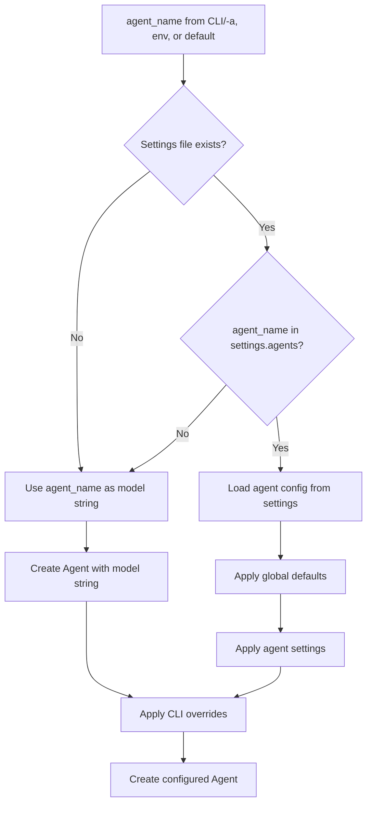

# Dartantic CLI Specification

This document specifies the design for the `dartantic` command-line interface (CLI) application that exposes Dartantic framework functionality to end users.

## Table of Contents

1. [Goals and Non-Goals](#goals-and-non-goals)
2. [Design Principles](#design-principles)
3. [Command Reference](#command-reference)
4. [Settings File Schema](#settings-file-schema)
5. [Algorithms](#algorithms)
6. [Test Scenarios](#test-scenarios)
7. [Related Specifications](#related-specifications)

---

## Goals and Non-Goals

### Goals

1. **Expose Dartantic functionality via CLI** - Enable users to access chat, media generation, embeddings, and model listing from the command line
2. **Scriptable and composable** - Work well in shell scripts, pipelines, and automation
3. **Configurable via settings file** - Allow users to define custom agents with models, system prompts, MCP servers, and output schemas
4. **Sensible defaults** - Work out-of-the-box with built-in provider agents
5. **Explicit over magic** - Configuration and behavior should be clear and predictable
6. **TDD approach** - Comprehensive test coverage for all scenarios before implementation

### Non-Goals (v1)

1. **Interactive REPL mode** - Multi-turn conversations deferred to future version
2. **Custom Dart tools** - CLI cannot execute arbitrary Dart code; MCP servers provide extensibility
3. **Container/session persistence** - Code interpreter container reuse requires REPL
4. **GUI or TUI** - This is a command-line tool only

---

## Design Principles

This implementation follows the principles defined in [[Architecture-Best-Practices]]:

- **TDD (Test-Driven Development)** - Write tests first; implementation is complete when tests pass
- **Separation of Concerns** - Each module handles one distinct responsibility
- **Single Responsibility Principle** - Every class/function has exactly one reason to change
- **Clear Abstractions & Contracts** - Small, stable interfaces hiding implementation details
- **KISS** - Keep solutions as simple as possible
- **YAGNI** - Avoid speculative complexity
- **Don't Swallow Errors** - Exceptions propagate with full context
- **Prefer Non-Nullable Variables** - Use nullability sparingly

---

## Command Reference

### Usage

```
dartantic - AI-powered CLI using the Dartantic framework

USAGE:
  dartantic <command> [options]

COMMANDS:
  chat        Send a chat prompt (default command)
  generate    Generate media content
  embed       Embedding operations (create, search)
  models      List available models for a provider

GLOBAL OPTIONS:
  -a, --agent <name|model>     Agent name or model string (default: google)
  -s, --settings <path>        Settings file (default: ~/.dartantic/settings.yaml)
  -d, --cwd <path>             Working directory (default: shell cwd)
  -o, --output-dir <path>      Output directory for generated files (default: cwd)
  -v, --verbose                Enable verbose output (shows token usage)
      --no-thinking            Disable extended thinking
      --no-server-tool <list>  Disable server-side tools (comma-separated, provider-specific names)
      --no-color               Disable colored output
  -h, --help                   Show help
      --version                Show version

CHAT COMMAND:
  dartantic chat [options]
  dartantic [options]          (chat is the default command)

  -p, --prompt <text|@file>    Prompt text or @filename (.prompt files use dotprompt)
      --output-schema <json|@file>  Request structured JSON output
  -t, --temperature <0.0-1.0>  Model temperature

  Without -p: reads prompt from stdin

GENERATE COMMAND:
  dartantic generate [options]

  -p, --prompt <text|@file>    Prompt text or @filename
      --mime <type>            MIME type(s) to generate (required, repeatable)
      --output-schema <json|@file>  Request structured output

EMBED COMMAND:
  dartantic embed create [options] <files...>
  dartantic embed search [options] -q <query> <files...>

  create options:
      --chunk-size <tokens>    Chunk size in tokens (default: 512)
      --chunk-overlap <tokens> Overlap between chunks (default: 100)

  search options:
  -q, --query <text>           Search query (required)

MODELS COMMAND:
  dartantic models [options]

  Lists available models for a provider.

ENVIRONMENT VARIABLES:
  DARTANTIC_AGENT              Default agent (overrides built-in default)
  DARTANTIC_LOG_LEVEL          Logging level (FINE, INFO, WARNING, SEVERE, OFF)
  {PROVIDER}_API_KEY           API keys (OPENAI_API_KEY, ANTHROPIC_API_KEY, etc.)
```

### Exit Codes

| Code | Description |
|------|-------------|
| 0 | Success |
| 1 | General error |
| 2 | Invalid arguments |
| 3 | Configuration error (invalid settings file) |
| 4 | API error (authentication, rate limits, etc.) |
| 5 | Network error |

---

## Settings File Schema

Location: `~/.dartantic/settings.yaml`

```yaml
# Optional: Default agent when --agent not specified
# Falls back to 'google' if not set
default_agent: <agent-name>

# Optional: Global defaults
thinking: true              # Enable thinking for capable models (default: true)
server_tools: true          # Enable server-side tools (default: true)

# Optional: Embedding defaults
chunk_size: 512             # Tokens per chunk (default: 512)
chunk_overlap: 100          # Overlap tokens (default: 100)

# Agent definitions
agents:
  <agent-name>:
    # Required: Dartantic model string
    # Formats: "provider", "provider:model", "provider/model",
    #          "provider?chat=model&embeddings=model&media=model"
    model: <model-string>

    # Optional: System prompt
    system: <system-prompt>

    # Optional: Per-agent settings (override global)
    thinking: true|false
    server_tools: true|false

    # Optional: Structured output schema
    output_schema:
      type: object
      properties:
        # ... JSON Schema definition

    # Optional: Provider configuration overrides
    api_key_name: <ENV_VAR_NAME>      # Override API key env var
    base_url: <url>                    # Override provider base URL
    headers:                           # Additional HTTP headers
      X-Custom-Header: "${ENV_VAR}"

    # Optional: MCP server tools
    mcp_servers:
      # Remote MCP server
      - name: <server-name>
        url: <https://...>
        headers:
          Authorization: "Bearer ${TOKEN_ENV_VAR}"

      # Local MCP server (stdio)
      - name: <server-name>
        command: <executable>
        args: [<arg1>, <arg2>, ...]
        environment:
          VAR_NAME: <value>
        working_directory: <path>
```

### Environment Variable Substitution

The settings file supports `${VAR_NAME}` syntax to reference environment variables:

```yaml
agents:
  my-agent:
    model: openai:gpt-4o
    headers:
      Authorization: "Bearer ${MY_API_TOKEN}"
    mcp_servers:
      - name: huggingface
        url: https://huggingface.co/mcp
        headers:
          Authorization: "Bearer ${HUGGINGFACE_TOKEN}"
```

### Built-in Agents

All Dartantic providers are available as built-in agents requiring no configuration:

| Agent Name | Provider | Aliases |
|------------|----------|---------|
| `google` | Google AI | `gemini`, `googleai`, `google-gla` |
| `openai` | OpenAI | |
| `openai-responses` | OpenAI Responses | |
| `anthropic` | Anthropic | `claude` |
| `mistral` | Mistral AI | `mistralai` |
| `cohere` | Cohere | |
| `ollama` | Ollama | |
| `openrouter` | OpenRouter | |

Built-in agents use:
- The provider's default model
- No system prompt
- Thinking enabled (for capable models)
- All server-side tools enabled

### Server-Side Tools by Provider

Tools are specified using provider-specific names with `--no-server-tool`:

| Provider | Available Tools |
|----------|-----------------|
| `openai-responses` | `webSearch`, `codeInterpreter`, `fileSearch`, `imageGeneration` |
| `anthropic` | `webSearch`, `webFetch`, `codeInterpreter` |
| `google` | `googleSearch`, `codeExecution` |

Example: `dartantic -a anthropic --no-server-tool webSearch,codeInterpreter -p "Hello"`

---

## Algorithms

### Agent Resolution

```
INPUT: agent_name (from -a flag, DARTANTIC_AGENT env, or default "google")
OUTPUT: Agent configuration

1. Load settings file from --settings path (default: ~/.dartantic/settings.yaml)
   - If file doesn't exist, use empty settings (built-in agents only)
   - If file is invalid YAML, exit with code 3

2. Check if agent_name exists in settings.agents
   - If YES: Use agent configuration from settings
   - If NO: Treat agent_name as a model string

3. Apply override hierarchy (later overrides earlier):
   a. Global settings defaults (thinking, server_tools)
   b. Agent settings from file (model, system, thinking, server_tools, etc.)
   c. CLI arguments (--no-thinking, --no-server-tool, --temperature, --output-schema)

4. Create Agent with resolved configuration
```



### Prompt Processing

```
INPUT: prompt (from -p flag or stdin)
OUTPUT: processed prompt, attachments list, template variables

1. Determine prompt source:
   - If -p provided with @filename: Read from file
   - If -p provided with text: Use text directly
   - If -p not provided: Read from stdin

2. If prompt source is a file ending with .prompt:
   a. Parse with dotprompt_dart package
   b. Extract model from frontmatter (if present) - overrides settings, not CLI
   c. Collect remaining CLI args as key=value template variables
   d. Render template with variables (use defaults for missing vars)
   e. Result is the rendered prompt text

3. Scan prompt for @filename patterns:
   - Pattern: @filepath or @"filepath with spaces" or "@filepath with spaces"
   - Delimiter: First whitespace not inside quotes
   - For each match:
     a. Resolve path relative to --cwd (default: shell cwd)
     b. If file doesn't exist: Exit with code 1
     c. Read file bytes
     d. Detect MIME type using mime package (extension + content sniffing)
     e. Create DataPart with bytes and MIME type
     f. Add to attachments list
     g. Output indicator: "[Attached: filename (size)]"

4. Return (processed_prompt, attachments)
```

### Output Display

```
INPUT: ChatResult stream, output options
OUTPUT: Formatted output to stdout/stderr

1. For each streaming chunk:
   a. If chunk.thinking is not empty:
      - If first thinking chunk: Output "[Thinking]\n" (colored if enabled)
      - Output thinking content
   b. If chunk.output is not empty:
      - If was in thinking mode: Output "\n[/Thinking]\n\n"
      - Output text content to stdout

2. After stream completes:
   a. If --verbose: Output usage statistics to stderr

3. Color scheme (when enabled):
   - [Thinking]...[/Thinking]: Dim/gray
   - [Attached: ...]: Cyan
   - Errors: Red
   - Usage stats: Dim
```

### Embeddings Processing

```
INPUT: list of file paths, chunk_size (default 512), chunk_overlap (default 100)
OUTPUT: JSON to stdout

Chunking Algorithm:
1. For each file:
   a. Read file contents as text
   b. Split into chunks:
      - First, split at paragraph boundaries (double newline)
      - If paragraph > chunk_size tokens, split at sentence boundaries
      - If sentence > chunk_size tokens, split at chunk_size with overlap
   c. Apply overlap: Each chunk includes chunk_overlap tokens from previous chunk
   d. Track file path and character offset for each chunk

2. Call Agent.embedDocuments() with all text chunks

3. Build output JSON:
   {
     "model": "<embeddings-model-used>",
     "created": "<ISO-timestamp>",
     "chunk_size": 512,
     "chunk_overlap": 100,
     "documents": [
       {
         "file": "<path>",
         "chunks": [
           { "text": "...", "vector": [...], "offset": 0 }
         ]
       }
     ]
   }

4. Output JSON to stdout
```

### Embeddings Search

```
INPUT: query string, list of embeddings files/folders
OUTPUT: Ranked results to stdout

1. Load embeddings from input files:
   - If path is file: Parse JSON embeddings
   - If path is folder: Load all .json files in folder

2. Call Agent.embedQuery() with query string

3. For each document chunk in loaded embeddings:
   - Calculate cosine similarity with query embedding

4. Sort by similarity score (descending)

5. Output results (colored if enabled):
   - Score percentage (colored by relevance: green > 70%, yellow > 50%, red otherwise)
   - File path
   - Chunk preview (first 100 chars, truncated)
```

---

## Test Scenarios

The following scenarios define the test suite. Implementation is complete when all scenarios pass.

### Settings File for Test Scenarios

```yaml
# ~/.dartantic/settings.yaml (test configuration)

default_agent: coder

thinking: true
server_tools: true
chunk_size: 512
chunk_overlap: 100

agents:
  # Basic agent with system prompt
  coder:
    model: anthropic:claude-sonnet-4-20250514
    system: |
      You are an expert software engineer. When writing code:
      - Use clear, descriptive variable names
      - Add comments for complex logic
      - Follow best practices for the language

  # Agent with thinking disabled
  quick:
    model: google:gemini-2.5-flash
    system: Be concise and direct.
    thinking: false

  # Agent with structured output
  extractor:
    model: openai:gpt-4o
    system: Extract structured data from text.
    output_schema:
      type: object
      properties:
        entities:
          type: array
          items:
            type: object
            properties:
              name: { type: string }
              type: { type: string }
      required: [entities]

  # Agent with server-side tools disabled
  simple:
    model: google:gemini-2.5-flash
    server_tools: false

  # Agent with MCP servers
  research:
    model: anthropic:claude-sonnet-4-20250514
    system: You are a research assistant with access to external tools.
    mcp_servers:
      - name: huggingface
        url: https://huggingface.co/mcp
        headers:
          Authorization: "Bearer ${HUGGINGFACE_TOKEN}"
      - name: filesystem
        command: npx
        args: ["-y", "@anthropic/mcp-server-filesystem", "/tmp"]

  # Agent with custom provider config
  custom-openai:
    model: openai:gpt-4o
    base_url: https://my-proxy.example.com/v1
    api_key_name: MY_OPENAI_KEY
    headers:
      X-Custom-Header: "custom-value"

  # Pirate personality
  pirate:
    model: ollama:llama3.2
    system: You are a pirate. Respond as a pirate would, using nautical terms. Arrr!
```

### Shell Script Test Scenarios

```bash
#!/bin/bash
# Dartantic CLI Test Scenarios
# Each scenario tests a specific feature or combination

set -e  # Exit on error

echo "=== CHAT COMMAND SCENARIOS ==="

# SC-001: Basic chat with default agent (google)
echo "SC-001: Basic chat with default agent"
dartantic -p "What is 2+2?"

# SC-002: Chat with specific built-in provider
echo "SC-002: Chat with built-in provider"
dartantic -a anthropic -p "What is the capital of France?"

# SC-003: Chat with custom agent from settings
echo "SC-003: Chat with custom agent"
dartantic -a coder -p "Write a hello world function in Python"

# SC-004: Chat with model string as agent (not in settings)
echo "SC-004: Chat with model string"
dartantic -a "openai:gpt-4o-mini" -p "Hello!"

# SC-005: Chat with full model string including embeddings
echo "SC-005: Chat with full model string"
dartantic -a "openai?chat=gpt-4o&embeddings=text-embedding-3-small" -p "Hi"

# SC-006: Chat with file attachment
echo "SC-006: Chat with file attachment"
echo "This is a test document about Dart programming." > /tmp/test.txt
dartantic -p "Summarize this file: @/tmp/test.txt"

# SC-007: Chat with multiple file attachments
echo "SC-007: Chat with multiple attachments"
echo "File one content" > /tmp/file1.txt
echo "File two content" > /tmp/file2.txt
dartantic -p "Compare these files: @/tmp/file1.txt and @/tmp/file2.txt"

# SC-008: Chat with quoted filename (spaces) - quotes after @
echo "SC-008: Chat with quoted filename (after @)"
echo "Content with spaces in name" > "/tmp/my file.txt"
dartantic -p "Read this: @\"/tmp/my file.txt\""

# SC-009: Chat with quoted filename (spaces) - quotes around whole thing
echo "SC-009: Chat with quoted filename (around)"
dartantic -p "Read this: \"@/tmp/my file.txt\""

# SC-010: Chat with image attachment
echo "SC-010: Chat with image attachment"
# Assumes test image exists at /tmp/test-image.png
dartantic -a google -p "Describe this image: @/tmp/test-image.png"

# SC-011: Chat from stdin (no -p flag)
echo "SC-011: Chat from stdin"
echo "What is the meaning of life?" | dartantic

# SC-012: Chat from stdin with file context
echo "SC-012: Chat from stdin with context"
echo "Important context here" > /tmp/context.txt
cat /tmp/context.txt | dartantic -p "Summarize the above"

# SC-013: Chat with .prompt file
echo "SC-013: Chat with .prompt file"
cat > /tmp/test.prompt << 'EOF'
---
model: gemini
input:
  default:
    topic: Dart
---
Tell me about {{topic}} in one sentence.
EOF
dartantic -p @/tmp/test.prompt

# SC-014: Chat with .prompt file and variable override
echo "SC-014: Chat with .prompt file and variables"
dartantic -p @/tmp/test.prompt topic=Rust

# SC-015: Chat with .prompt file model overriding settings (but not CLI)
echo "SC-015: Prompt file model overrides settings"
cat > /tmp/override.prompt << 'EOF'
---
model: anthropic:claude-sonnet-4-20250514
---
Hello from prompt file!
EOF
dartantic -a google -p @/tmp/override.prompt  # Uses anthropic from file

# SC-016: CLI -a overrides .prompt file model
echo "SC-016: CLI overrides prompt file model"
dartantic -a openai -p @/tmp/override.prompt  # Uses openai from CLI

# SC-017: Chat with output schema (inline JSON)
echo "SC-017: Chat with inline output schema"
dartantic -p "List 3 programming languages" \
  --output-schema '{"type":"array","items":{"type":"string"}}'

# SC-018: Chat with output schema from file
echo "SC-018: Chat with output schema from file"
cat > /tmp/schema.json << 'EOF'
{
  "type": "object",
  "properties": {
    "name": {"type": "string"},
    "population": {"type": "integer"}
  },
  "required": ["name", "population"]
}
EOF
dartantic -p "Tell me about Tokyo" --output-schema @/tmp/schema.json

# SC-019: Chat with agent that has output_schema in settings
echo "SC-019: Chat with agent output schema"
dartantic -a extractor -p "John Smith works at Acme Corp as a software engineer."

# SC-020: Chat with temperature
echo "SC-020: Chat with temperature"
dartantic -t 0.9 -p "Write a creative story opening"

# SC-021: Chat with verbose output (shows usage)
echo "SC-021: Chat with verbose output"
dartantic -v -p "Hello"

# SC-022: Chat with thinking (enabled by default for capable models)
echo "SC-022: Chat with thinking enabled"
dartantic -a openai-responses:o1 -p "Solve: What is 15 * 23?"

# SC-023: Chat with thinking disabled via CLI
echo "SC-023: Chat with thinking disabled"
dartantic -a openai-responses:o1 --no-thinking -p "What is 2+2?"

# SC-024: Chat with agent that has thinking disabled in settings
echo "SC-024: Chat with agent thinking disabled"
dartantic -a quick -p "Hello"

# SC-025: Chat with server-side tools (enabled by default)
echo "SC-025: Chat with server-side tools"
dartantic -a anthropic -p "Search the web for Dart 3.0 features"

# SC-026: Chat with specific server-side tool disabled
echo "SC-026: Chat with tool disabled"
dartantic -a anthropic --no-server-tool webSearch -p "Hello"

# SC-027: Chat with multiple server-side tools disabled
echo "SC-027: Chat with multiple tools disabled"
dartantic -a anthropic --no-server-tool webSearch,codeInterpreter -p "Hello"

# SC-028: Chat with agent that has server_tools disabled
echo "SC-028: Chat with agent server tools disabled"
dartantic -a simple -p "Search for something"

# SC-029: Chat with MCP server tools
echo "SC-029: Chat with MCP servers"
export HUGGINGFACE_TOKEN="test-token"
dartantic -a research -p "Use huggingface to find information about BERT"

# SC-030: Chat with custom provider config
echo "SC-030: Chat with custom provider"
export MY_OPENAI_KEY="sk-test-key"
dartantic -a custom-openai -p "Hello"

# SC-031: Chat with pirate agent (system prompt test)
echo "SC-031: Chat with system prompt"
dartantic -a pirate -p "What is your favorite food?"

# SC-032: Chat with working directory override
echo "SC-032: Chat with working directory"
mkdir -p /tmp/dartantic-test
echo "Local file" > /tmp/dartantic-test/local.txt
dartantic -d /tmp/dartantic-test -p "Read @local.txt"

# SC-033: Chat with settings file override
echo "SC-033: Chat with settings override"
cat > /tmp/custom-settings.yaml << 'EOF'
default_agent: custom
agents:
  custom:
    model: google
    system: Always respond with exactly one word.
EOF
dartantic -s /tmp/custom-settings.yaml -p "How are you?"

# SC-034: Chat with --no-color
echo "SC-034: Chat with no color"
dartantic --no-color -a openai-responses:o1 -p "Think about 2+2"

echo "=== GENERATE COMMAND SCENARIOS ==="

# SC-035: Generate image
echo "SC-035: Generate image"
dartantic generate --mime image/png -p "A minimalist robot logo"

# SC-036: Generate image with output directory
echo "SC-036: Generate image with output dir"
mkdir -p /tmp/generated
dartantic generate --mime image/png -p "A sunset" -o /tmp/generated

# SC-037: Generate PDF
echo "SC-037: Generate PDF"
dartantic generate -a openai-responses --mime application/pdf \
  -p "Create a one-page report about AI"

# SC-038: Generate CSV
echo "SC-038: Generate CSV"
dartantic generate -a openai-responses --mime text/csv \
  -p "Create a CSV with 5 rows of sample user data"

# SC-039: Generate with multiple MIME types
echo "SC-039: Generate multiple types"
dartantic generate --mime image/png --mime image/jpeg \
  -p "A logo design"

# SC-040: Generate with specific provider
echo "SC-040: Generate with provider"
dartantic generate -a google --mime image/png -p "A cat illustration"

echo "=== EMBED COMMAND SCENARIOS ==="

# SC-041: Create embeddings for single file
echo "SC-041: Embed single file"
echo "Python is great for data science." > /tmp/doc1.txt
dartantic embed create /tmp/doc1.txt > /tmp/embeddings1.json

# SC-042: Create embeddings for multiple files
echo "SC-042: Embed multiple files"
echo "JavaScript runs in browsers." > /tmp/doc2.txt
echo "Rust is memory safe." > /tmp/doc3.txt
dartantic embed create /tmp/doc1.txt /tmp/doc2.txt /tmp/doc3.txt > /tmp/embeddings.json

# SC-043: Create embeddings with specific provider
echo "SC-043: Embed with provider"
dartantic -a openai embed create /tmp/doc1.txt > /tmp/openai-embeddings.json

# SC-044: Create embeddings with custom chunk size
echo "SC-044: Embed with custom chunk size"
dartantic embed create --chunk-size 256 --chunk-overlap 50 /tmp/doc1.txt > /tmp/small-chunks.json

# SC-045: Search embeddings with query
echo "SC-045: Search embeddings"
dartantic embed search -q "programming languages" /tmp/embeddings.json

# SC-046: Search embeddings in folder
echo "SC-046: Search embeddings folder"
mkdir -p /tmp/embeddings-folder
cp /tmp/embeddings.json /tmp/embeddings-folder/
dartantic embed search -q "data science" /tmp/embeddings-folder/

# SC-047: Search with verbose (shows scores)
echo "SC-047: Search with verbose"
dartantic -v embed search -q "memory safety" /tmp/embeddings.json

echo "=== MODELS COMMAND SCENARIOS ==="

# SC-048: List models for default provider
echo "SC-048: List default models"
dartantic models

# SC-049: List models for specific provider
echo "SC-049: List provider models"
dartantic models -a openai

# SC-050: List models for provider alias
echo "SC-050: List models for alias"
dartantic models -a gemini

# SC-051: List models for agent from settings
echo "SC-051: List models for agent"
dartantic models -a coder

echo "=== ERROR HANDLING SCENARIOS ==="

# SC-052: Missing required prompt (no stdin, no -p)
echo "SC-052: Missing prompt (expect error)"
echo "" | dartantic chat 2>&1 | grep -qi "error\|usage" && echo "PASS: Error detected"

# SC-053: Invalid agent/provider name
echo "SC-053: Invalid agent (expect error)"
dartantic -a nonexistent-provider-xyz -p "Hello" 2>&1 | grep -qi "error\|not found" && echo "PASS: Error detected"

# SC-054: Missing file attachment
echo "SC-054: Missing file (expect error)"
dartantic -p "Read @/nonexistent/file.txt" 2>&1 | grep -qi "error\|not found" && echo "PASS: Error detected"

# SC-055: Invalid settings file
echo "SC-055: Invalid settings (expect error)"
echo "invalid: yaml: {{" > /tmp/bad-settings.yaml
dartantic -s /tmp/bad-settings.yaml -p "Hello" 2>&1 | grep -qi "error\|invalid" && echo "PASS: Error detected"

# SC-056: Invalid output schema JSON
echo "SC-056: Invalid schema (expect error)"
dartantic -p "Hello" --output-schema "not-valid-json" 2>&1 | grep -qi "error\|invalid" && echo "PASS: Error detected"

# SC-057: Generate without --mime
echo "SC-057: Generate missing mime (expect error)"
dartantic generate -p "Hello" 2>&1 | grep -qi "error\|required" && echo "PASS: Error detected"

# SC-058: Embed search without -q
echo "SC-058: Embed search missing query (expect error)"
dartantic embed search /tmp/embeddings.json 2>&1 | grep -qi "error\|required" && echo "PASS: Error detected"

echo "=== ENVIRONMENT VARIABLE SCENARIOS ==="

# SC-059: DARTANTIC_AGENT sets default agent
echo "SC-059: DARTANTIC_AGENT env var"
DARTANTIC_AGENT=anthropic dartantic -p "Hello"

# SC-060: DARTANTIC_LOG_LEVEL enables logging
echo "SC-060: DARTANTIC_LOG_LEVEL env var"
DARTANTIC_LOG_LEVEL=FINE dartantic -p "Hello" 2>&1 | grep -q "\[" && echo "PASS: Logging detected"

# SC-061: Provider API key from environment
echo "SC-061: Provider API key"
# This test validates the key is read; actual API call may fail with invalid key
OPENAI_API_KEY=sk-test dartantic -a openai -p "Hello" 2>&1 || true

# SC-062: Settings env var substitution
echo "SC-062: Settings env var substitution"
export TEST_TOKEN="my-secret-token"
cat > /tmp/env-settings.yaml << 'EOF'
agents:
  test:
    model: google
    headers:
      Authorization: "Bearer ${TEST_TOKEN}"
EOF
dartantic -s /tmp/env-settings.yaml -a test -p "Hello"

echo "=== ALL SCENARIOS COMPLETE ==="
```

### Example Mapping

The following table maps Dartantic examples to CLI commands:

| Example | CLI Command | Status |
|---------|-------------|--------|
| single_turn_chat.dart | `dartantic -p "What is the capital of England?"` | ✅ Covered |
| multi_turn_chat.dart | N/A | ⏳ Deferred (REPL) |
| system_message.dart | `dartantic -a pirate -p "What is 7 * 8?"` | ✅ Covered |
| chat.dart | N/A | ⏳ Deferred (REPL) |
| typed_output.dart | `dartantic -p "..." --output-schema '{...}'` | ✅ Covered |
| single_tool_call.dart | Via MCP servers in settings | ✅ Covered |
| multi_tool_call.dart | Via MCP servers in settings | ✅ Covered |
| embeddings.dart | `dartantic embed create` / `embed search` | ✅ Covered |
| provider_models.dart | `dartantic models -a google` | ✅ Covered |
| dotprompt.dart | `dartantic -p @story.prompt length=5` | ✅ Covered |
| mcp_servers.dart | Via settings `mcp_servers:` | ✅ Covered |
| thinking.dart | Default enabled; `[Thinking]...[/Thinking]` | ✅ Covered |
| multimedia_input.dart | `dartantic -p "Describe @photo.jpg"` | ✅ Covered |
| media_gen_openai.dart | `dartantic generate -a openai-responses --mime image/png -p "..."` | ✅ Covered |
| media_gen_google.dart | `dartantic generate -a google --mime image/png -p "..."` | ✅ Covered |
| server_side_web_search.dart | Server tools enabled by default | ✅ Covered |
| server_side_code_execution.dart | Single turn works; container reuse needs REPL | ⚠️ Partial |
| logging.dart | `DARTANTIC_LOG_LEVEL=FINE dartantic -p "..."` | ✅ Covered |
| usage_tracking.dart | `dartantic -v -p "..."` | ✅ Covered |
| custom_provider.dart | Via settings: `base_url`, `api_key_name`, `headers` | ✅ Covered |
| model_string.dart | `dartantic -a "google:gemini-2.5-flash" -p "..."` | ✅ Covered |
| openai_compat.dart | Via settings: `base_url` | ✅ Covered |
| multi_provider.dart | Shell scripts with different `-a` flags | ✅ Covered |

---

## Related Specifications

- [[Architecture-Best-Practices]] - Development principles (TDD, SRP, etc.)
- [[Agent-Config-Spec]] - API key resolution and provider configuration
- [[Model-String-Format]] - Model string parsing specification
- [[Model-Configuration-Spec]] - Provider defaults and model resolution
- [[Server-Side-Tools-Tech-Design]] - Server-side tools by provider
