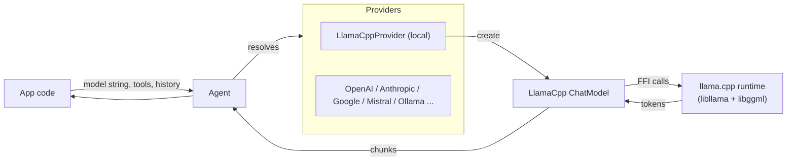
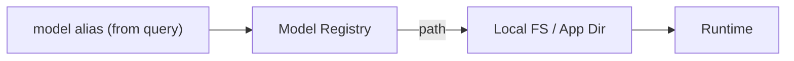
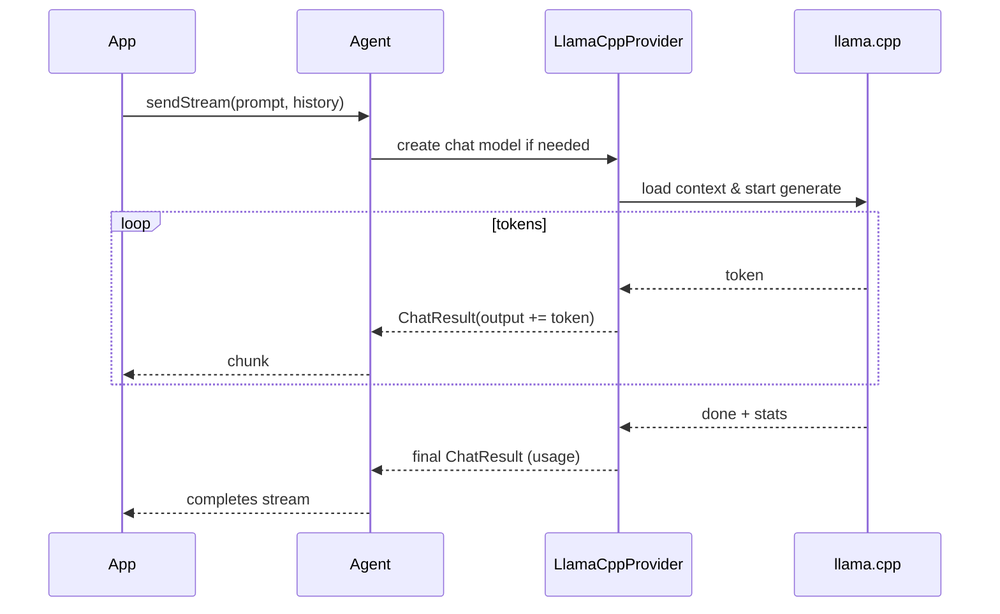

# Design: Adding **llama.cpp** as a First-Class Provider in Dartantic
**Status:** Draft for review  
**Owner:** dartantic_ai maintainers  
**Date:** 2025‑09‑05

> Purpose: describe an implementation plan to support on‑device, fully local LLM inference via **llama.cpp** while fitting Dartantic’s provider model, configuration style, streaming semantics, and agent features—without constraining which GGUF models users can load.

---

## 1) Context & Goals

Dartantic exposes LLMs via **providers** that implement common **chat** and **embeddings** interfaces, discoverable and swappable through a single, unified API. Providers can be built outside of `dartantic_ai` using the `dartantic_interface` package and registered dynamically, and agents stream text, tools, and typed output through the same surface. fileciteturn0file0

**Primary goals**

- Treat **llama.cpp** as a **model‑agnostic** local provider (no model hard‑coding).  
- Preserve core Dartantic UX: *model strings*, *streaming*, *multi‑turn chat*, *tools*, *typed output*, *usage tracking/logging*. fileciteturn0file0
- Make **custom settings** first‑class via **the same channels Dartantic already uses**: model string query parameters, per‑provider instance configuration, and environment variables supplied through `Agent.environment`. fileciteturn0file0
- Keep the design mobile‑ready (iOS/Android packaging of native libs & model assets) without forcing a particular distribution story.

**Non‑goals (v1)**

- Shipping weights or native binaries inside `dartantic_ai`.  
- GPU/NPU vendor specificity; we target a portable CPU/GPU build first, add accelerators later.  
- Guaranteeing embeddings parity with cloud models (optional Phase 2).

---

## 2) High‑Level Architecture


- The **Agent** looks up a provider by name (e.g., `"llamacpp"`) and streams results back. Providers are discoverable and swappable. fileciteturn0file0
- The **LlamaCppProvider** implements **Chat** (and optionally **Embeddings**) using `dartantic_interface`. fileciteturn0file0
- The **ChatModel** owns the llama.cpp context lifecycle and streaming, mapping output into **`ChatResult`** chunks consistent with Dartantic’s streaming API. fileciteturn0file0

---

## 3) Capabilities & Fit

| Capability | Support in this design | Notes |
|---|---|---|
| **Chat** | ✅ | First‑class, multi‑turn history honored. fileciteturn0file0 |
| **Streaming** | ✅ | Token‑level streaming mapped to Dartantic’s `sendStream` flow. fileciteturn0file0 |
| **Tool Calling** | ✅ (agent‑mediated) | Agent orchestrates tools; provider just streams model output and messages; no server dependency. fileciteturn0file0 |
| **Typed Output** | ✅ | Provider surfaces JSON‑friendly output for `sendFor<T>`; agent handles schema. fileciteturn0file0 |
| **Embeddings** | ⏳ Phase 2 | Optional: expose embeddings for GGUF checkpoints that support it. fileciteturn0file0 |
| **Usage Tracking** | ✅ (best effort) | Populate token counts when available; otherwise conservative estimates. fileciteturn0file0 |
| **Logging/Retry** | ✅ (where applicable) | Integrate with Dartantic’s logging; local provider may ignore HTTP retry semantics. fileciteturn0file0 |

---

## 4) Configuration Model (How **custom settings** are provided)

Dartantic already standardizes three configuration channels; the llama.cpp provider leans on them deliberately:

1. **Model string** (user‑facing): “`provider?query=params`” style that Dartantic resolves and the provider interprets. For example, the framework already supports `provider?chat=...&embeddings=...`; the **llama.cpp provider** additionally interprets provider‑specific keys (e.g., `ctx`, `threads`, `template`, `stop`, `model`, `quant`, etc.). fileciteturn0file0  
2. **Provider instance configuration** (programmatic defaults): pass a configured provider to `Agent.forProvider(...)`. These defaults are merged with any model‑string overrides. fileciteturn0file0  
3. **Environment**: pull from `Agent.environment` (and/or process env) for sensitive or device‑specific values like library/model directories. fileciteturn0file0

**Proposed query parameters (interpreted by this provider):**

- `model` — logical model alias (e.g., “llama3.2-3b-instruct-q4”), resolved via provider’s **Model Registry** (see §6).  
- `ctx`, `threads`, `seed`, `temperature`, `top_p`, `top_k`, `repeat_penalty`, `max_tokens` — core generation controls.  
- `template` — chat template selection: `auto` (default), `chatml`, `llama32`, `mistral`, `raw`.  
- `stop` — comma‑separated stop sequences (URL‑encoded).  
- `accel` — preferred backend hint (`cpu`, `metal`, `vulkan`, `auto`).  
- `kv_cache` — requested KV cache size policy (e.g., `% of ctx`).

**Resolution precedence:** model‑string query params → provider instance defaults → `Agent.environment` → baked defaults.

```mermaid
flowchart TB
    User["Model string + defaults + env"] --> Parse[Parse & Merge\n(provider-specific)"]
    Parse --> Options["Normalized Options"]
    Options --> ChatModelLLC
```
- This follows Dartantic patterns for model strings and provider configuration; we’re simply **interpreting additional keys** under the **llama.cpp** namespace. fileciteturn0file0

---

## 5) Provider & Model Boundaries

```mermaid
classDiagram
  class LlamaCppProvider {
    +name = "llamacpp"
    +caps = {chat, streaming}
    +defaultModelNames = { chat: "local" }
    +createChatModel(...)
    +listModels()
  }
  class LlamaCppChatModel {
    +send(...)
    +sendStream(...)
    +embed* (Phase 2)
  }
  LlamaCppProvider --> LlamaCppChatModel : creates
```
- The provider is **discoverable** by name and participates in the same **model listing** and **capabilities** checks as built‑ins. fileciteturn0file0
- **Embeddings** can be added later; the provider advertises only chat+streaming at launch.

---

## 6) Model & Asset Resolution (no hard‑coding)

To remain model‑agnostic while still being practical on mobile/desktop, introduce a **Model Registry** abstraction **inside the provider**:

- Maps a **user‑facing `model` alias** → **concrete GGUF file path**, **expected template**, and optional **integrity hash**.  
- Multiple **sources** feed the registry at runtime:
  - **Provider constructor defaults** (e.g., an app may ship curated aliases).  
  - **Environment** (e.g., a directory the user controls). fileciteturn0file0  
  - **Model string** overrides.  
- Optionally, a **pluggable resolver** can download or copy GGUFs into an app‑writable directory (outside the scope of `dartantic_ai` itself).



This approach keeps **any GGUF** loadable without provider code changes and solves mobile packaging constraints by pushing path and license acceptance into app‑level policy.

---

## 7) Prompt Strategy (templates without assumptions)

Local models vary in **chat templates**; to avoid brittle assumptions:

1. **Auto‑detect** a template from GGUF metadata when available (e.g., a tokenizer/chat template string embedded in the file).  
2. **Fallback** to a small set of **named strategies** (`llama32`, `chatml`, `mistral`, `raw`), selectable via the `template` query param.  
3. Allow an **app‑provided prompt strategy** via provider construction (advanced use) if the default heuristics don’t fit.

```mermaid
flowchart TD
    A[Load GGUF] --> B{Embedded\nchat template?}
    B -- yes --> T[Use embedded template]
    B -- no --> C{template param?}
    C -- yes --> P[Use named strategy]
    C -- no --> D[Default heuristic\n(e.g., llama32)]
    T --> E[Format history + prompt]
    P --> E
    D --> E
    E --> Runtime
```

This keeps the provider **model‑agnostic** while still delivering good defaults for common families.

---

## 8) Streaming Semantics

- Dartantic streams **`ChatResult`** chunks; the llama.cpp provider forwards partial tokens as chunks and appends newly created messages to the conversation, so multi‑turn chat behaves identically to cloud providers. fileciteturn0file0
- **Stop sequences** are honored: if a stop token appears in the output buffer, the provider ends the turn cleanly and flushes the final `ChatResult` with truncated text.
- **Usage**: the final chunk should carry best‑effort token counts compatible with Dartantic’s **usage tracking** UI. fileciteturn0file0



---

## 9) Tool Calling & Typed Output

- **Tool calling** is agent‑orchestrated; the provider only needs to stream model text and/or function call “suggestions.” The Agent integrates tool results and continues the conversation as usual. fileciteturn0file0
- **Typed output**: the provider doesn’t parse JSON itself; it just returns streamed text. The Agent’s `sendFor<T>` guides the model with a schema and parses the response—identical to other providers. fileciteturn0file0

Implication: llama.cpp models that weren’t fine‑tuned for explicit function‑call tokens can still participate because the **Agent** wraps calls and state consistently.

---

## 10) Embeddings (Phase 2)

- When compiled/available, expose an **EmbeddingsModel** from the provider to support local vectorization. This integrates with Dartantic’s **embeddings** API, including similarity helpers and usage reporting. fileciteturn0file0
- Configuration follows the same channels: `provider?embeddings=<alias>&dim=...` plus provider defaults and environment. fileciteturn0file0

---

## 11) Configuration Sources & Examples (no code)

**Where settings come from**

- **Model string** (user input): provider‑specific query params like `ctx`, `template`, `stop`. fileciteturn0file0  
- **Provider instance defaults**: supplied when constructing/ registering the provider for an app. fileciteturn0file0  
- **Environment**: `Agent.environment[...]` (safe for web/WASM or mobile), or platform env for CLI/server. fileciteturn0file0

**Proposed environment keys (suggested naming):**

- `LLAMACPP_LIB_PATH` — absolute path to `libllama` (and co‑located `libggml`).  
- `LLAMACPP_MODELS_DIR` — base directory to resolve model aliases.  
- `LLAMACPP_DEFAULT_MODEL` — fallback alias when `model` isn’t specified.

These are **provider‑specific** and optional; they mirror Dartantic’s guidance on environment setup and avoid hard‑coding paths in model strings. fileciteturn0file0

---

## 12) Error Handling & Logging

- Surface clean, **provider‑scoped** error messages (e.g., “model file not found,” “unsupported quantization”).  
- Integrate with Dartantic’s **logging** options (levels & filtering) for troubleshooting local runs. fileciteturn0file0  
- Retry semantics are trivial for local inference (no HTTP 429), but the **Agent’s automatic retry** scaffolding remains harmless and can be ignored for this provider. fileciteturn0file0

---

## 13) Usage Reporting

- Populate token usage when exposed by the runtime; otherwise, **estimate** from tokenized length and emitted tokens and mark as estimated. This supports Dartantic’s **usage tracking** UI/metrics. fileciteturn0file0

---

## 14) Mobile Packaging Considerations (iOS/Android)

- **Native libraries**: the app bundles platform‑specific `libllama`/`libggml` artifacts; the provider only requires a path.  
- **Model files**: apps should **download at first run** or ship via an asset pipeline, respecting model licenses.  
- **Accelerators**: start with CPU (portable); optionally detect Metal/Vulkan availability and honor an `accel=auto` hint.  
- **Storage & permissions**: keep GGUFs in an app‑private directory with integrity checks.

> Rationale: keep `dartantic_ai` provider portable and un‑opinionated about app distribution while enabling smooth mobile UX.

---

## 15) Security & Licensing

- The provider must **not** bypass model license gates. It should expose hooks for apps to **present license terms** and only download/activate a model after acceptance.  
- Local files are untrusted input; verify **hashes** and handle corrupted GGUFs gracefully.

---

## 16) Performance & Stability Guardrails

- Reasonable defaults: `ctx` in the single‑digit thousands on mobile, conservative thread counts, and a small KV cache overhead.  
- Expose **backpressure** handling for long contexts (e.g., pause/resume streaming if the UI falls behind).  
- Provide **memory foot‑print heuristics** to warn users when a requested model/context likely exceeds device limits.

---

## 17) Registration & Discovery

- Ship the provider with name **`llamacpp`** and expose **`listModels()`** from the in‑process registry so users can discover available aliases at runtime.  
- Allow **dynamic provider registration** in the global map so the provider can be addressed by name (e.g., `"llamacpp"`), consistent with other providers. fileciteturn0file0

---

## 18) Rollout Plan

1. **MVP**: Chat + Streaming; templates: `auto`, `llama32`, `chatml`, `mistral`, `raw`; options: `model`, `ctx`, `threads`, `temperature`, `top_p`, `top_k`, `repeat_penalty`, `stop`, `max_tokens`; usage reporting (best effort); logging. fileciteturn0file0  
2. **Mobile polish**: integrity checks, progressive download flow, accelerator hints.  
3. **Embeddings (optional)**: expose an EmbeddingsModel for supported GGUFs with basic similarity helpers. fileciteturn0file0  
4. **Auto‑template**: read embedded templates when present; improve heuristics.  
5. **Advanced**: NPU/GPU backends as build variants; finer‑grained KV cache control; improved token accounting.

---

## 19) Open Questions

- **Template metadata**: how reliably can we read chat templates from GGUF across families?  
- **Usage accuracy**: what token metrics can the runtime expose portably?  
- **Model discovery UX**: should the provider define a standard JSON manifest format for alias → path + metadata?  
- **Licensing UX**: where should the “accept terms” state live (app vs. provider)?

---

## 20) Appendix: Provider Settings (reference)

> All keys are optional; provider merges values from model string, provider defaults, and environment (in that order).

| Key | Meaning | Example value |
|---|---|---|
| `model` | Logical model alias resolved to a GGUF path | `llama3.2-3b-instruct-q4` |
| `ctx` | Context window tokens | `8192` |
| `threads` | Inference threads | `4` |
| `temperature` | Sampling temperature | `0.7` |
| `top_p` / `top_k` | Nucleus / top‑K sampling | `0.9` / `40` |
| `repeat_penalty` | Repetition penalty | `1.1` |
| `max_tokens` | Max new tokens | `256` |
| `stop` | Comma‑separated stop sequences (URL‑encoded) | `%3C%7Ceot_id%7C%3E` |
| `template` | Chat template strategy | `auto`, `llama32`, `chatml`, `mistral`, `raw` |
| `accel` | Backend hint | `auto`, `cpu`, `metal`, `vulkan` |
| `kv_cache` | KV cache sizing policy | `0.5x_ctx` |

---

### References (Dartantic docs)

- Providers, model strings, capabilities, discovery, and dynamic registration. fileciteturn0file0  
- Streaming output semantics and multi‑turn chat. fileciteturn0file0  
- Tool calling orchestration and typed output. fileciteturn0file0  
- Environment configuration for keys & provider settings. fileciteturn0file0  
- Custom providers built with `dartantic_interface` (no dependency on `dartantic_ai` required). fileciteturn0file0

---

*End of document.*
