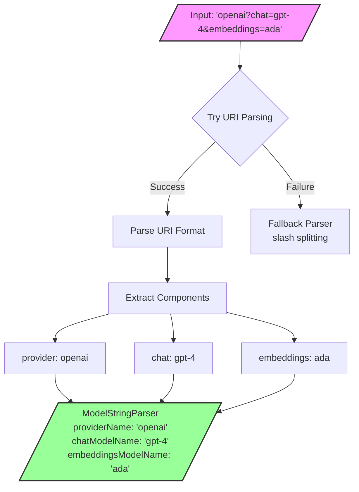
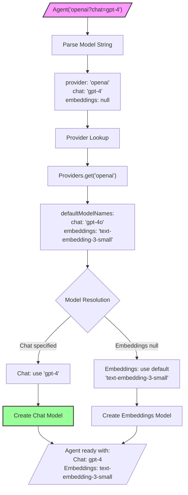

This document defines the model configuration system for dartantic 1.0, including model string formats, naming conventions, and provider defaults.

## Model String Format

The `ModelStringParser` supports flexible URI-based parsing with multiple formats for backward compatibility:

### Supported Formats

| Format             | Example                                          | Parsed Result                                                                     |
| ------------------ | ------------------------------------------------ | --------------------------------------------------------------------------------- |
| **Provider only**  | `openai`                                         | provider: `openai`, chat: `null`, embeddings: `null`, media: `null`               |
| **Provider:model** | `openai:gpt-4o`                                  | provider: `openai`, chat: `gpt-4o`, embeddings: `null`, media: `null`             |
| **Provider/model** | `openai/gpt-4o`                                  | provider: `openai`, chat: `gpt-4o`, embeddings: `null`, media: `null`             |
| **Query params**   | `openai?chat=gpt-4o&embeddings=text-embedding-3` | provider: `openai`, chat: `gpt-4o`, embeddings: `text-embedding-3`, media: `null` |
| **Media query**    | `openai?media=gpt-image-1`                       | provider: `openai`, chat: `null`, embeddings: `null`, media: `gpt-image-1`        |
| **All selectors**  | `openai?chat=gpt-4o&embeddings=text-embedding-3&media=gpt-image-1` | provider: `openai`, chat: `gpt-4o`, embeddings: `text-embedding-3`, media: `gpt-image-1` |

### Parsing Flow



### Implementation

```dart
factory ModelStringParser.parse(String model) {
  final uri = Uri.tryParse(model);
  if (uri != null) {
    // Handles all formats elegantly using Uri parsing
    // - Absolute URIs: provider:model (colon becomes scheme separator)
    // - Relative URIs: provider, provider/model, or provider?params
  }
  // Fallback for edge cases
}
```

### String Building

The parser can also build model strings using `toString()`:
- Provider only → `"openai"`
- Chat model only → `"openai:gpt-4"` (uses colon format)
- Multiple models → `"openai?chat=gpt-4&embeddings=ada&media=gpt-image-1"` (uses query format)

## Provider Model Defaults

Each provider defines default models for chat, embeddings, and optionally media operations:

### Default Resolution Flow



Media selectors follow the same precedence rules—if `ModelKind.media` has a
default configured by the provider, the agent will use it whenever the model
string omits an explicit `media=` query parameter.

### Provider Defaults Table

| Provider         | Chat Default                             | Embeddings Default          | Media Default |
| ---------------- | ---------------------------------------- | --------------------------- | ------------- |
| OpenAI           | `gpt-4o`                                 | `text-embedding-3-small`    | N/A           |
| OpenAI Responses | `gpt-4o`                                 | `text-embedding-3-small`    | `gpt-4o`      |
| Anthropic        | `claude-sonnet-4-0`                      | N/A (no embeddings)         | N/A           |
| Google           | `gemini-2.0-flash`                       | `models/text-embedding-004` | N/A           |
| Mistral          | `mistral-7b-instruct`                    | `mistral-embed`             | N/A           |
| Cohere           | `command-r-plus`                         | `embed-v4.0`                | N/A           |
| Ollama           | `llama3.2`                               | N/A (no embeddings)         | N/A           |
| OpenRouter       | `google/gemini-2.0-flash`                | N/A (chat only)             | N/A           |
| Together         | `meta-llama/Llama-3.2-3B-Instruct-Turbo` | N/A (chat only)             | N/A           |

### Provider Configuration

```dart
abstract class Provider {
  final Map<ModelKind, String> defaultModelNames;
  
  // Example provider with both chat and embeddings
  static final openai = OpenAIProvider(
    name: 'openai',
    displayName: 'OpenAI',
    defaultModelNames: {
      ModelKind.chat: 'gpt-4o',
      ModelKind.embeddings: 'text-embedding-3-small',
      // Optional: ModelKind.media: 'gpt-image-1',
    },
    apiKeyName: 'OPENAI_API_KEY',
    // Use Provider.listModels() for runtime capability discovery
  );
}
```

## Model Naming Convention

All models use consistent parameter naming across the codebase:

```dart
// Chat models
ChatModel({
  required this.name,  // Always 'name', not 'model' or 'modelId'
  required this.defaultOptions,
  this.tools,
  this.temperature,
  
});

// Embeddings models
EmbeddingsModel({
  required this.name,  // Same convention
  required this.defaultOptions,
  this.dimensions,
  this.batchSize,
});
```

This consistency ensures:
- Easy refactoring and searching
- Clear API surface
- No confusion between `model`, `modelId`, `modelName`, etc.

## Usage Examples

### Simple Provider (Uses All Defaults)
```dart
// Uses provider defaults for both chat and embeddings
final agent = Agent('openai');
// Chat: gpt-4o, Embeddings: text-embedding-3-small
```

### Specific Chat Model
```dart
// Overrides chat model, uses default embeddings
final agent = Agent('openai:gpt-4o');
// or
final agent = Agent('openai/gpt-4o');
// Chat: gpt-4o, Embeddings: text-embedding-3-small
```

### Different Models for Each Operation
```dart
// Explicit models for both operations
final agent = Agent('openai?chat=gpt-4o&embeddings=text-embedding-3-large');
// Chat: gpt-4o, Embeddings: text-embedding-3-large
```

### Direct Provider Usage
```dart
final provider = Providers.openai;
final chatModel = provider.createChatModel(name: 'gpt-4o');
final embeddingsModel = provider.createEmbeddingsModel();  // Uses default
```

### Custom Provider Instance
```dart
final provider = OpenAIProvider(
  apiKey: 'sk-custom',
  baseUrl: Uri.parse('https://proxy.com/v1'),
  defaultModelNames: {
    ModelKind.chat: 'gpt-4o',
    ModelKind.embeddings: 'text-embedding-3-large',
  },
);
final agent = Agent.forProvider(provider);
```

## Provider Resolution

1. **Provider name lookup** (case-insensitive)
   - `Agent('OpenAI')` → finds `openai` provider
   
2. **Alias resolution**
   - `Agent('claude')` → resolves to `anthropic` provider
   
3. **Model defaults** from `provider.defaultModelNames[ModelKind]`
   - Used when no explicit model specified
   
4. **Explicit model names** override defaults
   - `Agent('openai:gpt-4')` overrides chat default

## Edge Cases and Validation

### Valid Examples
- `openai` - Provider only, uses all defaults
- `openai:gpt-4` - Explicit chat model
- `openai/gpt-4` - Alternative syntax for chat model
- `openai?chat=gpt-4&embeddings=ada` - Explicit both models
- `google?embeddings=models/text-embedding-004` - Embeddings only

### Invalid Examples
- Empty string → throws `Exception('Invalid model string format: ""')`
- Invalid format → throws parsing exception

### Resolution Examples
- Providers without embeddings support throw `UnsupportedError` when embeddings methods are called
- Custom models override defaults only for specified types
- `Agent.forProvider` allows direct provider instance usage with optional model overrides

## Agent.model Round-Trip Requirement

The `Agent.model` property returns a fully-qualified model string that can be used to reconstruct an equivalent Agent configuration. This is a critical invariant:

```dart
final agent1 = Agent.forProvider(provider);
final modelString = agent1.model;

// Round-trip: creating a new Agent from the model string produces equivalent config
final agent2 = Agent(modelString);
assert(agent2.model == agent1.model);
```

### Model String Construction

The `Agent.model` getter constructs the model string by:

1. Using explicit model names if provided during Agent creation
2. Falling back to provider defaults for any unspecified model types
3. Including all three model types (chat, embeddings, media) when the provider has defaults

For providers with all three model type defaults, `Agent.model` produces:
```
openai?chat=gpt-4o&embeddings=text-embedding-3-small&media=dall-e-3
```

For providers with only chat and embeddings:
```
openai?chat=gpt-4o&embeddings=text-embedding-3-small
```

For providers with only chat (or when only chat is specified):
```
openai:gpt-4o
```

### Why Round-Trip Matters

- **Serialization**: Model strings can be stored and used to recreate agents
- **Display**: UI can show the complete configuration to users
- **Debugging**: Easy to see exactly what models an Agent is configured to use
- **Cloning**: Create equivalent agents from the model string

## Design Principles

1. **Simplicity**: URI parsing handles all formats cleanly
2. **Consistency**: All models use `name` parameter
3. **Flexibility**: Support both simple and complex configurations
4. **Type Safety**: Separate chat and embeddings model creation
5. **Backwards Compatibility**: Legacy `provider:model` format still works
6. **Extensibility**: Query format allows future model types
7. **Round-Trip**: `Agent.model` produces strings that reconstruct equivalent agents

## Related Specifications

- **API Key Resolution**: See [[Agent-Config-Spec]]
- **Provider Architecture**: See [[Unified-Provider-Architecture]]
