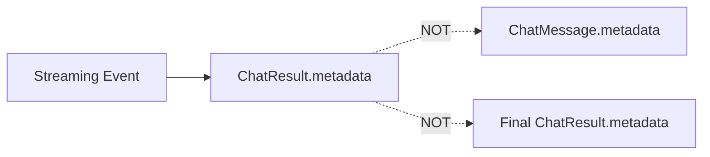

# Server-Side Tools Technical Design

This document describes the architecture and implementation patterns for server-side tools in Dartantic AI providers. Server-side tools are capabilities executed by the provider's infrastructure (not client-side) that stream progress events during execution.

## Table of Contents
1. [Overview](#overview)
2. [Provider Capabilities Summary](#provider-capabilities-summary)
3. [Generic Patterns](#generic-patterns)
   - [Metadata vs Message Output](#metadata-vs-message-output)
   - [Metadata Flow Pattern](#metadata-flow-pattern)
   - [Streaming Events](#streaming-events)
   - [Final Message Metadata](#final-message-metadata)
   - [Synthetic Summary Events](#synthetic-summary-events)
   - [Content Deliverables](#content-deliverables)
4. [Implementation Guidelines](#implementation-guidelines)
5. [OpenAI Responses Provider](#openai-responses-provider)
   - [Configuration](#configuration)
   - [Supported Tools](#supported-tools)
   - [Provider-Specific Details](#provider-specific-details)
6. [Anthropic Claude Provider](#anthropic-claude-provider)
   - [Configuration](#anthropic-configuration)
   - [Supported Tools](#anthropic-supported-tools)
   - [Provider-Specific Details](#anthropic-provider-specific-details)
7. [Google Gemini Provider](#google-gemini-provider)
   - [Configuration](#google-configuration)
   - [Supported Tools](#google-supported-tools)
   - [Provider-Specific Details](#google-provider-specific-details)
8. [Testing Strategy](#testing-strategy)

## Overview

Server-side tools are capabilities provided by AI providers that execute on the provider's infrastructure rather than requiring client-side implementation. Unlike client-side tools (user-defined functions), server-side tools:

- Execute on the provider's infrastructure
- Are configured via provider-specific options
- Stream progress events during execution
- Require standardized metadata handling to expose their operation to applications

This document establishes generic patterns that apply across providers, with provider-specific details documented separately.

## Provider Capabilities Summary

The following table summarizes server-side tool availability across the three major providers:

| Tool | OpenAI Responses | Anthropic Claude | Google Gemini |
|------|------------------|------------------|---------------|
| **Code Execution** | ✅ `codeInterpreter` | ✅ `codeInterpreter` | ✅ `codeExecution` |
| **Web Search** | ✅ `webSearch` | ✅ `webSearch` | ✅ `googleSearch` |
| **Web Fetch** | ❌ | ✅ `webFetch` | ❌ |
| **File/Vector Search** | ✅ `fileSearch` | ❌ | ❌ |
| **Image Generation** | ✅ `imageGeneration` | ❌ | ❌ |

### Feature Comparison

| Feature | OpenAI Responses | Anthropic Claude | Google Gemini |
|---------|------------------|------------------|---------------|
| Container/session reuse | ✅ | ❌ | ❌ |
| Partial image previews | ✅ | ❌ | ❌ |
| File download from sandbox | ✅ | ✅ | ✅ |
| Grounding/citations | ✅ | ✅ | ✅ |

### Configuration Classes

| Provider | Options Class | Server-Side Tools Enum |
|----------|--------------|------------------------|
| OpenAI Responses | `OpenAIResponsesChatModelOptions` | `OpenAIServerSideTool` |
| Anthropic Claude | `AnthropicChatOptions` | `AnthropicServerSideTool` |
| Google Gemini | `GoogleChatModelOptions` | `GoogleServerSideTool` |

## Generic Patterns

The following patterns apply to all providers with server-side tools.


## Metadata vs Message Output

Understanding when server-side tool data appears in **metadata** versus **message output** (parts) is critical:

### The Principle

- **Metadata**: Progress information, intermediate states, tool execution details
- **Message Output**: Final deliverables that are part of the conversation content

### Why This Distinction Matters

Server-side tools often produce both:
1. **Process information**: How the tool executed, what steps it took
2. **Content deliverables**: Actual results that should be part of the message

The distinction ensures:
- Clean separation between "how it happened" (metadata) and "what was produced" (message content)
- Metadata is optional to consume - developers can ignore it if they only care about results
- Message content is always accessible through standard part iteration
- Conversation history remains clean and focused on actual content

### Metadata and Model Context

**Critical**: Metadata is **never** sent to the model. It exists purely for application/developer use. This means:
- ✅ Safe to keep in message history for debugging/transparency
- ✅ Safe to strip from messages before sending to reduce token usage
- ✅ Does not affect model behavior or responses
- ✅ Can contain verbose debugging information without cost

Developers can choose to:
- Keep metadata for full transparency and debugging
- Strip metadata to reduce memory/storage footprint
- Selectively preserve certain metadata fields

### Metadata: Partial/Progress Information

Metadata contains information about tool execution and intermediate states. Typical metadata includes:

- **Progress events**: in_progress, processing, completed
- **Intermediate states**: Partial results, status updates
- **Execution details**: What was searched, code executed, queries run

**Key characteristic**: Metadata is about the **journey** - it shows what the tool is doing or did.

### Message Output: Final Deliverables

Message parts contain final content that is part of the conversation. Content belongs in message parts when:

- The content is a primary deliverable (images, files, documents)
- Users will want to see/save/use it directly
- It should appear in conversation history naturally
- It's standalone content that makes sense without context

**Key characteristic**: Message parts are **deliverables** - they are the actual content being communicated.

### Examples by Tool Type

**Image Generation:**
- Metadata: Progress events, partial preview images
- Message Parts: Final generated image as `DataPart`
- Rationale: The image IS the response content

**Code Execution:**
- Metadata: Execution events, code, logs, results
- Message Parts: Text synthesis only
- Rationale: Code output is contextual, model synthesizes into natural language

**Search (Web/File):**
- Metadata: Search events, queries, results
- Message Parts: Text synthesis only
- Rationale: Search informs the text response

### Decision Matrix: Metadata vs Message Output

Use **message parts** when:
- ✅ The content is a primary deliverable (images, files)
- ✅ Users will want to see/save/use it directly
- ✅ It should appear in conversation history naturally
- ✅ It's standalone content that makes sense without context

Use **metadata** when:
- ✅ Showing tool execution progress/steps
- ✅ Providing debugging/transparency information
- ✅ Offering intermediate states (previews, partial results)
- ✅ Documenting what was searched/executed
- ✅ Content needs context from text to be meaningful

### Consistency Rules

1. **Both during streaming and final**: Structure should be the same
2. **Metadata accumulates**: Each streaming chunk adds to the event list
3. **Parts replace**: Final message parts replace any streaming parts
4. **No duplication**: Don't put the same content in both metadata and parts

## Metadata Flow Pattern

Server-side tool metadata follows a streaming-only pattern:

### Pattern Overview



**Key Principle**: Tool events are ONLY available during streaming, NOT in message metadata.

- **During streaming**: Individual events emitted in `ChatResult.metadata`
- **Message metadata**: Only contains `_responses_session` (for session continuation)
- **Final result metadata**: Only contains response-level info (response_id, model, status)

### Why This Pattern?

1. **No duplication**: Tool events already streamed in real-time, no need to duplicate in message history
2. **Clean message history**: Messages only contain data needed for processing (session info)
3. **Clear separation**: Streaming metadata = transparency/debugging, Message metadata = processing data
4. **Reduced memory**: Large tool event logs don't bloat conversation history

## Streaming Events

### Event Emission During Streaming

When a server-side tool event arrives, it's immediately emitted in the `ChatResult.metadata` as a **single-item list**.

**Algorithm:**
1. Identify the event type and determine which tool it belongs to
2. Convert the event to JSON
3. Wrap the JSON in a single-item list
4. Create a ChatResult with empty output and the list in metadata under the tool's key
5. Yield this chunk to the streaming response

### List Format

**Critical**: Metadata is ALWAYS a list, even during streaming with single events. This ensures:
- Consistent structure between streaming and final results
- Developer code works the same for both cases
- Easy to iterate over events without type checking

```dart
// Developer code works the same for streaming and final:
await for (final chunk in agent.sendStream(prompt)) {
  final events = chunk.metadata['web_search'] as List?;
  if (events != null) {
    for (final event in events) {
      final stage = event['type'];
      print('Stage: $stage');
    }
  }
}
```

### Event Accumulation

Events are accumulated in an internal event log map during streaming for use in final result metadata.

**Algorithm:**
1. Maintain a map with keys for each tool type: 'web_search', 'file_search', 'image_generation', 'local_shell', 'mcp', 'code_interpreter'
2. Each key maps to a list of event objects (JSON maps)
3. When a server-side tool event arrives during streaming:
   - Convert the event to JSON
   - Append to the appropriate tool's list in the map
   - Yield the event in `ChatResult.metadata` for streaming consumers
4. This accumulated log is used ONLY to populate final `ChatResult.metadata` (via `Agent.send()`)

## Final Message Metadata

### Building Message Metadata

Message metadata contains ONLY session information needed for processing.

**Algorithm:**
1. Create a message metadata map
2. Add only `_responses_session` data (response_id for session continuation)
3. **DO NOT** add tool events, thinking, or any other transparency metadata
4. Attach this minimal metadata map to the final ChatMessage

**Rationale**: Tool events were already streamed via `ChatResult.metadata`. Message metadata should only contain data needed for message processing (like session continuation), not transparency/debugging data.

### Result Metadata

**Streaming chunks**: Each `ChatResult.metadata` contains tool events as they arrive

**Final ChatResult.metadata** (from `Agent.send()`): Contains accumulated tool events from all chunks
- Thinking (accumulated from all deltas)
- Tool events (accumulated from all streaming events)
- Response-level info (response_id, model, status)

**Difference from message metadata**: Result metadata provides transparency for non-streaming consumers. Message metadata only contains processing data.

## Synthetic Summary Events

**Status**: NOT used in current implementation

**Previous Design**: The original design added synthetic summary events from `response.output` to message metadata for tools like FileSearch and CodeInterpreter that have additional data not available during streaming.

**Current Implementation**: Tool events are NOT added to message metadata at all. They are only available:
1. During streaming via `ChatResult.metadata`
2. In the final `ChatResult.metadata` (accumulated by `Agent.send()`)

**Rationale**:
- Tool events were already streamed in real-time
- Duplicating them in message metadata creates unnecessary bloat
- Message metadata should only contain data needed for processing (like `_responses_session`)
- Developers who need tool events can access them from `ChatResult.metadata` during streaming or from the final result

This section is retained for historical context and may be reconsidered in future iterations if use cases emerge that require tool event data in conversation history.

## Content Deliverables

Some server-side tools generate content that should appear as message parts, not just metadata.

### When to Create DataParts

Content should be added as a `DataPart` when:
1. It's the primary deliverable of the tool (images, documents, files)
2. It should persist in conversation history
3. Users expect to access it as message content

### Progressive Content (Partial Results)

For tools that support progressive rendering/generation:

**Algorithm:**
1. During streaming, track state:
   - Store partial content indexed by unique identifier (e.g., outputIndex)
   - Each new partial updates the corresponding entry
   - Mark entry as completed when completion event arrives
2. When building the final result:
   - Iterate through all completed entries
   - Decode/process each content item into appropriate format
   - Create a DataPart for each completed item with appropriate MIME type
   - Add all DataParts to the message parts list
3. Wait for completion events - only add DataParts for completed items

### Why DataPart and Not Just Metadata?

1. **Semantic correctness**: Generated content is primary response material, not metadata
2. **Consistency**: Content from all sources should appear as parts
3. **Developer ergonomics**: Standard message part handling works uniformly
4. **History persistence**: Content naturally persists in conversation history

## Implementation Guidelines

### 1. Event Recording

**Algorithm:**
1. When a streaming event arrives, check its type
2. If it's a server-side tool event (web search, image generation, etc.):
   - Convert event to JSON
   - Append to the appropriate tool's list in internal event log
   - Yield a metadata chunk (see next section)

### 2. Metadata Emission

**Algorithm:**
1. Create a ChatResult with:
   - Empty output message (no parts)
   - Empty messages list
   - Metadata containing the event as a single-item list under the tool key
   - Empty usage stats
2. Yield this chunk to the stream

The single-item list format is critical for consistency with final metadata structure.

### 3. Final Metadata Assembly

**Algorithm for Message Metadata:**
1. Create message metadata map
2. Add ONLY `_responses_session` data (for session continuation)
3. **DO NOT** add tool events or thinking
4. Return this minimal map as part of the final ChatMessage

**Algorithm for Result Metadata (Agent.send only):**
1. `Agent.send()` accumulates metadata from all streaming chunks
2. Accumulate thinking from streaming chunks into a buffer
3. Preserve tool event logs from streaming chunks
4. Include response-level info (response_id, model, status)
5. Return complete metadata in final `ChatResult.metadata`

### 4. Content Deliverables

**Algorithm:**
1. During streaming: track partial content and completion status
2. When building final result: check completion flag
3. If completed: process content and add DataPart to message parts

See [Content Deliverables](#content-deliverables) section for details.

### 5. Non-Text Parts in Streamed Responses

**Algorithm:**
1. Check if text was streamed during response
2. If yes:
   - Filter message parts to separate text from non-text parts
   - Create output message with empty parts list (text already streamed)
   - Add output message metadata
   - If non-text parts exist: create separate message with only non-text parts
   - Return result with metadata-only output and non-text parts in messages
3. If no text was streamed:
   - Include all parts (text and non-text) in output message

## Developer Usage Patterns

### Consuming Tool Metadata During Streaming

```dart
await for (final chunk in agent.sendStream(prompt)) {
  if (chunk.output.isNotEmpty) stdout.write(chunk.output);

  // Access tool events (always a list)
  final toolEvents = chunk.metadata['tool_name'] as List?;
  if (toolEvents != null) {
    for (final event in toolEvents) {
      // Process event based on its structure
      final eventType = event['type'] as String?;
      // Handle event...
    }
  }
}
```

### Accessing Complete Tool History (Non-Streaming)

```dart
final result = await agent.send(prompt);

// Tool events are in result.metadata (accumulated by Agent.send)
final toolEvents = result.metadata['tool_name'] as List?;
if (toolEvents != null) {
  for (final event in toolEvents) {
    // Process complete event history
  }
}

// Messages only contain session info, not tool events
final session = result.messages.last.metadata['_responses_session'];
// Use session data for stateful continuation...
```

### Handling Content Deliverables

```dart
await for (final chunk in agent.sendStream(prompt)) {
  // Check for content parts in messages
  for (final msg in chunk.messages) {
    for (final part in msg.parts) {
      if (part is DataPart) {
        // Handle generated content (images, files, etc.)
        processContent(part.bytes, part.mimeType);
      }
    }
  }
}
```

## OpenAI Responses Provider

This section contains OpenAI Responses API specific implementation details. The generic patterns defined above apply here, but this section documents the provider-specific configuration, event types, and behaviors.

Future providers with server-side tools should follow the same generic patterns while documenting their own provider-specific details in separate sections.

### Configuration

Server-side tools are configured when creating an Agent via `OpenAIResponsesChatModelOptions`:

```dart
final agent = Agent(
  'openai-responses:gpt-4o',
  chatModelOptions: OpenAIResponsesChatModelOptions(
    serverSideTools: {
      OpenAIServerSideTool.webSearch,
      OpenAIServerSideTool.imageGeneration,
    },
    webSearchConfig: WebSearchConfig(
      contextSize: WebSearchContextSize.medium,
      location: WebSearchLocation(city: 'Seattle', country: 'US'),
    ),
    imageGenerationConfig: ImageGenerationConfig(
      partialImages: 2,  // Request 2 progressive previews
      quality: ImageGenerationQuality.high,
      size: ImageGenerationSize.square1024,
    ),
  ),
);
```

### Supported Tools

- **Web Search**: Search the web for current information
- **Image Generation**: Generate images using gpt-image-1
- **File Search**: Search through uploaded files/vector stores
- **Code Interpreter**: Execute Python code with file handling
- **MCP (Model Context Protocol)**: Connect to MCP servers
- **Local Shell**: Execute shell commands server-side

**Note**: OpenAI's Responses API also provides a **Computer Use** tool for remote desktop/browser control, but this is currently out of scope for Dartantic and not implemented.

### Tool-Specific Configuration Classes

#### WebSearchConfig
- **contextSize**: Search context size (small, medium, large)
- **location**: User location metadata (city, region, country, timezone)

#### ImageGenerationConfig
- **partialImages**: Number of progressive previews (0-3, default: 0)
- **quality**: Image quality (low, medium, high, auto - default: auto)
- **size**: Image dimensions (square1024, portrait, landscape, etc. - default: auto)

#### FileSearchConfig
- **vectorStoreIds**: List of vector store IDs to search
- **maxResults**: Maximum number of results to return
- **ranker**: Ranking algorithm to use
- **scoreThreshold**: Minimum relevance score

#### CodeInterpreterConfig
- **containerId**: Specific container ID to reuse (enables container persistence)
- **fileIds**: Files to make available in container

**Important**: Container reuse requires explicit configuration:
1. The `container_id` is only returned in metadata when files are created in the container
2. To reuse a container across turns, pass the `containerId` from a previous response
3. Create a new Agent instance with the `containerId` set in `CodeInterpreterConfig`

### Provider-Specific Details

#### Event Types

OpenAI Responses uses event types like:
- `response.web_search_call.in_progress`
- `response.web_search_call.searching`
- `response.web_search_call.completed`
- `response.image_generation_call.partial_image`
- `response.code_interpreter_call.interpreting`

#### Synthetic Summary Events

Tools requiring synthetic events:
- ✅ **FileSearch**: Append `FileSearchCall` (has queries + results)
- ✅ **CodeInterpreter**: Append `CodeInterpreterCall` (has code + results + containerId)
- ❌ **WebSearch**: Ignore `WebSearchCall` (no additional data)
- ❌ **ImageGeneration**: Ignore `ImageGenerationCall` (resultBase64 redundant)
- ❌ **MCP**: Ignore `McpCall` (no additional data)
- ❌ **LocalShell**: Ignore `LocalShellCall` (no additional data)
- 🚫 **ComputerUse**: Not supported (out of scope for Dartantic)

#### Image Generation Details

When `partialImages > 0`, the API streams intermediate render stages:
1. Track each `ResponseImageGenerationCallPartialImage` event
2. Store base64 data indexed by outputIndex (supports multiple concurrent images)
3. Set completion flag on `ResponseImageGenerationCallCompleted` for each outputIndex
4. Add all completed images as DataParts after completion

**Implementation**: The `AttachmentCollector` class manages both image generation and code interpreter file attachments:

- **Images**: Tracked via `Map<int, String> _imagesByIndex` and `Set<int> _completedImageIndices`
  - Maps output index → base64 data
  - Supports multiple concurrent image generation calls
  - Each image tracked independently by its position in the response output array

- **Container Files**: Tracked via `Set<({String containerId, String fileId})> _containerFiles`
  - Uses a Set to automatically handle multiple files without duplication
  - Files are discovered via `ContainerFileCitation` annotations in text content
  - Downloaded asynchronously and converted to DataParts

Both attachment types are resolved in `resolveAttachments()`, which returns all completed images and downloaded container files as a unified list of DataParts.

### Example Usage

#### Web Search

```dart
await for (final chunk in agent.sendStream('What are the latest Dart news?')) {
  final webSearchEvents = chunk.metadata['web_search'] as List?;
  if (webSearchEvents != null) {
    for (final event in webSearchEvents) {
      print('Stage: ${event['type']}');
    }
  }
}
```

#### Image Generation with Previews

```dart
await for (final chunk in agent.sendStream('Generate a logo')) {
  final imageEvents = chunk.metadata['image_generation'] as List?;
  if (imageEvents != null) {
    for (final event in imageEvents) {
      // Save partial images
      if (event['partial_image_b64'] != null) {
        final bytes = base64Decode(event['partial_image_b64']);
        savePreview(bytes, event['partial_image_index']);
      }
    }
  }

  // Final image as DataPart
  for (final msg in chunk.messages) {
    for (final part in msg.parts) {
      if (part is DataPart && part.mimeType.startsWith('image/')) {
        saveFinal(part.bytes);
      }
    }
  }
}
```

#### Code Interpreter

Code execution follows the same pattern as thinking/reasoning:
- **During streaming**: Individual code delta events stream in chunk metadata
- **After streaming**: Single accumulated code delta appears in message metadata

```dart
// Stream code as it's generated
await for (final chunk in agent.sendStream('Calculate fibonacci(100)')) {
  final codeEvents = chunk.metadata['code_interpreter'] as List?;
  if (codeEvents != null) {
    for (final event in codeEvents) {
      // Stream individual code deltas character-by-character if desired
      if (event['type'] == 'response.code_interpreter_call_code.delta') {
        stdout.write(event['delta']);
      }
    }
  }
}

// Extract container_id from metadata (only returned when files are created)
String? extractContainerId(Map<String, dynamic> metadata) {
  final ciEvents = metadata['code_interpreter'] as List?;
  if (ciEvents != null) {
    for (final event in ciEvents) {
      // container_id is nested in event['item']['container_id']
      final item = event['item'];
      if (item is Map && item['container_id'] != null) {
        return item['container_id'] as String;
      }
    }
  }
  return null;
}

// Container reuse across turns requires explicit configuration
final history = <ChatMessage>[];
String? containerId;

// First turn: create a file to get a container_id
final agent1 = Agent(
  'openai-responses',
  chatModelOptions: const OpenAIResponsesChatModelOptions(
    serverSideTools: {OpenAIServerSideTool.codeInterpreter},
  ),
);

await for (final chunk in agent1.sendStream(
  'Calculate fibonacci(10) and write results to fib.txt',
)) {
  history.addAll(chunk.messages);
  containerId ??= extractContainerId(chunk.metadata);
}

// Second turn: reuse container with explicit config
final agent2 = Agent(
  'openai-responses',
  chatModelOptions: OpenAIResponsesChatModelOptions(
    serverSideTools: const {OpenAIServerSideTool.codeInterpreter},
    codeInterpreterConfig: CodeInterpreterConfig(containerId: containerId),
  ),
);

await for (final chunk in agent2.sendStream(
  'Read fib.txt and calculate the sum',
  history: history,
)) {
  // Container is reused - can access files from previous turn
}

// Generated images are automatically attached as DataParts
final result = await agent.send('Create a plot and save it as plot.png');
for (final part in agent.messages.last.parts) {
  if (part is DataPart && part.mimeType.startsWith('image/')) {
    print('Image generated: ${part.bytes.length} bytes');
    // The image bytes are directly available in the message
  }
}
```

**File Generation**: When code interpreter generates files (e.g., via `plt.savefig()`), they are:
1. Referenced via `container_file_citation` events in streaming metadata
2. Automatically downloaded and attached as `DataPart`s in the model's response
3. Citations with zero-length text ranges (start_index == end_index) are filtered out

- Metadata keys follow the constants defined in
  `OpenAIResponsesToolTypes` (for example `image_generation`, `code_interpreter`).
- Tool events are recorded in `EventMappingState.toolEventLog` and surfaced in
  both streaming chunks and the aggregated final metadata.

## Anthropic Claude Provider

Anthropic tooling mirrors the generic patterns with a lighter-weight event
recorder tailored to Claude's SSE payloads.

### Configuration

- Server-side tools can be enabled with the `AnthropicServerSideTool` enum set
  (`serverSideTools`) or via explicit `AnthropicServerToolConfig` entries.
  Dartantic injects the required code execution sandbox automatically for media
  runs.
- Requests remove Anthropic's tool input schemas to avoid `input_schema`
  validation issues when streaming (`_stripServerToolInputSchemas`).
- **Default maxTokens**: Dartantic uses 4096 tokens by default for Anthropic
  requests (matching Anthropic's default for modern Claude models). This is
  sufficient for server-side tool execution. If you override this with a lower
  value, server-side tools may fail to complete their execution cycles.

### Supported Tools

| Tool | Metadata Key | Notes |
|------|--------------|-------|
| Code execution sandbox | `code_execution` | Emits execution events, file IDs, stdout/stderr. |
| Text editor helper | `text_editor_code_execution` | Provides intermediate file edits for the sandbox. |
| Bash execution helper | `bash_code_execution` | Shell commands executed within the code sandbox. |
| Web search | `web_search` | Returns search queries/results and produces external link metadata. |
| Web fetch | `web_fetch` | Streams fetched document metadata/content; delivers document bytes when available. |

Other Anthropic tools (for example computer-use) are wired to fall through the
same event recording pipeline when they become generally available.

### Provider-Specific Details

- **Event Recording**: `MessageStreamEventTransformer` now uses
  `AnthropicEventMappingState` and `_buildToolMetadataChunk` to record every
  tool event. Streaming chunks emit metadata under the relevant tool key, and
  the final `ChatResult.metadata` contains the full aggregated history.
- **Deliverables**: `AnthropicToolDeliverableTracker` handles inline image
  previews, downloads sandbox files via `AnthropicFilesClient`, surfaces web
  search results as `LinkPart`s, and materializes fetched documents as
  `DataPart`s when content is provided. The tracker deduplicates base64
  previews, file downloads, links, and fetched documents, matching the patterns
  used for OpenAI Responses.
- **Fallback Content**: When no explicit document asset is returned, the media
  model synthesizes a PDF summary from accumulated stdout/stderr snippets using
  the shared tracker text buffer.
- **File Downloads**: `AnthropicFilesClient` centralises the Files API access,
  normalising beta headers and error handling so both chat and media layers can
  reuse the client without duplicating HTTP logic.
- **Metadata Output**: Final media results merge the tracker log into
  `MediaGenerationResult.metadata`, ensuring non-streaming consumers see the
  complete tool history without replaying the stream.

### Example Usage

#### Web Search

```dart
final agent = Agent(
  'anthropic',
  chatModelOptions: const AnthropicChatOptions(
    serverSideTools: {AnthropicServerSideTool.webSearch},
  ),
);

await for (final chunk in agent.sendStream(
  'Search for recent Dart programming language announcements',
)) {
  stdout.write(chunk.output);
  // Web search results appear as LinkParts in messages
  for (final msg in chunk.messages) {
    for (final part in msg.parts) {
      if (part is LinkPart) {
        print('Source: ${part.url}');
      }
    }
  }
}
```

#### Web Fetch

```dart
final agent = Agent(
  'anthropic',
  chatModelOptions: const AnthropicChatOptions(
    serverSideTools: {AnthropicServerSideTool.webFetch},
  ),
);

final history = <ChatMessage>[];
await for (final chunk in agent.sendStream(
  'Retrieve https://example.com and summarize its content',
)) {
  stdout.write(chunk.output);
  history.addAll(chunk.messages);
}

// Fetched document bytes appear as DataParts
for (final msg in history) {
  for (final part in msg.parts) {
    if (part is DataPart) {
      print('Fetched: ${part.name} (${part.mimeType})');
      // Save or process the fetched document bytes
    }
  }
}
```

#### Code Execution

```dart
final agent = Agent(
  'anthropic',
  chatModelOptions: const AnthropicChatOptions(
    serverSideTools: {AnthropicServerSideTool.codeInterpreter},
  ),
);

final history = <ChatMessage>[];
await for (final chunk in agent.sendStream(
  'Calculate the first 10 Fibonacci numbers and create a CSV file',
)) {
  stdout.write(chunk.output);
  history.addAll(chunk.messages);
}

// Generated files are automatically downloaded and appear as DataParts
for (final msg in history) {
  for (final part in msg.parts) {
    if (part is DataPart) {
      print('Generated: ${part.name} (${part.bytes.length} bytes)');
    }
  }
}
```

## Google Gemini Provider

Google Gemini provides server-side tools through the Gemini API, offering code
execution and Google Search grounding capabilities.

### Configuration

Server-side tools are configured when creating an Agent via `GoogleChatModelOptions`:

```dart
final agent = Agent(
  'google',
  chatModelOptions: const GoogleChatModelOptions(
    serverSideTools: {
      GoogleServerSideTool.codeExecution,
      GoogleServerSideTool.googleSearch,
    },
  ),
);
```

### Supported Tools

| Tool | Enum Value | Description |
|------|------------|-------------|
| Code Execution | `codeExecution` | Python sandbox for code execution |
| Google Search | `googleSearch` | Web search with grounding |

### Provider-Specific Details

#### Code Execution Capabilities

Google's code execution supports generating arbitrary files:

- **Full file generation**: Code execution can create any file type including
  CSVs, PDFs, text files, images, and more. All generated files are returned
  as `DataPart`s.
- **No container persistence**: Unlike OpenAI Responses, there's no way to reuse
  a container/session across turns. Each request runs in a fresh sandbox.
- **Inline images**: Matplotlib plots and other images appear as inline data
  in the response, automatically converted to `DataPart`s.

#### Google Search (Grounding)

Google Search provides web grounding for responses:

- Results are integrated into the model's response
- Grounding metadata includes source URLs and citations
- No separate metadata key - grounding is embedded in response

### Example Usage

#### Code Execution

```dart
final agent = Agent(
  'google',
  chatModelOptions: const GoogleChatModelOptions(
    serverSideTools: {GoogleServerSideTool.codeExecution},
  ),
);

final history = <ChatMessage>[];
await for (final chunk in agent.sendStream(
  'Calculate the first 10 Fibonacci numbers and create a CSV file '
  'called "fibonacci.csv" with two columns: index and value.',
)) {
  stdout.write(chunk.output);
  history.addAll(chunk.messages);
}

// Generated files appear as DataParts (CSV, images, PDFs, etc.)
for (final msg in history) {
  for (final part in msg.parts) {
    if (part is DataPart) {
      print('Generated: ${part.name} (${part.mimeType}, ${part.bytes.length} bytes)');
    }
  }
}
```

#### Google Search

```dart
final agent = Agent(
  'google',
  chatModelOptions: const GoogleChatModelOptions(
    serverSideTools: {GoogleServerSideTool.googleSearch},
  ),
);

await for (final chunk in agent.sendStream(
  'What are the most recent announcements about the Dart '
  'programming language?',
)) {
  stdout.write(chunk.output);
  // Response includes grounded information from web search
}
```

## Testing Strategy

### Unit Tests

1. **Event recording**: Verify events are added to internal event log
2. **Metadata emission**: Check streaming chunks have events as single-item lists
3. **Message metadata**: Verify messages only contain `_responses_session`, NOT tool events
4. **Result metadata accumulation**: Verify `Agent.send()` accumulates tool events in result.metadata
5. **Image DataPart**: Confirm final image appears as DataPart when completed

### Integration Tests

1. **Web search flow**: Test streaming events appear in `ChatResult.metadata`
2. **Image generation**: Test partial images in streaming metadata + final DataPart
3. **File search**: Test streaming events contain search results
4. **Code interpreter**: Test streaming code deltas + container reuse
5. **Multiple tools**: Test multiple server-side tools in one response

### Test Structure

Tests should verify:
- Streaming chunks contain single-item event lists in `ChatResult.metadata`
- Final `ChatResult.metadata` (from `Agent.send()`) contains accumulated events
- Message metadata contains ONLY `_responses_session`, NOT tool events
- Event types match expected progression for the provider
- Content deliverables appear as DataPart in message parts
- Session continuation works via `_responses_session` in message metadata

## Related Documentation

- [Message Handling Architecture](Message-Handling-Architecture.md) - Core message patterns
- [OpenAI Responses Provider Requirements](../plans/openai-responses-provider/responses-provider-requirements.md) - Feature requirements
- [OpenAI Responses Provider Technical Design](../plans/openai-responses-provider/responses-provider-tech-design.md) - Implementation details
- [State Management Architecture](State-Management-Architecture.md) - Session persistence patterns
