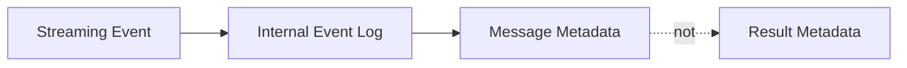

# Server-Side Tools Technical Design

This document describes the architecture and implementation patterns for server-side tools in the OpenAI Responses provider, including web search, image generation, file search, code interpreter, computer use, MCP, and local shell.

## Table of Contents
1. [Overview](#overview)
2. [Configuration](#configuration)
3. [Metadata vs Message Output](#metadata-vs-message-output)
4. [Metadata Flow Pattern](#metadata-flow-pattern)
5. [Streaming Events](#streaming-events)
6. [Final Message Metadata](#final-message-metadata)
7. [Synthetic Summary Events](#synthetic-summary-events)
8. [Image Generation Special Handling](#image-generation-special-handling)
9. [Implementation Guidelines](#implementation-guidelines)

## Overview

Server-side tools are capabilities provided by the OpenAI Responses API that execute on the server rather than requiring client-side implementation. Unlike client-side tools (user-defined functions), server-side tools are:

- Executed by OpenAI's infrastructure
- Configured via the `serverSideTools` option
- Stream progress events during execution
- Require special metadata handling to expose their operation to applications

### Supported Tools

- **Web Search**: Search the web for current information
- **Image Generation**: Generate images using gpt-image-1
- **File Search**: Search through uploaded files/vector stores
- **Code Interpreter**: Execute Python code with file handling
- **Computer Use**: Control a remote desktop environment
- **MCP (Model Context Protocol)**: Connect to MCP servers
- **Local Shell**: Execute shell commands server-side

## Configuration

### Agent-Level Configuration

Server-side tools are configured when creating an Agent via `OpenAIResponsesChatModelOptions`:

```dart
final agent = Agent(
  'openai-responses:gpt-4o',
  chatModelOptions: OpenAIResponsesChatModelOptions(
    serverSideTools: {
      OpenAIServerSideTool.webSearch,
      OpenAIServerSideTool.imageGeneration,
    },
    webSearchConfig: WebSearchConfig(
      contextSize: WebSearchContextSize.medium,
      location: WebSearchLocation(city: 'Seattle', country: 'US'),
    ),
    imageGenerationConfig: ImageGenerationConfig(
      partialImages: 2,  // Request 2 progressive previews
      quality: ImageGenerationQuality.high,
      size: ImageGenerationSize.square1024,
    ),
  ),
);
```

### Tool-Specific Configuration Classes

Each tool that supports configuration has a dedicated config class:

#### WebSearchConfig
- **contextSize**: Search context size (small, medium, large)
- **location**: User location metadata (city, region, country, timezone)

#### ImageGenerationConfig
- **partialImages**: Number of progressive previews (0-3, default: 0)
- **quality**: Image quality (low, medium, high, auto - default: auto)
- **size**: Image dimensions (square1024, portrait, landscape, etc. - default: auto)

#### FileSearchConfig
- **vectorStoreIds**: List of vector store IDs to search
- **maxResults**: Maximum number of results to return
- **ranker**: Ranking algorithm to use
- **scoreThreshold**: Minimum relevance score

#### CodeInterpreterConfig
- **shouldReuseContainer**: Whether to reuse previous container
- **containerId**: Specific container ID to reuse
- **fileIds**: Files to make available in container

#### ComputerUseConfig
- **displayWidth**: Virtual display width
- **displayHeight**: Virtual display height
- **environment**: Desktop environment configuration

### Design Principles for Config Classes

1. **Non-nullable with sensible defaults**: All config fields have default values to avoid null checks
2. **Type-safe enums**: Use enums for well-known option sets (quality, size, etc.)
3. **Model parameter excluded**: Model selection is handled by Agent, not tool configs
4. **Immutable**: All config classes are `@immutable` with `final` fields

## Metadata vs Message Output

Understanding when server-side tool data appears in **metadata** versus **message output** (parts) is critical:

### The Principle

- **Metadata**: Progress information, intermediate states, tool execution details
- **Message Output**: Final deliverables that are part of the conversation content

### Why This Distinction Matters

Server-side tools often produce both:
1. **Process information**: How the tool executed, what steps it took
2. **Content deliverables**: Actual results that should be part of the message

The distinction ensures:
- Clean separation between "how it happened" (metadata) and "what was produced" (message content)
- Metadata is optional to consume - developers can ignore it if they only care about results
- Message content is always accessible through standard part iteration
- Conversation history remains clean and focused on actual content

### Metadata: Partial/Progress Information

Metadata contains information about tool execution and intermediate states:

| Tool | Metadata Contains | Purpose |
|------|------------------|---------|
| Web Search | in_progress, searching, completed events | Show search progress to user |
| Image Generation | in_progress, generating, partial_image events | Show rendering progress, intermediate previews |
| File Search | in_progress, searching, completed events, queries, results | Show search progress and what was found |
| Code Interpreter | in_progress, interpreting, completed events, code, logs | Show execution progress and steps |
| Computer Use | in_progress, screenshot events, action events | Show UI automation progress |

**Key characteristic**: Metadata is about the **journey** - it shows what the tool is doing or did.

### Message Output: Final Deliverables

Message parts contain final content that is part of the conversation:

| Tool | Message Parts Contain | Why It's a Part |
|------|----------------------|----------------|
| Image Generation | `DataPart` with final image bytes | The image IS the response content |
| Computer Use | `DataPart` with screenshots (sometimes) | Visual evidence of actions |
| Code Interpreter | (Text only, results in metadata) | Code output is contextual, not primary content |
| Web Search | (Text only, no parts) | Search results inform the text response |
| File Search | (Text only, no parts) | Search results inform the text response |

**Key characteristic**: Message parts are **deliverables** - they are the actual content being communicated.

### Image Generation: Detailed Example

Image generation demonstrates both clearly:

#### Metadata (Progress):
```dart
// During streaming:
chunk.metadata['image_generation'] = [
  {'type': 'response.image_generation_call.in_progress', ...},
  {'type': 'response.image_generation_call.generating', ...},
  {'type': 'response.image_generation_call.partial_image',
   'partial_image_b64': '<base64>', 'partial_image_index': 0},  // Preview #1
  {'type': 'response.image_generation_call.partial_image',
   'partial_image_b64': '<base64>', 'partial_image_index': 1},  // Preview #2
]

// Final message:
message.metadata['image_generation'] = [
  // All events above, plus:
  {'type': 'response.image_generation_call.completed', ...},
]
```

**Purpose**: Show generation progress, allow saving intermediate previews

#### Message Output (Final Deliverable):
```dart
// Final message:
message.parts = [
  TextPart('Here is the logo for NeuralFlow.'),
  DataPart(imageBytes, mimeType: 'image/png', name: 'image.png'),  // THE actual image
]
```

**Purpose**: The image is the primary content - it should be in the message for history/display

#### Developer Usage Pattern:
```dart
await for (final chunk in agent.sendStream('Generate a logo')) {
  // Show progress (optional):
  final events = chunk.metadata['image_generation'] as List?;
  if (events != null) {
    for (final event in events) {
      if (event['partial_image_b64'] != null) {
        // Show preview to user
        displayPreview(base64Decode(event['partial_image_b64']));
      }
    }
  }

  // Get final image (required):
  for (final msg in chunk.messages) {
    for (final part in msg.parts) {
      if (part is DataPart && part.mimeType.startsWith('image/')) {
        // This is the actual deliverable
        saveImage(part.bytes);
        displayFinal(part.bytes);
      }
    }
  }
}
```

### Code Interpreter: Counter-Example

Code interpreter does NOT put output in message parts because:
- The code and logs are contextual information, not primary content
- The model's text response synthesizes the results into a natural answer
- Raw code output would clutter the conversation history

```dart
// Code interpreter results stay in metadata:
message.metadata['code_interpreter'] = [
  {..., 'type': 'code_interpreter_call', 'code': '...', 'results': [{logs: '...'}]}
]

// The message parts contain only the synthesized response:
message.parts = [
  TextPart('The result is 354224848179261915075'),  // Synthesized from code output
]
```

### Decision Matrix: Metadata vs Message Output

Use **message parts** when:
- ✅ The content is a primary deliverable (images, files)
- ✅ Users will want to see/save/use it directly
- ✅ It should appear in conversation history naturally
- ✅ It's standalone content that makes sense without context

Use **metadata** when:
- ✅ Showing tool execution progress/steps
- ✅ Providing debugging/transparency information
- ✅ Offering intermediate states (previews, partial results)
- ✅ Documenting what was searched/executed
- ✅ Content needs context from text to be meaningful

### Consistency Rules

1. **Both during streaming and final**: Structure should be the same
2. **Metadata accumulates**: Each streaming chunk adds to the event list
3. **Parts replace**: Final message parts replace any streaming parts
4. **No duplication**: Don't put the same content in both metadata and parts

## Metadata Flow Pattern

Server-side tool metadata follows the same pattern as thinking/reasoning metadata:

### Pattern Overview



This mirrors the thinking pattern:
- **During streaming**: Individual events emitted in `ChatResult.metadata`
- **Final result**: Complete event list in `ChatMessage.metadata`
- **Result metadata**: Does NOT include tool events (only response_id, model, status)

### Why This Pattern?

1. **Consistency**: Matches the established thinking metadata pattern
2. **Accessibility**: Tool events are part of the conversation history
3. **Developer ergonomics**: Same structure during streaming and in final message
4. **Separation of concerns**: Result metadata is for response-level info, message metadata is for content-level info

## Streaming Events

### Event Emission During Streaming

When a server-side tool event arrives, it's immediately emitted in the `ChatResult.metadata` as a **single-item list**.

**Algorithm:**
1. Identify the event type and determine which tool it belongs to
2. Convert the event to JSON
3. Wrap the JSON in a single-item list
4. Create a ChatResult with empty output and the list in metadata under the tool's key
5. Yield this chunk to the streaming response

### List Format

**Critical**: Metadata is ALWAYS a list, even during streaming with single events. This ensures:
- Consistent structure between streaming and final results
- Developer code works the same for both cases
- Easy to iterate over events without type checking

```dart
// Developer code works the same for streaming and final:
await for (final chunk in agent.sendStream(prompt)) {
  final events = chunk.metadata['web_search'] as List?;
  if (events != null) {
    for (final event in events) {
      final stage = event['type'];
      print('Stage: $stage');
    }
  }
}
```

### Event Accumulation

Events are accumulated in an internal event log map that tracks events for each tool type (web_search, file_search, image_generation, etc.).

**Algorithm:**
1. Maintain a map with keys for each tool type: 'web_search', 'file_search', 'image_generation', 'computer_use', 'local_shell', 'mcp', 'code_interpreter'
2. Each key maps to a list of event objects (JSON maps)
3. When a server-side tool event arrives during streaming:
   - Convert the event to JSON
   - Append to the appropriate tool's list in the map
4. This accumulated log is used to build the final message metadata

## Final Message Metadata

### Building Message Metadata

When building the final result, complete event lists are copied from the internal event log to the message metadata.

**Algorithm:**
1. Create a message metadata map
2. If thinking/reasoning was captured, add it under 'thinking' key
3. Iterate through the internal event log map
4. For each tool that has non-empty event lists:
   - Copy the entire event list to message metadata under the tool's key
5. Attach this metadata map to the final ChatMessage

### Result Metadata (Does NOT Include Tool Events)

The `ChatResult.metadata` contains only response-level information (response_id, model, status). Tool events do NOT appear here - they only appear in the message metadata. This separation maintains clear distinction between response-level metadata and content-level metadata.

## Synthetic Summary Events

### Problem: Missing Data in Streaming Events

Some tools have additional data in `response.output` items that isn't available during streaming:

| Tool | Streaming Events Have | response.output Adds |
|------|----------------------|---------------------|
| WebSearch | Progress stages | Nothing (just id/status) |
| ImageGeneration | Partial images | resultBase64 (redundant) |
| FileSearch | Progress stages | **queries, results** |
| CodeInterpreter | Progress stages | **code, results, containerId** |
| ComputerUse | Screenshots, actions | Nothing |
| MCP | Progress stages | Nothing |
| LocalShell | Command, output | Nothing |

### Solution: Append Synthetic Events

For tools with additional data (FileSearch and CodeInterpreter), append the `response.output` item as a synthetic final event to the message metadata.

**Algorithm:**
1. After all streaming events have been processed
2. Iterate through `response.output` items
3. For FileSearchCall items:
   - Create synthetic event with type: 'file_search_call'
   - Include id, queries, results, and status from the call
   - Append to the 'file_search' event list in message metadata
4. For CodeInterpreterCall items:
   - Create synthetic event with type: 'code_interpreter_call'
   - Include id, code, results, containerId, and status from the call
   - Append to the 'code_interpreter' event list in message metadata
5. Ignore all other output item types (no additional data beyond streaming events)

### Final Metadata Structure

The complete event list includes both streaming events and the synthetic summary:

```dart
metadata['code_interpreter'] = [
  {'type': 'response.code_interpreter_call.in_progress', 'item_id': '...', ...},
  {'type': 'response.code_interpreter_call.interpreting', 'item_id': '...', ...},
  {'type': 'response.code_interpreter_call.completed', 'item_id': '...', ...},
  {'type': 'code_interpreter_call', 'id': '...', 'code': '...', 'results': [...], 'status': {...}},  // Synthetic
]
```

### Which Tools Need Synthetic Events?

- ✅ **FileSearch**: Append `FileSearchCall` (has queries + results)
- ✅ **CodeInterpreter**: Append `CodeInterpreterCall` (has code + results + containerId)
- ❌ **WebSearch**: Ignore `WebSearchCall` (no additional data)
- ❌ **ImageGeneration**: Ignore `ImageGenerationCall` (resultBase64 redundant with partial image handling)
- ❌ **ComputerUse**: Ignore `ComputerCall` (no additional data)
- ❌ **MCP**: Ignore `McpCall` (no additional data)
- ❌ **LocalShell**: Ignore `LocalShellCall` (no additional data)

## Image Generation Special Handling

Image generation has unique requirements beyond standard metadata:

### Progressive Rendering (Partial Images)

When `partialImages > 0`, the API streams intermediate render stages as events. Each partial image event includes base64-encoded image data and an index. The sequence progresses from in_progress → generating → partial_image (possibly multiple times) → completed.

### Final Image as DataPart

The last partial image is added to the final message as a `DataPart`.

**Algorithm:**
1. During streaming, track state:
   - Store the base64 data and index from each `ResponseImageGenerationCallPartialImage` event
   - Each new partial image overwrites the previous one
   - Set a completion flag when `ResponseImageGenerationCallCompleted` event arrives
2. When building the final result:
   - Check if image generation completed AND we have partial image data
   - If yes: decode the last partial image base64 to bytes
   - Create a DataPart with the bytes, mimeType 'image/png', and name including the image index
   - Add the DataPart to the message parts list
3. The completion event is critical - only add DataPart after receiving it to ensure we have the truly final image

### Why DataPart and Not Just Metadata?

1. **Semantic correctness**: Generated images are primary response content, not metadata
2. **Consistency**: Images from vision models appear as parts, so generated images should too
3. **Developer ergonomics**: Standard message part handling works for all images
4. **History persistence**: Images naturally persist in conversation history

### Completion Event is Critical

Only add the DataPart after seeing `ResponseImageGenerationCallCompleted`. This ensures:
- We have the truly final image (last partial)
- We don't add incomplete/intermediate renders as the "final" image
- Proper synchronization between streaming and final result

## Implementation Guidelines

### 1. Event Recording

**Algorithm:**
1. When a streaming event arrives, check its type
2. If it's a server-side tool event (web search, image generation, etc.):
   - Convert event to JSON
   - Append to the appropriate tool's list in internal event log
   - Yield a metadata chunk (see next section)

### 2. Metadata Emission

**Algorithm:**
1. Create a ChatResult with:
   - Empty output message (no parts)
   - Empty messages list
   - Metadata containing the event as a single-item list under the tool key
   - Empty usage stats
2. Yield this chunk to the stream

The single-item list format is critical for consistency with final metadata structure.

### 3. Final Metadata Assembly

**Algorithm:**
1. Create message metadata map
2. Add thinking metadata if present
3. For each tool in event log with non-empty events:
   - Copy complete event list to message metadata
4. Return this map as part of the final ChatMessage

### 4. Synthetic Event Appending

**Algorithm:**
1. After all streaming events processed
2. Iterate through `response.output` items
3. For FileSearchCall: append synthetic event to 'file_search' list
4. For CodeInterpreterCall: append synthetic event to 'code_interpreter' list
5. Ignore all other item types

See [Synthetic Summary Events](#synthetic-summary-events) section for detailed algorithm.

### 5. Image Generation DataPart

**Algorithm:**
1. During streaming: track last partial image base64, index, and completion status
2. When building final result: check completion flag
3. If completed: decode base64 to bytes and add DataPart to message parts

See [Image Generation Special Handling](#image-generation-special-handling) section for detailed algorithm.

### 6. Non-Text Parts in Streamed Responses

**Algorithm:**
1. Check if text was streamed during response
2. If yes:
   - Filter message parts to separate text from non-text parts
   - Create output message with empty parts list (text already streamed)
   - Add output message metadata
   - If non-text parts exist: create separate message with only non-text parts
   - Return result with metadata-only output and non-text parts in messages
3. If no text was streamed:
   - Include all parts (text and non-text) in output message

## Example: Developer Usage

### Handling Web Search Events

```dart
await for (final chunk in agent.sendStream('What are the latest Dart news?')) {
  if (chunk.output.isNotEmpty) stdout.write(chunk.output);

  final webSearchEvents = chunk.metadata['web_search'] as List?;
  if (webSearchEvents != null) {
    for (final event in webSearchEvents) {
      final stage = event['type'] as String;
      print('Web search: $stage');
    }
  }
}
```

### Accessing Complete History

```dart
final result = await agent.send('What are the latest Dart news?');
final history = agent.messages;
final lastMessage = history.last;

final webSearchEvents = lastMessage.metadata['web_search'] as List?;
if (webSearchEvents != null) {
  print('Complete web search flow:');
  for (final event in webSearchEvents) {
    print('  - ${event['type']}');
  }
}
```

### Image Generation with Progressive Previews

```dart
await for (final chunk in agent.sendStream('Generate a logo')) {
  if (chunk.output.isNotEmpty) stdout.write(chunk.output);

  final imageEvents = chunk.metadata['image_generation'] as List?;
  if (imageEvents != null) {
    for (final event in imageEvents) {
      final stage = event['type'] as String;
      print('Image generation: $stage');

      // Save partial images during generation
      if (event['partial_image_b64'] != null) {
        final bytes = base64Decode(event['partial_image_b64']);
        File('partial_${event['partial_image_index']}.png').writeAsBytesSync(bytes);
      }
    }
  }

  // Final image arrives as DataPart in message
  for (final msg in chunk.messages) {
    for (final part in msg.parts) {
      if (part is DataPart && part.mimeType.startsWith('image/')) {
        File('final_image.png').writeAsBytesSync(part.bytes);
      }
    }
  }
}
```

### Code Interpreter with Results

```dart
final result = await agent.send('Calculate fibonacci(100)');
final lastMessage = agent.messages.last;

final codeEvents = lastMessage.metadata['code_interpreter'] as List?;
if (codeEvents != null) {
  // Last event is the synthetic summary with code and results
  final summary = codeEvents.last;
  print('Code executed:\n${summary['code']}');

  final results = summary['results'] as List?;
  if (results != null) {
    for (final result in results) {
      if (result['type'] == 'logs') {
        print('Output: ${result['logs']}');
      }
    }
  }
}
```

## Testing Strategy

### Unit Tests

1. **Event recording**: Verify events are added to internal event log
2. **Metadata emission**: Check streaming chunks have events as single-item lists
3. **Final metadata**: Ensure complete event lists appear in message metadata
4. **Synthetic events**: Verify FileSearch/CodeInterpreter summaries are appended
5. **Image DataPart**: Confirm final image appears as DataPart when completed

### Integration Tests

1. **Web search flow**: Test full streaming + final metadata
2. **Image generation**: Test partial images + final DataPart
3. **File search**: Test streaming events + synthetic summary
4. **Code interpreter**: Test streaming + code/results in summary
5. **Multiple tools**: Test multiple server-side tools in one response

### Test Structure

Tests should verify:
- Streaming chunks contain single-item event lists for each tool event
- Final result contains complete accumulated event lists in message metadata
- Event types match expected progression (in_progress → specific stages → completed)
- Synthetic events are properly appended for FileSearch and CodeInterpreter
- Generated images appear as DataPart in message parts
- Result metadata does NOT contain tool events (only response-level metadata)

## Related Documentation

- [Message Handling Architecture](Message-Handling-Architecture.md) - Core message patterns
- [OpenAI Responses Provider Requirements](../plans/openai-responses-provider/responses-provider-requirements.md) - Feature requirements
- [OpenAI Responses Provider Technical Design](../plans/openai-responses-provider/responses-provider-tech-design.md) - Implementation details
- [State Management Architecture](State-Management-Architecture.md) - Session persistence patterns