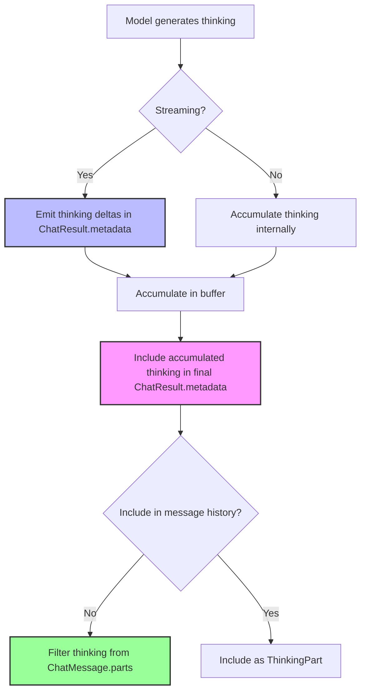
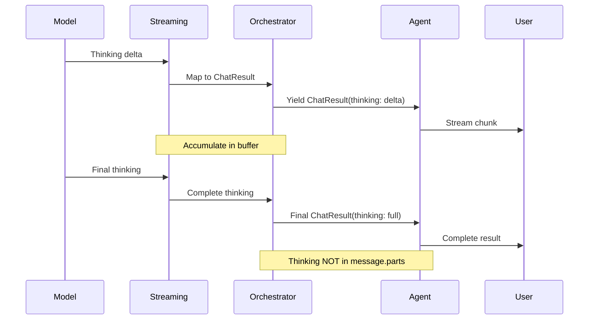

# Thinking (Extended Reasoning) Technical Design

This document describes how Dartantic AI exposes LLM reasoning/thinking capabilities across different providers. "Thinking" or "extended reasoning" refers to models showing their internal reasoning process before providing a final answer.

## Table of Contents
1. [Overview](#overview)
2. [Generic Architecture](#generic-architecture)
3. [Provider Implementations](#provider-implementations)
   - [OpenAI Responses](#openai-responses)
   - [Anthropic](#anthropic)
4. [Usage Patterns](#usage-patterns)
5. [Testing Strategy](#testing-strategy)
6. [Implementation Guidelines](#implementation-guidelines)

## Overview

### What is Thinking?

Thinking (also called "extended reasoning" or "chain-of-thought") is a capability where LLMs expose their internal reasoning process before generating a final response. This provides:

- **Transparency**: See how the model approaches problems
- **Debugging**: Understand why models give certain answers
- **Quality**: Models often produce better answers when "thinking out loud"
- **Education**: Learn problem-solving approaches from the model

### Supported Providers

| Provider | Capability | Status | Configuration |
|----------|-----------|--------|---------------|
| OpenAI Responses | Reasoning Summary | ✅ Implemented | Agent-level `enableThinking` + optional `reasoningSummary` |
| Anthropic | Extended Thinking | ✅ Implemented | Agent-level `enableThinking` + optional `thinkingBudgetTokens` |
| Google | Extended Thinking | ✅ Implemented | Agent-level `enableThinking` + optional `thinkingBudgetTokens` |
| Others | N/A | ❌ Not supported | - |

## Generic Architecture

### The Thinking Pattern

Dartantic AI follows a consistent pattern for thinking across all providers:



### Core Principles

1. **Agent-Level Configuration**: Thinking is enabled via `enableThinking: true` parameter at the Agent constructor level, not in provider-specific options
2. **Dedicated Surface**: Thinking appears in `ChatResult.thinking`, not as a primary message part
3. **Streaming Transparency**: During streaming, thinking deltas are emitted through the `thinking` field as they arrive
4. **Accumulation**: The agent accumulator concatenates all streamed deltas and exposes the full thinking text in the final result
5. **History Isolation**: Thinking is typically NOT sent back to the model in conversation history
   - **Exception**: Anthropic requires thinking blocks (with signatures) to be preserved when tool calls are present
   - This is handled transparently by the provider implementation via `_anthropic_thinking_block` metadata
   - Users pay for thinking tokens on every turn when using tools with Anthropic
6. **Provider-Specific Fine-Tuning**: Options classes (e.g., `AnthropicChatOptions`, `GoogleChatModelOptions`) contain only provider-specific tuning parameters like token budgets, not the enable flag
7. **Provider Agnostic**: Same consumption pattern works across all providers

### Metadata Flow



### Key Differences from Message Content

| Aspect | Message Content | Thinking Field |
|--------|----------------|----------------|
| Location | `ChatMessage.parts` | `ChatResult.thinking` |
| Sent to Model | ✅ Yes | ❌ No (by default) |
| Purpose | Conversation content | Transparency/debugging |
| Streaming | Text deltas | Thinking deltas |
| Accumulation | In message accumulator | In thinking buffer |
| History | Persists | Optional (usually filtered) |

## Provider Implementations

### OpenAI Responses

OpenAI's Responses API supports reasoning through the `reasoning` parameter and exposes it via streaming events.

#### Configuration

```dart
import 'package:dartantic_ai/dartantic_ai.dart';

// Simple configuration - enable thinking with default settings
final agent = Agent(
  'openai-responses:gpt-5',
  enableThinking: true,  // Automatically uses reasoningSummary: detailed
);

// Advanced configuration - customize reasoning options
final agentAdvanced = Agent(
  'openai-responses:gpt-5',
  enableThinking: true,
  chatModelOptions: const OpenAIResponsesChatModelOptions(
    reasoningSummary: OpenAIReasoningSummary.brief,  // Override default
    reasoningEffort: OpenAIReasoningEffort.high,
  ),
);
```

#### Reasoning Summary Options

```dart
enum OpenAIReasoningSummary {
  /// Brief reasoning summary (fastest)
  brief,

  /// Detailed reasoning summary (more comprehensive)
  detailed,

  /// Provider decides the verbosity level
  auto,
}
```

#### Implementation Details

**Streaming Events**: `ResponseReasoningSummaryTextDelta`

```dart
// In ReasoningEventHandler
Stream<ChatResult<ChatMessage>> _handleReasoningSummaryDelta(
  openai.ResponseReasoningSummaryTextDelta event,
  EventMappingState state,
) async* {
  // Accumulate in buffer
  state.thinkingBuffer.write(event.delta);

  // Emit as thinking chunk
  yield ChatResult<ChatMessage>(
    output: const ChatMessage(role: ChatMessageRole.model, parts: []),
    messages: const [],
    thinking: event.delta,
    usage: null,
  );
}
```

**Final Result**: Thinking accumulated in `ChatResult.thinking` but NOT in message parts.

**Token Accounting**:
- OpenAI charges for full reasoning tokens generated
- Reasoning tokens reported separately in usage
- Token budget controlled by model, not user-configurable

**Signature**: No cryptographic signature provided

**Implementation Note**: Unlike Anthropic and Google, OpenAI Responses does not store the `enableThinking` flag in the ChatModel. Instead, the Provider merges thinking configuration into the options object before creating the ChatModel. This allows for more granular control through the options-based reasoning configuration.

#### Message Handling

```dart
// Thinking is NOT included in message parts
final message = ChatMessage(
  role: ChatMessageRole.model,
  parts: [
    TextPart(text: finalAnswer),  // Only the answer, not the thinking
  ],
);

// Thinking available in result metadata
final result = ChatResult(
  output: message,
  messages: [message],
  metadata: {
    'thinking': accumulatedThinkingText,  // Full reasoning
  },
);
```

### Anthropic

Anthropic's Messages API supports extended thinking through the `thinking` parameter with explicit token budget control.

#### Configuration

```dart
import 'package:dartantic_ai/dartantic_ai.dart';

// Simple configuration - enable thinking with default budget (4096 tokens)
final agent = Agent(
  'anthropic:claude-sonnet-4-5',
  enableThinking: true,
);

// Advanced configuration - customize token budget
final agentCustomBudget = Agent(
  'anthropic:claude-sonnet-4-5',
  enableThinking: true,
  chatModelOptions: const AnthropicChatOptions(
    thinkingBudgetTokens: 8192,  // Optional: override default budget
  ),
);
```

#### Implementation Details

**SDK Support**: `anthropic_sdk_dart` v0.3.0+ includes full thinking support

**Content Blocks**: Anthropic includes thinking as `Block.thinking()` in message content:

```dart
// Anthropic's native format includes thinking in content
Block.thinking(
  type: ThinkingBlockType.thinking,
  thinking: "Let me think through this step by step...",
  signature: "optional_cryptographic_signature",
  cacheControl: null,
)
```

**Streaming Events**: `BlockDelta.thinking()`

```dart
// In MessageStreamEventTransformer
BlockDelta.thinking(
  thinking: "Step 1: Analyze the problem...",
  type: ThinkingBlockDeltaType.thinkingDelta,
)
```

**Dartantic Mapping Strategy**:

Despite Anthropic including thinking in message content, Dartantic follows the established pattern with one important exception:

1. **During streaming**: Extract thinking deltas and emit via `ChatResult.thinking`
2. **After completion**: Accumulate full thinking in result metadata
3. **In message history**: Thinking blocks are preserved in metadata when tool calls are present

⚠️ **Important**: When a response includes both thinking and tool calls, the thinking block is preserved in the message structure and sent back in subsequent turns. This is required by Anthropic's API to maintain proper context for multi-turn tool usage. Users are charged for these thinking tokens on every turn.

**Implementation Flow**:

The Anthropic message mapper handles thinking through the following high-level flow:

1. **Streaming Phase**:
   - Accumulate thinking deltas in a buffer as `ThinkingBlockDelta` events arrive
   - Emit each delta through `ChatResult.thinking` for real-time display
   - Capture the cryptographic signature from the `ThinkingBlock.start` event

2. **Completion Phase**:
   - Store accumulated thinking text and signature in message metadata
   - When tool calls are present, preserve the complete thinking block data
   - Filter thinking blocks from message parts for regular (non-tool) responses

3. **History Reconstruction**:
   - When sending messages back to Anthropic, check for thinking block metadata
   - If present and tool calls exist, reconstruct the `Block.thinking()` with original signature
   - Place thinking block before tool_use blocks (required by Anthropic's API)

See `anthropic_message_mappers.dart` for the complete implementation.

**Token Accounting**:
- Thinking tokens count toward `max_tokens` limit
- User charged for full thinking tokens generated (not the summary)
- Explicit budget control via `budgetTokens` parameter
- Minimum budget: 1,024 tokens

**Signature**: Anthropic provides optional cryptographic signature for authenticity verification

**Token Budget Configuration**:
- Default: 4096 tokens
- Optional override via `AnthropicChatOptions.thinkingBudgetTokens`
- Minimum: 1,024 tokens
- Maximum: Less than `maxTokens`
- Anthropic recommends 4k-10k for most tasks, scaling up for complex reasoning

### Google

Google's Gemini API supports extended thinking through the `thinkingConfig` parameter with explicit token budget control and dynamic thinking modes.

#### Configuration

```dart
import 'package:dartantic_ai/dartantic_ai.dart';

// Simple configuration - enable thinking with dynamic budget (model decides)
final agent = Agent(
  'google:gemini-2.5-flash',
  enableThinking: true,
);

// Advanced configuration - customize token budget
final agentCustomBudget = Agent(
  'google:gemini-2.5-flash',
  enableThinking: true,
  chatModelOptions: const GoogleChatModelOptions(
    thinkingBudgetTokens: 8192,  // Optional: override dynamic default
  ),
);

// Explicit dynamic thinking (model decides optimal budget)
final agentDynamic = Agent(
  'google:gemini-2.5-flash',
  enableThinking: true,
  chatModelOptions: const GoogleChatModelOptions(
    thinkingBudgetTokens: -1,  // Explicit dynamic mode
  ),
);
```

#### Implementation Details

**SDK Support**: `google_cloud_ai_generativelanguage_v1beta` v0.1.2+ includes full thinking support

**Content Parts**: Google includes thinking as regular text parts with a `thought` boolean flag:

```dart
// Google's native format marks thinking with flag
Part(
  text: "Let me think through this step by step...",
  thought: true,
)
```

**Dartantic Mapping Strategy**:

Despite Google including thinking in content parts, Dartantic follows the established pattern:

1. **During streaming**: Extract thinking text from parts where `thought=true` and emit via `ChatResult.thinking`
2. **After completion**: Accumulate full thinking in result metadata
3. **In message history**: Thinking is NOT included in message parts (filtered during mapping)

**Implementation Flow**:

The Google message mapper handles thinking through the following flow:

1. **Response Processing**:
   - Check each part's `thought` flag
   - If `thought=true`, accumulate text in thinking buffer
   - If `thought=false`, add text as normal TextPart

2. **Metadata Addition**:
   - Store accumulated thinking in `ChatResult.thinking`
   - Thinking never appears in `ChatMessage.parts`

See `google_message_mappers.dart` for the complete implementation.

**Token Accounting**:
- Thinking tokens count toward `maxOutputTokens` limit
- User charged for full thinking tokens generated
- Explicit budget control via `thinkingBudgetTokens` parameter
- Budget ranges vary by model (see configuration section)

**Token Budget Options**:
- **Gemini 2.5 Pro**: 128-32768 tokens (default: dynamic)
- **Gemini 2.5 Flash**: 0-24576 tokens (default: dynamic)
- **Gemini 2.5 Flash-Lite**: 512-24576 tokens (no default)
- **Dynamic Mode (-1)**: Model determines optimal budget based on task complexity

**Thought Signatures**: Google provides optional encrypted signatures for thinking blocks to maintain context across multi-turn conversations with function calling.

**Token Budget Configuration**:
- Default: Dynamic (-1, model decides optimal budget)
- Optional override via `GoogleChatModelOptions.thinkingBudgetTokens`
- Ranges vary by model:
  - Gemini 2.5 Pro: 128-32768 tokens
  - Gemini 2.5 Flash: 0-24576 tokens
  - Gemini 2.5 Flash-Lite: 512-24576 tokens
- Set to -1 for dynamic thinking (recommended)
- Set to 0 to disable thinking

## Provider Comparison

| Feature | OpenAI Responses | Anthropic | Google |
|---------|-----------------|-----------|---------|
| **Enable Method** | Agent `enableThinking` parameter | Agent `enableThinking` parameter | Agent `enableThinking` parameter |
| **ChatModel Storage** | No (merged into options at Provider level) | Yes (stored in ChatModel field) | Yes (stored in ChatModel field) |
| **Fine-Tuning Options** | `reasoningSummary`, `reasoningEffort` | `thinkingBudgetTokens` | `thinkingBudgetTokens` |
| **Default Behavior** | `reasoningSummary: detailed` when enabled | 4096 token budget | Dynamic (-1, model decides) |
| **Token Budget Control** | No (model-controlled) | Yes (4096 default, min 1024) | Yes (dynamic default, model-specific ranges) |
| **Dynamic Budget** | No | No | Yes (-1 for model-determined) |
| **Token Accounting** | Separate reasoning budget | Counts toward `max_tokens` | Counts toward `maxOutputTokens` |
| **Streaming Event** | `ResponseReasoningSummaryTextDelta` | `BlockDelta.thinking()` | Text parts with `thought=true` |
| **Content Block** | No (metadata only) | Yes (`Block.thinking()`) | Yes (Part with `thought` flag) |
| **Signature** | No | Yes (optional cryptographic) | Yes (optional encrypted) |
| **Dartantic Representation** | `ChatResult.thinking` | `ChatResult.thinking` + metadata for tool replay | `ChatResult.thinking` |
| **Message History** | Never included | Preserved when tool calls present | Never included |
| **Tool Use Compatibility** | Full support | Full support (thinking auto-preserved) | Full support |
| **Temperature Constraints** | None | Cannot use with modified temperature | None |
| **Top-K Constraints** | None | Cannot use | None |
| **Top-P Constraints** | None | Limited to 0.95-1.0 range | None |

## Usage Patterns

### Streaming with Thinking

```dart
import 'dart:io';
import 'package:dartantic_ai/dartantic_ai.dart';

Future<void> demonstrateStreamingThinking(Agent agent) async {
  final thinkingChunks = <String>[];
  final textChunks = <String>[];

  await for (final chunk in agent.sendStream('Solve: What is 15% of 847?')) {
    // Collect thinking deltas
    final thinking = chunk.thinking as String?;
    if (thinking != null) {
      thinkingChunks.add(thinking);
      stdout.write('[THINKING] $thinking');
    }

    // Collect response text
    if (chunk.output.isNotEmpty) {
      textChunks.add(chunk.output);
      stdout.write(chunk.output);
    }
  }

  final fullThinking = thinkingChunks.join();
  final fullResponse = textChunks.join();

  print('\n\n=== Summary ===');
  print('Thinking length: ${fullThinking.length} chars');
  print('Response length: ${fullResponse.length} chars');
}
```

### Non-Streaming with Thinking

```dart
Future<void> demonstrateNonStreamingThinking(Agent agent) async {
  final result = await agent.send('What is the capital of France?');

  // Access accumulated thinking
  final thinking = result.thinking as String?;
  if (thinking != null) {
    print('=== Thinking ===');
    print(thinking);
    print('\n=== Answer ===');
  }

  // The final answer
  print(result.output);

  // Verify thinking NOT in message parts
  final thinkingParts = result.messages.last.parts
      .where((p) => p.toString().contains('thinking'))
      .toList();
  assert(thinkingParts.isEmpty, 'Thinking should not be in message parts');
}
```

### Provider-Specific Examples

#### OpenAI Responses

```dart
void main() async {
  final agent = Agent(
    'openai-responses:gpt-5',
    enableThinking: true,  // Uses reasoningSummary: detailed by default
  );

  stdout.write('Question: What are the first 10 prime numbers?\n\n');

  await for (final chunk in agent.sendStream('What are the first 10 prime numbers?')) {
    final thinking = chunk.thinking as String?;
    if (thinking != null) {
      stdout.write('[Reasoning] $thinking\n');
    }

    if (chunk.output.isNotEmpty) {
      stdout.write(chunk.output);
    }
  }

  exit(0);
}
```

#### Anthropic

```dart
void main() async {
  final agent = Agent(
    'anthropic:claude-sonnet-4-5',
    enableThinking: true,  // Uses 4096 token budget by default
  );

  stdout.write('Question: Explain quantum entanglement\n\n');

  final thinkingBuffer = StringBuffer();
  await for (final chunk in agent.sendStream(
    'Explain quantum entanglement in simple terms.',
  )) {
    final thinking = chunk.thinking as String?;
    if (thinking != null) {
      thinkingBuffer.write(thinking);
      stdout.write('[Extended Thinking] $thinking\n');
    }

    if (chunk.output.isNotEmpty) {
      stdout.write(chunk.output);
    }
  }

  print('\n\nTotal thinking length: ${thinkingBuffer.length} characters');

  exit(0);
}
```

#### Google

```dart
void main() async {
  final agent = Agent(
    'google:gemini-2.5-flash',
    enableThinking: true,  // Uses dynamic budget (-1) by default
  );

  stdout.write('Question: Solve a complex math problem\n\n');

  final thinkingBuffer = StringBuffer();
  await for (final chunk in agent.sendStream(
    'What is the derivative of x^3 + 2x^2 - 5x + 7?',
  )) {
    final thinking = chunk.thinking as String?;
    if (thinking != null) {
      thinkingBuffer.write(thinking);
      stdout.write('[Thinking] $thinking\n');
    }

    if (chunk.output.isNotEmpty) {
      stdout.write(chunk.output);
    }
  }

  print('\n\nTotal thinking length: ${thinkingBuffer.length} characters');

  exit(0);
}
```

### Multi-Provider Example

```dart
Future<void> compareThinkingAcrossProviders() async {
  final question = 'Calculate the compound interest on \$1000 at 5% for 3 years.';

  // OpenAI Responses
  final openaiAgent = Agent(
    'openai-responses:gpt-5',
    enableThinking: true,
  );

  print('=== OpenAI Responses ===');
  await demonstrateThinking(openaiAgent, question);

  // Anthropic
  final anthropicAgent = Agent(
    'anthropic:claude-sonnet-4-5',
    enableThinking: true,
  );

  print('\n=== Anthropic Extended Thinking ===');
  await demonstrateThinking(anthropicAgent, question);

  // Google
  final googleAgent = Agent(
    'google:gemini-2.5-flash',
    enableThinking: true,
  );

  print('\n=== Google Extended Thinking ===');
  await demonstrateThinking(googleAgent, question);
}

Future<void> demonstrateThinking(Agent agent, String question) async {
  var thinkingLength = 0;

  await for (final chunk in agent.sendStream(question)) {
    final thinking = chunk.thinking as String?;
    if (thinking != null) {
      thinkingLength += thinking.length;
      stdout.write('[T]');
    }
    if (chunk.output.isNotEmpty) {
      stdout.write(chunk.output);
    }
  }

  print('\nThinking tokens: ~${thinkingLength ~/ 4}');
}
```

## Testing Strategy

### Test Coverage Requirements

Tests should cover the following functional areas across all thinking-enabled providers:

**Unit Tests:**
- Provider `createChatModel()` accepts `enableThinking` parameter
- Provider passes `enableThinking` flag to ChatModel constructor (Anthropic, Google)
- Provider merges thinking config into options (OpenAI Responses)
- Options classes properly handle `thinkingBudgetTokens` parameter
- Message mappers build provider-specific thinking config from `enableThinking` + options
- Streaming transformers extract thinking deltas from provider-specific events
- Thinking accumulation in buffers during streaming
- Thinking blocks filtered from `ChatMessage.parts`
- Final `ChatResult.thinking` contains complete accumulated thinking text

**Integration Tests:**
- End-to-end streaming with thinking enabled
- Non-streaming thinking in result metadata
- Thinking NOT included in conversation history (except Anthropic with tools)
- Thinking with tool calls
- Provider capability declarations (`ProviderCaps.thinking`)
- Unsupported providers throw `UnsupportedError` when `enableThinking=true`

**Test Organization:**
- Use capability-based test filtering to run tests only against supporting providers
- Test both simple configuration (default budgets) and advanced configuration (custom budgets/options)
- Verify provider-specific behavior (e.g., Anthropic's thinking block preservation with tools)

## Implementation Guidelines

### For Provider Implementers

When implementing thinking support for a new provider:

1. **Declare Capability**
   - Add `ProviderCaps.thinking` to the provider's capability set
   - This enables capability-based test filtering

2. **Accept `enableThinking` Parameter**
   - Add `bool enableThinking = false` parameter to `Provider.createChatModel()`
   - This is the standard interface all providers must implement

3. **Choose Implementation Pattern**

   **Option A: Store in ChatModel (Anthropic/Google pattern)**
   - Pass `enableThinking` to ChatModel constructor
   - Store as private field (e.g., `_enableThinking`)
   - Use when building provider-specific API requests

   **Option B: Merge into Options (OpenAI Responses pattern)**
   - Transform `enableThinking` into provider-specific options at Provider level
   - Pass merged options to ChatModel
   - Use when provider has complex thinking configuration

4. **Add Provider-Specific Options**
   - Add optional fine-tuning parameters to ChatOptions class
   - Examples: `thinkingBudgetTokens`, `reasoningEffort`, `reasoningSummary`
   - Document that these only apply when `enableThinking=true`

5. **Extract Thinking from Streaming Events**
   - Map provider-specific thinking events to `ChatResult.thinking` field
   - Emit each delta immediately during streaming
   - Accumulate deltas in a buffer for final result

6. **Filter Thinking from Message Parts**
   - Thinking must NOT appear in `ChatMessage.parts`
   - Exception: Provider-specific requirements (e.g., Anthropic with tools)
   - Store any required replay data in message metadata

7. **Handle Tool Call Integration**
   - Verify thinking works correctly with tool calls
   - Preserve thinking context if required by provider API
   - Document any special behavior

### Architectural Constraints

- **Agent-Level Configuration**: Thinking is enabled via `Agent(enableThinking: true)`, not in provider-specific options
- **Never send thinking back to model**: Filter thinking from conversation history (unless provider requires it)
- **Always emit thinking via the field**: Use `ChatResult.thinking`, not custom metadata keys
- **Always accumulate thinking**: Provide full thinking text in final result
- **Single-item events during streaming**: Each thinking delta is a separate chunk
- **Provider-agnostic surface**: Same `ChatResult.thinking` field across all providers

### Error Handling

Provider implementations should validate thinking configuration:

- **Unsupported provider**: Throw `UnsupportedError` in `createChatModel()` when `enableThinking=true` for providers without `ProviderCaps.thinking`
- **Budget constraints**: Validate token budgets against provider-specific minimums and maximums
- **Invalid parameter combinations**: Enforce provider-specific restrictions (e.g., Anthropic's temperature constraints)
- **Clear error messages**: Include which providers DO support thinking in error messages

### Performance Considerations

- **Thinking increases latency**: Models take longer to respond when thinking
- **Thinking consumes tokens**: Budget for additional token costs
- **Streaming benefits**: Users see progress as thinking streams
- **Buffer management**: Use StringBuffer for efficient accumulation

## Related Documentation

- [[Server-Side-Tools-Tech-Design]] - Similar metadata pattern for server-side tools
- [[Message-Handling-Architecture]] - Message part design and filtering
- [[Orchestration-Layer-Architecture]] - Streaming state management
- [[Provider-Implementation-Guide]] - General provider implementation patterns
