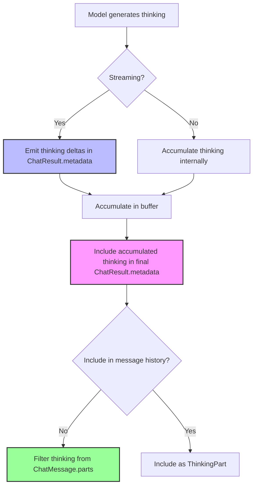
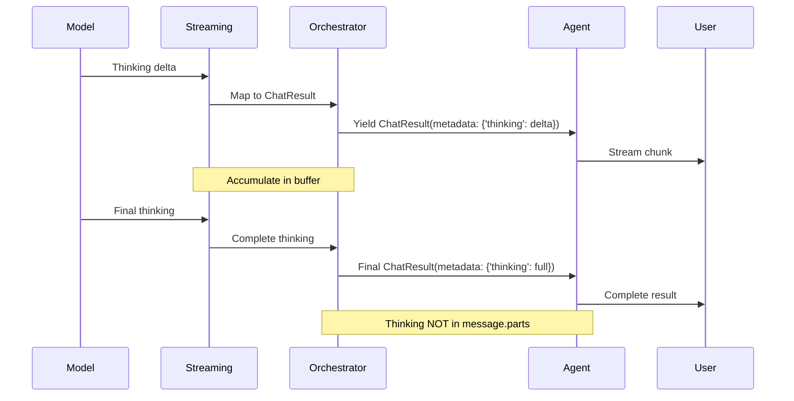

# Thinking (Extended Reasoning) Technical Design

This document describes how Dartantic AI exposes LLM reasoning/thinking capabilities across different providers. "Thinking" or "extended reasoning" refers to models showing their internal reasoning process before providing a final answer.

## Table of Contents
1. [Overview](#overview)
2. [Generic Architecture](#generic-architecture)
3. [Provider Implementations](#provider-implementations)
   - [OpenAI Responses](#openai-responses)
   - [Anthropic](#anthropic)
4. [Usage Patterns](#usage-patterns)
5. [Testing Strategy](#testing-strategy)
6. [Implementation Guidelines](#implementation-guidelines)

## Overview

### What is Thinking?

Thinking (also called "extended reasoning" or "chain-of-thought") is a capability where LLMs expose their internal reasoning process before generating a final response. This provides:

- **Transparency**: See how the model approaches problems
- **Debugging**: Understand why models give certain answers
- **Quality**: Models often produce better answers when "thinking out loud"
- **Education**: Learn problem-solving approaches from the model

### Supported Providers

| Provider | Capability | Status | Configuration |
|----------|-----------|--------|---------------|
| OpenAI Responses | Reasoning Summary | ✅ Implemented | `reasoningSummary` parameter |
| Anthropic | Extended Thinking | ✅ Implemented | `thinking` parameter |
| Others | N/A | ❌ Not supported | - |

## Generic Architecture

### The Thinking Pattern

Dartantic AI follows a consistent pattern for thinking across all providers:



### Core Principles

1. **Metadata-First Design**: Thinking appears in `ChatResult.metadata['thinking']`, not as a primary message part
2. **Streaming Transparency**: During streaming, thinking deltas are emitted as they arrive
3. **Accumulation**: Full thinking text is accumulated and available in final result
4. **History Isolation**: Thinking is typically NOT sent back to the model in conversation history
   - **Exception**: Anthropic requires thinking blocks to be preserved when tool calls are present
   - This is handled transparently by the provider implementation
   - Users pay for thinking tokens on every turn when using tools with Anthropic
5. **Provider Agnostic**: Same consumption pattern works across all providers

### Metadata Flow



### Key Differences from Message Content

| Aspect | Message Content | Thinking Metadata |
|--------|----------------|-------------------|
| Location | `ChatMessage.parts` | `ChatResult.metadata['thinking']` |
| Sent to Model | ✅ Yes | ❌ No (by default) |
| Purpose | Conversation content | Transparency/debugging |
| Streaming | Text deltas | Thinking deltas |
| Accumulation | In message accumulator | In thinking buffer |
| History | Persists | Optional (usually filtered) |

## Provider Implementations

### OpenAI Responses

OpenAI's Responses API supports reasoning through the `reasoning` parameter and exposes it via streaming events.

#### Configuration

```dart
import 'package:dartantic_ai/dartantic_ai.dart';
import 'package:openai_core/openai_core.dart';

final agent = Agent(
  'openai-responses:gpt-5',
  chatModelOptions: const OpenAIResponsesChatModelOptions(
    reasoningSummary: OpenAIReasoningSummary.detailed,
  ),
);
```

#### Reasoning Summary Options

```dart
enum OpenAIReasoningSummary {
  /// Brief reasoning summary (fastest)
  brief,

  /// Detailed reasoning summary (more comprehensive)
  detailed,

  /// Provider decides the verbosity level
  auto,
}
```

#### Implementation Details

**Streaming Events**: `ResponseReasoningSummaryTextDelta`

```dart
// In ReasoningEventHandler
Stream<ChatResult<ChatMessage>> _handleReasoningSummaryDelta(
  openai.ResponseReasoningSummaryTextDelta event,
  EventMappingState state,
) async* {
  // Accumulate in buffer
  state.thinkingBuffer.write(event.delta);

  // Emit as metadata chunk
  yield ChatResult<ChatMessage>(
    output: const ChatMessage(role: ChatMessageRole.model, parts: []),
    messages: const [],
    metadata: {'thinking': event.delta},
    usage: null,
  );
}
```

**Final Result**: Thinking accumulated in `ChatResult.metadata['thinking']` but NOT in message parts.

**Token Accounting**:
- OpenAI charges for full reasoning tokens generated
- Reasoning tokens reported separately in usage
- Token budget controlled by model, not user-configurable

**Signature**: No cryptographic signature provided

#### Message Handling

```dart
// Thinking is NOT included in message parts
final message = ChatMessage(
  role: ChatMessageRole.model,
  parts: [
    TextPart(text: finalAnswer),  // Only the answer, not the thinking
  ],
);

// Thinking available in result metadata
final result = ChatResult(
  output: message,
  messages: [message],
  metadata: {
    'thinking': accumulatedThinkingText,  // Full reasoning
  },
);
```

### Anthropic

Anthropic's Messages API supports extended thinking through the `thinking` parameter with explicit token budget control.

#### Configuration

```dart
import 'package:dartantic_ai/dartantic_ai.dart';
import 'package:anthropic_sdk_dart/anthropic_sdk_dart.dart';

final agent = Agent(
  'anthropic:claude-sonnet-4-5',
  chatModelOptions: AnthropicChatOptions(
    maxTokens: 16000,
    thinking: ThinkingConfig.enabled(
      type: ThinkingConfigEnabledType.enabled,
      budgetTokens: 10000,  // Must be < maxTokens
    ),
  ),
);
```

#### Thinking Configuration

```dart
// Enable thinking with token budget
ThinkingConfig.enabled(
  type: ThinkingConfigEnabledType.enabled,
  budgetTokens: 10000,  // Minimum: 1024, must be < maxTokens
)

// Disable thinking (default)
ThinkingConfig.disabled(
  type: ThinkingConfigDisabledType.disabled,
)

// Or simply omit the parameter
AnthropicChatOptions()  // thinking defaults to null (disabled)
```

#### Implementation Details

**SDK Support**: `anthropic_sdk_dart` v0.3.0+ includes full thinking support

**Content Blocks**: Anthropic includes thinking as `Block.thinking()` in message content:

```dart
// Anthropic's native format includes thinking in content
Block.thinking(
  type: ThinkingBlockType.thinking,
  thinking: "Let me think through this step by step...",
  signature: "optional_cryptographic_signature",
  cacheControl: null,
)
```

**Streaming Events**: `BlockDelta.thinking()`

```dart
// In MessageStreamEventTransformer
BlockDelta.thinking(
  thinking: "Step 1: Analyze the problem...",
  type: ThinkingBlockDeltaType.thinkingDelta,
)
```

**Dartantic Mapping Strategy**:

Despite Anthropic including thinking in message content, Dartantic follows the established pattern with one important exception:

1. **During streaming**: Extract thinking deltas and emit as `ChatResult.metadata['thinking']`
2. **After completion**: Accumulate full thinking in result metadata
3. **In message history**: Thinking blocks are preserved in metadata when tool calls are present

⚠️ **Important**: When a response includes both thinking and tool calls, the thinking block is preserved in the message structure and sent back in subsequent turns. This is required by Anthropic's API to maintain proper context for multi-turn tool usage. Users are charged for these thinking tokens on every turn.

**Implementation Flow**:

The Anthropic message mapper handles thinking through the following high-level flow:

1. **Streaming Phase**:
   - Accumulate thinking deltas in a buffer as `ThinkingBlockDelta` events arrive
   - Emit each delta as `ChatResult.metadata['thinking']` for real-time display
   - Capture the cryptographic signature from the `ThinkingBlock.start` event

2. **Completion Phase**:
   - Store accumulated thinking text and signature in message metadata
   - When tool calls are present, preserve the complete thinking block data
   - Filter thinking blocks from message parts for regular (non-tool) responses

3. **History Reconstruction**:
   - When sending messages back to Anthropic, check for thinking block metadata
   - If present and tool calls exist, reconstruct the `Block.thinking()` with original signature
   - Place thinking block before tool_use blocks (required by Anthropic's API)

See `anthropic_message_mappers.dart` for the complete implementation.

**Token Accounting**:
- Thinking tokens count toward `max_tokens` limit
- User charged for full thinking tokens generated (not the summary)
- Explicit budget control via `budgetTokens` parameter
- Minimum budget: 1,024 tokens

**Signature**: Anthropic provides optional cryptographic signature for authenticity verification

#### Options Integration

```dart
class AnthropicChatOptions extends ChatModelOptions {
  const AnthropicChatOptions({
    this.maxTokens,
    this.temperature,
    this.topK,
    this.topP,
    this.stopSequences,
    this.userId,
    this.thinking,  // NEW: Extended thinking configuration
  });

  // ... existing fields ...

  /// Configuration for Claude's extended thinking.
  ///
  /// When enabled, Claude shows its internal reasoning process before
  /// providing the final answer. Thinking content is exposed via:
  /// - During streaming: `ChatResult.metadata['thinking']` (incremental deltas)
  /// - In final result: Accumulated thinking in result metadata
  /// - In message history: Preserved in metadata when tool calls present
  ///
  /// **Anthropic-specific behavior**: When a response includes both thinking
  /// and tool calls, the thinking block is preserved in the message structure
  /// and sent back in subsequent turns. This is required by Anthropic's API
  /// to maintain proper context for multi-turn tool usage.
  ///
  /// The `budgetTokens` parameter controls how many tokens Claude can use
  /// for thinking. This must be at least 1,024 and less than `maxTokens`.
  /// Larger budgets enable more comprehensive reasoning.
  ///
  /// Example:
  /// ```dart
  /// AnthropicChatOptions(
  ///   maxTokens: 16000,
  ///   thinking: ThinkingConfig.enabled(
  ///     type: ThinkingConfigEnabledType.enabled,
  ///     budgetTokens: 10000,
  ///   ),
  /// )
  /// ```
  ///
  /// Token costs:
  /// - Thinking tokens count toward your `max_tokens` limit
  /// - You are charged for all thinking tokens generated
  /// - Thinking blocks in conversation history also consume tokens
  ///
  /// See: https://docs.anthropic.com/en/docs/build-with-claude/extended-thinking
  final ThinkingConfig? thinking;
}
```

#### Message Mapper Changes

```dart
a.CreateMessageRequest createMessageRequest(
  List<ChatMessage> messages, {
  required String modelName,
  required AnthropicChatOptions? options,
  required AnthropicChatOptions defaultOptions,
  List<Tool>? tools,
  double? temperature,
  JsonSchema? outputSchema,
}) {
  // ... existing parameter handling ...

  return a.CreateMessageRequest(
    model: a.Model.modelId(modelName),
    messages: messagesDtos,
    maxTokens: options?.maxTokens ?? defaultOptions.maxTokens ?? _defaultMaxTokens,
    stopSequences: options?.stopSequences ?? defaultOptions.stopSequences,
    system: systemMsg != null ? a.CreateMessageRequestSystem.text(systemMsg) : null,
    temperature: temperature ?? options?.temperature ?? defaultOptions.temperature,
    topK: options?.topK ?? defaultOptions.topK,
    topP: options?.topP ?? defaultOptions.topP,
    metadata: a.CreateMessageRequestMetadata(
      userId: options?.userId ?? defaultOptions.userId,
    ),
    tools: structuredTools,
    toolChoice: hasTools ? const a.ToolChoice(type: a.ToolChoiceType.auto) : null,
    stream: true,
    thinking: options?.thinking ?? defaultOptions.thinking,  // NEW: Pass thinking config
  );
}
```

## Provider Comparison

| Feature | OpenAI Responses | Anthropic |
|---------|-----------------|-----------|
| **Configuration Type** | Enum (`brief`, `detailed`, `auto`) | Object with token budget |
| **Minimum Budget** | Implicit (model-controlled) | 1,024 tokens (explicit) |
| **Maximum Budget** | Model-controlled | User-specified (< `max_tokens`) |
| **Token Accounting** | Separate reasoning budget | Counts toward `max_tokens` |
| **Streaming Event** | `ResponseReasoningSummaryTextDelta` | `BlockDelta.thinking()` |
| **Content Block** | No (metadata only) | Yes (`Block.thinking()`) |
| **Signature** | No | Yes (optional cryptographic) |
| **Dartantic Representation** | `metadata['thinking']` only | `metadata['thinking']` + stored for reconstruction |
| **Message History** | Never included | Preserved when tool calls present |
| **Tool Use Compatibility** | Full support | Full support (thinking auto-preserved) |
| **Temperature Constraints** | None | Cannot use with modified temperature |
| **Top-K Constraints** | None | Cannot use |
| **Top-P Constraints** | None | Limited to 0.95-1.0 range |

## Usage Patterns

### Streaming with Thinking

```dart
import 'dart:io';
import 'package:dartantic_ai/dartantic_ai.dart';

Future<void> demonstrateStreamingThinking(Agent agent) async {
  final thinkingChunks = <String>[];
  final textChunks = <String>[];

  await for (final chunk in agent.sendStream('Solve: What is 15% of 847?')) {
    // Collect thinking deltas
    final thinking = chunk.metadata['thinking'] as String?;
    if (thinking != null) {
      thinkingChunks.add(thinking);
      stdout.write('[THINKING] $thinking');
    }

    // Collect response text
    if (chunk.output.isNotEmpty) {
      textChunks.add(chunk.output);
      stdout.write(chunk.output);
    }
  }

  final fullThinking = thinkingChunks.join();
  final fullResponse = textChunks.join();

  print('\n\n=== Summary ===');
  print('Thinking length: ${fullThinking.length} chars');
  print('Response length: ${fullResponse.length} chars');
}
```

### Non-Streaming with Thinking

```dart
Future<void> demonstrateNonStreamingThinking(Agent agent) async {
  final result = await agent.send('What is the capital of France?');

  // Access accumulated thinking
  final thinking = result.metadata['thinking'] as String?;
  if (thinking != null) {
    print('=== Thinking ===');
    print(thinking);
    print('\n=== Answer ===');
  }

  // The final answer
  print(result.output);

  // Verify thinking NOT in message parts
  final thinkingParts = result.messages.last.parts
      .where((p) => p.toString().contains('thinking'))
      .toList();
  assert(thinkingParts.isEmpty, 'Thinking should not be in message parts');
}
```

### Provider-Specific Examples

#### OpenAI Responses

```dart
void main() async {
  final agent = Agent(
    'openai-responses:gpt-5',
    chatModelOptions: const OpenAIResponsesChatModelOptions(
      reasoningSummary: OpenAIReasoningSummary.detailed,
    ),
  );

  stdout.write('Question: What are the first 10 prime numbers?\n\n');

  await for (final chunk in agent.sendStream('What are the first 10 prime numbers?')) {
    final thinking = chunk.metadata['thinking'] as String?;
    if (thinking != null) {
      stdout.write('[Reasoning] $thinking\n');
    }

    if (chunk.output.isNotEmpty) {
      stdout.write(chunk.output);
    }
  }

  exit(0);
}
```

#### Anthropic

```dart
void main() async {
  final agent = Agent(
    'anthropic:claude-sonnet-4-5',
    chatModelOptions: AnthropicChatOptions(
      maxTokens: 16000,
      thinking: ThinkingConfig.enabled(
        type: ThinkingConfigEnabledType.enabled,
        budgetTokens: 8000,
      ),
    ),
  );

  stdout.write('Question: Explain quantum entanglement\n\n');

  final thinkingBuffer = StringBuffer();
  await for (final chunk in agent.sendStream(
    'Explain quantum entanglement in simple terms.',
  )) {
    final thinking = chunk.metadata['thinking'] as String?;
    if (thinking != null) {
      thinkingBuffer.write(thinking);
      stdout.write('[Extended Thinking] $thinking\n');
    }

    if (chunk.output.isNotEmpty) {
      stdout.write(chunk.output);
    }
  }

  print('\n\nTotal thinking length: ${thinkingBuffer.length} characters');

  exit(0);
}
```

### Multi-Provider Example

```dart
Future<void> compareThinkingAcrossProviders() async {
  final question = 'Calculate the compound interest on \$1000 at 5% for 3 years.';

  // OpenAI Responses
  final openaiAgent = Agent(
    'openai-responses:gpt-5',
    chatModelOptions: const OpenAIResponsesChatModelOptions(
      reasoningSummary: OpenAIReasoningSummary.detailed,
    ),
  );

  print('=== OpenAI Responses ===');
  await demonstrateThinking(openaiAgent, question);

  // Anthropic
  final anthropicAgent = Agent(
    'anthropic:claude-sonnet-4-5',
    chatModelOptions: AnthropicChatOptions(
      maxTokens: 8000,
      thinking: ThinkingConfig.enabled(
        type: ThinkingConfigEnabledType.enabled,
        budgetTokens: 4000,
      ),
    ),
  );

  print('\n=== Anthropic Extended Thinking ===');
  await demonstrateThinking(anthropicAgent, question);
}

Future<void> demonstrateThinking(Agent agent, String question) async {
  var thinkingLength = 0;

  await for (final chunk in agent.sendStream(question)) {
    final thinking = chunk.metadata['thinking'] as String?;
    if (thinking != null) {
      thinkingLength += thinking.length;
      stdout.write('[T]');
    }
    if (chunk.output.isNotEmpty) {
      stdout.write(chunk.output);
    }
  }

  print('\nThinking tokens: ~${thinkingLength ~/ 4}');
}
```

## Testing Strategy

### Unit Tests

#### Options Serialization

```dart
// test/anthropic_chat_options_test.dart
test('thinking config passes through to SDK', () {
  final options = AnthropicChatOptions(
    thinking: ThinkingConfig.enabled(
      type: ThinkingConfigEnabledType.enabled,
      budgetTokens: 5000,
    ),
  );

  expect(options.thinking, isNotNull);
  expect(options.thinking, isA<ThinkingConfigEnabled>());
  final enabled = options.thinking as ThinkingConfigEnabled;
  expect(enabled.budgetTokens, 5000);
});

test('thinking defaults to null (disabled)', () {
  final options = AnthropicChatOptions();
  expect(options.thinking, isNull);
});
```

#### Message Mapper

```dart
// test/anthropic_message_mappers_test.dart
test('thinking config included in CreateMessageRequest', () {
  final messages = [
    const ChatMessage.user('Test prompt'),
  ];

  final request = createMessageRequest(
    messages,
    modelName: 'claude-sonnet-4-5',
    options: AnthropicChatOptions(
      thinking: ThinkingConfig.enabled(
        type: ThinkingConfigEnabledType.enabled,
        budgetTokens: 3000,
      ),
    ),
    defaultOptions: const AnthropicChatOptions(),
  );

  expect(request.thinking, isNotNull);
  expect(request.thinking, isA<ThinkingConfigEnabled>());
});

test('thinking blocks filtered from final message parts', () {
  // Mock streaming response with thinking blocks
  final events = [
    // ... thinking events ...
  ];

  final transformer = MessageStreamEventTransformer();
  final results = await transformer.bind(Stream.fromIterable(events)).toList();

  // Find final message
  final finalMessage = results.last.messages.last;

  // Verify no thinking in parts
  final hasThinkingPart = finalMessage.parts.any((p) {
    // Check if part represents thinking content
    return false;  // Should never find thinking in parts
  });

  expect(hasThinkingPart, false);

  // Verify thinking in metadata
  expect(results.last.metadata['thinking'], isNotEmpty);
});
```

#### Streaming Transformer

```dart
// test/anthropic_streaming_test.dart
test('thinking deltas emit metadata chunks', () async {
  final thinkingDeltas = [
    'Step 1: ',
    'Analyze the problem. ',
    'Step 2: ',
    'Calculate the result.',
  ];

  // Create mock stream with thinking events
  final events = thinkingDeltas.map((delta) =>
    MessageStreamEvent.contentBlockDelta(
      delta: BlockDelta.thinking(
        thinking: delta,
        type: ThinkingBlockDeltaType.thinkingDelta,
      ),
      index: 0,
    ),
  );

  final transformer = MessageStreamEventTransformer();
  final results = await transformer.bind(Stream.fromIterable(events)).toList();

  // Each delta should produce a metadata chunk
  expect(results.length, thinkingDeltas.length);

  for (var i = 0; i < results.length; i++) {
    expect(results[i].metadata['thinking'], thinkingDeltas[i]);
  }
});

test('thinking accumulates in buffer', () async {
  // Test that full thinking is available in final result
  final events = [
    // ... multiple thinking delta events ...
    // ... final message stop event ...
  ];

  final transformer = MessageStreamEventTransformer();
  final results = await transformer.bind(Stream.fromIterable(events)).toList();

  final finalResult = results.last;
  final fullThinking = finalResult.metadata['thinking'] as String;

  expect(fullThinking, contains('Step 1:'));
  expect(fullThinking, contains('Step 2:'));
  expect(fullThinking, isNot(isEmpty));
});
```

### Integration Tests

#### End-to-End Thinking

```dart
// test/anthropic_thinking_integration_test.dart
group('Anthropic Extended Thinking Integration', () {
  test('thinking appears in metadata during streaming', () async {
    final agent = Agent(
      'anthropic:claude-sonnet-4-5',
      chatModelOptions: AnthropicChatOptions(
        maxTokens: 8000,
        thinking: ThinkingConfig.enabled(
          type: ThinkingConfigEnabledType.enabled,
          budgetTokens: 4000,
        ),
      ),
    );

    final thinkingChunks = <String>[];
    await for (final chunk in agent.sendStream(
      'What is 23 * 47? Show your work.',
    )) {
      final thinking = chunk.metadata['thinking'] as String?;
      if (thinking != null) {
        thinkingChunks.add(thinking);
      }
    }

    expect(thinkingChunks, isNotEmpty);
    final fullThinking = thinkingChunks.join();
    expect(fullThinking.length, greaterThan(50));
  });

  test('non-streaming thinking in result metadata', () async {
    final agent = Agent(
      'anthropic:claude-sonnet-4-5',
      chatModelOptions: AnthropicChatOptions(
        maxTokens: 8000,
        thinking: ThinkingConfig.enabled(
          type: ThinkingConfigEnabledType.enabled,
          budgetTokens: 4000,
        ),
      ),
    );

    final result = await agent.send('Calculate 156 ÷ 12');

    final thinking = result.metadata['thinking'] as String?;
    expect(thinking, isNotNull);
    expect(thinking, isNotEmpty);
  });

  test('thinking blocks not in message history', () async {
    final agent = Agent(
      'anthropic:claude-sonnet-4-5',
      chatModelOptions: AnthropicChatOptions(
        maxTokens: 8000,
        thinking: ThinkingConfig.enabled(
          type: ThinkingConfigEnabledType.enabled,
          budgetTokens: 4000,
        ),
      ),
    );

    final result = await agent.send('Simple math: 2+2');

    // Check all parts in all messages
    for (final message in result.messages) {
      for (final part in message.parts) {
        // No part should reference thinking content
        expect(part.runtimeType.toString(), isNot(contains('Thinking')));
      }
    }
  });

  test('thinking with tool calls', () async {
    final agent = Agent(
      'anthropic:claude-sonnet-4-5',
      tools: [weatherTool],
      chatModelOptions: AnthropicChatOptions(
        maxTokens: 8000,
        thinking: ThinkingConfig.enabled(
          type: ThinkingConfigEnabledType.enabled,
          budgetTokens: 4000,
        ),
      ),
    );

    var hadThinking = false;
    var hadToolCall = false;

    await for (final chunk in agent.sendStream(
      'What is the weather in Seattle?',
    )) {
      if (chunk.metadata['thinking'] != null) hadThinking = true;
      if (chunk.output.toolCalls.isNotEmpty) hadToolCall = true;
    }

    expect(hadThinking, true);
    expect(hadToolCall, true);
  });
});
```

#### Provider Capability Tests

```dart
// test/provider_caps_test.dart
test('Anthropic provider declares thinking capability', () {
  final provider = AnthropicProvider();
  expect(provider.caps, contains(ProviderCaps.thinking));
});

test('OpenAI Responses provider declares thinking capability', () {
  final provider = OpenAIResponsesProvider();
  expect(provider.caps, contains(ProviderCaps.thinking));
});
```

### Test Coverage Requirements

Tests should cover the following areas:

- Options serialization and defaults
- Message mapper passes thinking config
- Streaming transformer extracts thinking deltas
- Thinking accumulation in buffer
- Thinking blocks filtered from message parts
- Thinking appears in metadata only
- End-to-end streaming with thinking
- Non-streaming thinking in result metadata
- Thinking with tool calls
- Provider capability declarations

## Implementation Guidelines

### For Provider Implementers

If implementing thinking support for a new provider:

1. **Declare Capability**
   ```dart
   class MyProvider extends Provider {
     MyProvider() : super(
       caps: {
         ProviderCaps.chat,
         ProviderCaps.thinking,  // Declare support
       },
     );
   }
   ```

2. **Add Configuration to Options**
   ```dart
   class MyChatOptions extends ChatModelOptions {
     final ThinkingConfig? thinking;  // Or provider-specific type
   }
   ```

3. **Extract Thinking from Streaming Events**
   ```dart
   // In your streaming transformer
   if (event.isThinkingDelta) {
     thinkingBuffer.write(event.thinkingText);

     yield ChatResult(
       output: const ChatMessage(role: ChatMessageRole.model, parts: []),
       messages: const [],
       metadata: {'thinking': event.thinkingText},
       usage: null,
     );
   }
   ```

4. **Filter Thinking from Message Parts**
   ```dart
   // When building final message
   final parts = allParts.where((p) => p is! ThinkingPart).toList();
   final message = ChatMessage(role: ChatMessageRole.model, parts: parts);
   ```

5. **Include Accumulated Thinking in Final Metadata**
   ```dart
   final result = ChatResult(
     output: message,
     messages: [message],
     metadata: {
       'thinking': thinkingBuffer.toString(),
     },
   );
   ```

### Architectural Constraints

- **Never send thinking back to model**: Filter thinking from conversation history
- **Always emit thinking as metadata**: Use `ChatResult.metadata['thinking']`
- **Always accumulate thinking**: Provide full thinking in final result
- **Single-item events during streaming**: Each thinking delta is a separate chunk
- **Consistent key naming**: Always use `'thinking'` as the metadata key

### Error Handling

Provider implementations should validate thinking configuration and reject invalid requests:

- **Budget too small**: Providers should reject requests with `budgetTokens < 1024` (Anthropic minimum)
- **Budget exceeds max tokens**: Providers should reject requests where `budgetTokens >= maxTokens`
- **Unsupported provider**: Agent should check `ProviderCaps.thinking` capability before enabling thinking
- **Invalid parameter combinations**: Some providers restrict temperature, top-K, or top-P when thinking is enabled

Error handling is implemented in the provider-specific code, not in the design document.

### Performance Considerations

- **Thinking increases latency**: Models take longer to respond when thinking
- **Thinking consumes tokens**: Budget for additional token costs
- **Streaming benefits**: Users see progress as thinking streams
- **Buffer management**: Use StringBuffer for efficient accumulation

## Related Documentation

- [[Server-Side-Tools-Tech-Design]] - Similar metadata pattern for server-side tools
- [[Message-Handling-Architecture]] - Message part design and filtering
- [[Orchestration-Layer-Architecture]] - Streaming state management
- [[Provider-Implementation-Guide]] - General provider implementation patterns
