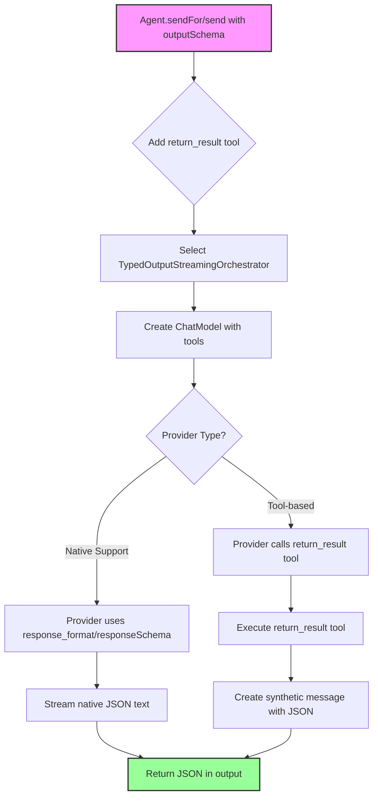
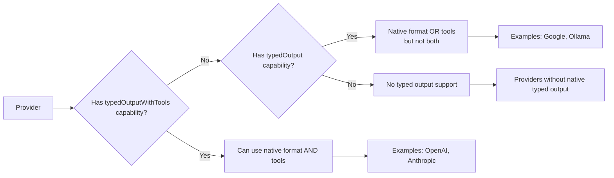
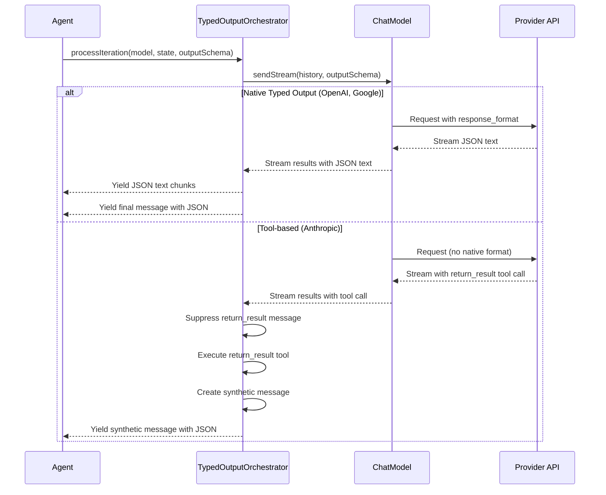

This document specifies how the dartantic_ai compatibility layer handles typed output (structured JSON responses) across different providers.

## Table of Contents
1. [Overview](#overview)
2. [Provider Capabilities](#provider-capabilities)
3. [Implementation Approaches](#implementation-approaches)
4. [Agent-Level Handling](#agent-level-handling)
5. [Provider-Specific Details](#provider-specific-details)
6. [Testing and Validation](#testing-and-validation)

## Overview

Typed output allows constraining LLM responses to specific JSON schemas. The system handles this through a clean separation of concerns across the six-layer architecture:

- **API Layer (Agent)**: Selects appropriate orchestrator and adds return_result tool universally
- **Orchestration Layer**: TypedOutputStreamingOrchestrator handles typed output workflows
- **Provider Abstraction Layer**: ChatModel interface passes outputSchema to implementations
- **Provider Implementation Layer**: Provider-specific handling (native vs tool-based)
- **Infrastructure Layer**: JSON validation and parsing utilities
- **Protocol Layer**: Raw API communication with schema parameters

### Typed Output Flow



### Provider Decision Flow



## Provider Capabilities

### Support Matrix

| Provider   | Typed Output | Method | Simultaneous Tools+Output |
|------------|--------------|--------|---------------------------|
| OpenAI     | ✅          | Native response_format | ✅ |
| OpenAI Responses | ✅     | Native text_format (stateful) | ✅ |
| OpenRouter | ✅          | Native (OpenAI-compatible) | ✅ |
| Anthropic  | ✅          | return_result tool | ✅ |
| Google     | ✅          | Native responseSchema + Double Agent | ✅ |
| Ollama     | ✅          | Native format param (as of ollama_dart ^0.3.0) | ❌ (future: add double agent) |
| Together   | ✅          | Native (OpenAI-compatible) | ✅ |
| Cohere     | ✅          | Native (OpenAI-compatible) | ❌ (API limitation) |
| Mistral    | ❌          | Not supported | ❌ |

## Implementation Approaches

### Native API Support

Providers with direct API support for structured output handle typed output cleanly without any special handling at the Agent level.

#### OpenAI and Compatible Providers

OpenAI supports both tools and typed output simultaneously with no conflicts:

```dart
// OpenAI uses response_format.json_schema
ResponseFormat.jsonSchema(
  jsonSchema: JsonSchemaObject(
    name: 'response',
    description: 'Generated response following the provided schema',
    schema: outputSchema.schemaMap,
    strict: true,
  ),
)
```

#### OpenAI Responses Provider

The OpenAI Responses provider uses the stateful Responses API with session management:

```dart
// OpenAI Responses uses text_format with session continuations
TextFormatJsonSchema(
  name: 'dartantic_output',
  schema: outputSchema.schemaMap,
  strict: true,
)
```

Key differences from regular OpenAI:
- **Stateful Sessions**: Maintains conversation state across requests with `previousResponseId`
- **Message Validation**: Enforces strict user/model message alternation
- **Session Metadata**: Stores session IDs in message metadata for continuations
- **Native JSON Support**: Like OpenAI, it has native typed output support without `return_result`

The Agent always adds the return_result tool when outputSchema is provided, regardless of provider. 

**Empirically verified behavior**:
- **OpenAI**: Uses native response_format and returns JSON directly (ignores return_result tool)
- **Anthropic**: Calls the return_result tool (no native support)

The Agent's logic handles both cases identically:
- If return_result was called: use that output (Anthropic path)
- If not: use the model's direct output (OpenAI and other native providers)

This unified approach allows the Agent to support both native typed output (OpenAI, Google, etc.) and tool-based typed output (Anthropic) transparently.

#### Streaming Semantics

- **Progressive streaming**: Providers that emit schema-constrained JSON incrementally may stream partial chunks. Orchestrators forward those deltas so clients can render progressive JSON (see `example/bin/typed_output.dart`).
- **Message contents**: During streaming, the assistant message attached to each chunk remains empty (other than metadata/tool parts). The JSON payload exists only in the streamed text chunks, so callers that care about the text must accumulate `chunk.output` themselves.
- **Final decoding**: APIs such as `Agent.send()` and `Agent.sendFor()` buffer the streamed chunks internally and decode once streaming completes. External consumers that want the final JSON document must follow the same pattern: concatenate the streamed chunks and parse once because the terminal assistant message does not repeat the streamed text.
- **Provider responsibility**: Provider implementations should avoid emitting conflicting chunks; once a fragment is streamed it cannot be “taken back.” If a provider cannot supply coherent streaming deltas, it should suppress progressive JSON and emit only the final payload.

**Note**: Ollama now supports JSON schema natively as of `ollama_dart ^0.3.0`. However, like Google, Ollama does not support using tools and typed output simultaneously. A future enhancement will add the double agent pattern for Ollama.

#### Google/Gemini
```dart
// Google uses GenerationConfig.responseSchema
GenerationConfig(
  responseMimeType: 'application/json',
  responseSchema: convertToGeminiSchema(outputSchema),
)
```

**Double Agent Pattern**: Google's API does not support using tools and typed output (responseSchema) simultaneously in a single API call. To work around this limitation, Google uses the `GoogleDoubleAgentOrchestrator` which implements a two-phase approach:

**Phase 1 - Tool Execution:**
- Sends messages with tools (no outputSchema)
- Suppresses text output (we only care about tool calls)
- Executes all tool calls
- Accumulates tool results

**Phase 2 - Structured Output:**
- Sends tool results with outputSchema (no tools)
- Returns the structured JSON output
- Attaches metadata about suppressed content from Phase 1

This pattern allows Google to support the same capability as Anthropic and OpenAI, just with a different implementation strategy. The orchestrator is selected automatically by the Agent when both `outputSchema` and `tools` are present.

#### Ollama
```dart
// Ollama uses format parameter in HTTP request
{
  "format": outputSchema.schemaMap,
  "model": "...",
  "messages": [...],
}
```

### Tool-Based Approach (return_result pattern)

For providers without native typed output support, the Agent automatically adds a special tool:

```dart
// In Agent.runStream when outputSchema is provided
if (outputSchema != null) {
  final returnResultTool = Tool<Map<String, dynamic>>(
    name: kReturnResultToolName,
    description: 'Return the final result in the required structured format',
    inputSchema: outputSchema,
    inputFromJson: (json) => json,
    onCall: (args) async => json.encode(args),
  );
  
  tools = [...?_tools, returnResultTool];
}
```

## Orchestration Layer Handling

### TypedOutputStreamingOrchestrator

The system uses a specialized orchestrator for typed output requests that extends the default orchestrator:

```dart
class TypedOutputStreamingOrchestrator extends DefaultStreamingOrchestrator {
  const TypedOutputStreamingOrchestrator({
    required this.provider,
    required this.hasReturnResultTool,
  });

  final Provider provider;
  final bool hasReturnResultTool;

  @override
  String get providerHint => 'typed-output';

  @override
  Stream<StreamingIterationResult> processIteration(
    ChatModel<ChatModelOptions> model,
    StreamingState state, {
    JsonSchema? outputSchema,
  }) async* {
    state.resetForNewMessage();

    // Stream the model response
    await for (final result in model.sendStream(
      state.conversationHistory,
      outputSchema: outputSchema,
    )) {
      // Stream native JSON text for providers without return_result tool
      if (!hasReturnResultTool) {
        final textOutput = result.output.parts
            .whereType<TextPart>()
            .map((p) => p.text)
            .join();

        if (textOutput.isNotEmpty) {
          yield StreamingIterationResult(
            output: textOutput,
            messages: const [],
            shouldContinue: true,
            finishReason: result.finishReason,
            metadata: result.metadata,
            usage: result.usage,
          );
        }
      }

      // Accumulate the message
      state.accumulatedMessage = state.accumulator.accumulate(
        state.accumulatedMessage,
        result.output,
      );
      state.lastResult = result;
    }

    // Handle return_result tool calls
    final consolidatedMessage = state.accumulator.consolidate(
      state.accumulatedMessage,
    );

    // Check if this message has return_result tool call
    final hasReturnResultCall = consolidatedMessage.parts
        .whereType<ToolPart>()
        .any((p) => p.kind == ToolPartKind.call && p.name == kReturnResultToolName);

    if (hasReturnResultCall) {
      // Execute tools and create synthetic message with JSON
      final toolCalls = consolidatedMessage.parts
          .whereType<ToolPart>()
          .where((p) => p.kind == ToolPartKind.call)
          .toList();

      final executionResults = await state.executor.executeBatch(
        toolCalls,
        state.toolMap,
      );

      // Extract return_result JSON
      for (final result in executionResults) {
        if (result.toolPart.name == kReturnResultToolName && result.isSuccess) {
          final returnResultJson = result.resultPart.result ?? '';
          
          // Create synthetic message
          final syntheticMessage = ChatMessage(
            role: ChatMessageRole.model,
            parts: [TextPart(returnResultJson)],
            metadata: {'toolId': result.toolPart.id},
          );

          yield StreamingIterationResult(
            output: returnResultJson,
            messages: [syntheticMessage],
            shouldContinue: false,
            finishReason: state.lastResult.finishReason,
            metadata: state.lastResult.metadata,
            usage: state.lastResult.usage,
          );
        }
      }
    }
  }
}
```

### Message Flow and Normalization



### Orchestrator Selection for Typed Output

The Agent automatically selects the TypedOutputStreamingOrchestrator when outputSchema is provided:

```dart
// In Agent._selectOrchestrator()
StreamingOrchestrator _selectOrchestrator({
  JsonSchema? outputSchema,
  List<Tool>? tools,
}) {
  if (outputSchema != null) {
    final hasReturnResultTool = 
        tools?.any((t) => t.name == kReturnResultToolName) ?? false;

    return TypedOutputStreamingOrchestrator(
      provider: _provider,
      hasReturnResultTool: hasReturnResultTool,
    );
  }
  
  return const DefaultStreamingOrchestrator();
}
```

## Agent-Level Handling

### Universal Tool Addition

The Agent always adds the return_result tool when outputSchema is provided, regardless of provider:

```dart
// In Agent.runStream when outputSchema is provided
if (outputSchema != null) {
  final returnResultTool = Tool<Map<String, dynamic>>(
    name: kReturnResultToolName,
    description: 'REQUIRED: You MUST call this tool to return the final result. '
                'Use this tool to format and return your response according to '
                'the specified JSON schema.',
    inputSchema: outputSchema,
    inputFromJson: (json) => json,
    onCall: (args) async => json.encode(args),
  );
  
  tools = [...?_tools, returnResultTool];
}
```

### Model Creation

```dart
// Agent creates model directly from provider
final model = _provider.createModel(
  name: _modelName,
  tools: tools,  // Includes return_result if outputSchema provided
  temperature: _temperature,
  
);
```

### Response Processing through Orchestrator

```dart
// Agent delegates typed output processing to orchestrator
final orchestrator = _selectOrchestrator(outputSchema: outputSchema, tools: model.tools);
final state = StreamingState(
  conversationHistory: conversationHistory,
  toolMap: {for (final tool in model.tools ?? <Tool>[]) tool.name: tool},
);

try {
  await for (final result in orchestrator.processIteration(model, state, outputSchema: outputSchema)) {
    // Orchestrator handles return_result vs native output detection
    yield ChatResult<String>(
      id: result.id,
      output: result.output,  // Already processed as JSON
      messages: result.messages,
      finishReason: result.finishReason,
      metadata: result.metadata,
      usage: result.usage,
    );
  }
} finally {
  await _lifecycleManager.disposeModel(model);
}
```

## Provider-Specific Details

### OpenAI
- **Method**: Native `response_format.json_schema` parameter
- **Behavior**: Uses native format and returns JSON directly (ignores return_result tool)
- **Tools**: Can use tools and typed output simultaneously
- **Verified**: Testing shows OpenAI uses native response_format even when return_result tool is present

### OpenAI Responses
- **Method**: Native `text_format` parameter with stateful session management
- **Behavior**: Uses native format and returns JSON directly (filters out return_result tool)
- **Tools**: Can use tools and typed output simultaneously
- **Session Management**:
  - Maintains conversation state across requests using `responseId`
  - Stores session metadata in message.metadata for conversation continuations
  - Only sends new messages after the session anchor point to reduce token usage
- **Message Validation**:
  - Enforces strict user/model message alternation synchronously
  - Validates messages before sending to API (unlike other providers)
  - Exposed race conditions in Agent that other providers missed
- **Key Differences from Regular OpenAI**:
  - Uses stateful Responses API instead of stateless Chat Completions
  - Requires session ID tracking for multi-turn conversations
  - Validates message structure more strictly
  - Filters out return_result tool since it has native JSON support
- **Implementation Notes**:
  - OpenAIResponsesChatModel overrides `tools` getter to filter return_result
  - OpenAIResponsesMessageMapper handles session metadata and message mapping
  - OpenAIResponsesEventMapper processes streaming events and builds results

### Anthropic
- **Method**: return_result tool pattern
- **Behavior**: Model calls return_result tool with JSON
- **Tools**: Works naturally since return_result is just another tool
- **Note**: Agent handles this transparently - Anthropic mapper has no special logic
- **Edge case**: Sometimes returns empty final message after return_result call (Agent replaces with JSON)

### Google/Gemini
- **Method**: Native `responseSchema` in GenerationConfig + Double Agent orchestrator
- **Behavior**: Phase 1 executes tools, Phase 2 returns JSON with suppressed metadata
- **Tools**: Supports tools and typed output together via double agent pattern
- **Implementation**: `GoogleDoubleAgentOrchestrator` handles two-phase workflow
  - Phase 1: Sends request with tools (no outputSchema), executes tool calls
  - Phase 2: Sends tool results with outputSchema (no tools), gets structured output
  - Suppresses text from Phase 1 and attaches as metadata to Phase 2 output
- **Metadata**: Attaches `suppressedText` metadata when model attempts to output text in Phase 1

### Ollama
- **Method**: Native `format` parameter
- **Behavior**: Directly returns JSON in response  
- **Tools**: Cannot use tools and typed output together
- **Implementation**: Uses direct HTTP client to access format parameter
- **TODO**: Add return_result pattern for simultaneous tools+output

## Testing and Validation

### Test Coverage

1. **Basic Structured Output**: Simple JSON object generation
2. **Complex Schemas**: Nested objects, arrays, enums
3. **Edge Cases**: Required fields, null handling, type validation
4. **Tool Integration**: Simultaneous tools and typed output (where supported)

### Example Usage

```dart
// Define schema
final schema = JsonSchema.create({
  'type': 'object',
  'properties': {
    'name': {'type': 'string'},
    'age': {'type': 'integer'},
  },
  'required': ['name', 'age'],
});

// Use with any provider
final agent = Agent('anthropic');  // or 'openai', 'google', etc.
final result = await agent.runFor<Person>(
  'Generate a person named John who is 30 years old',
  outputSchema: schema,
  outputFromJson: Person.fromJson,
);
```

### Ollama Support

As of `ollama_dart ^0.3.0`, Ollama supports JSON schema natively through the `GenerateChatCompletionRequestFormat.schema()` API. Ollama supports typed output natively, making structured output work seamlessly:

```dart
final agent = Agent('ollama:qwen2.5:7b-instruct');
final result = await agent.runFor<Person>(
  'Generate a person named Jane who is 25 years old',
  outputSchema: personSchema,
  outputFromJson: Person.fromJson,
);
// Ollama uses native JSON schema format parameter
```

**Limitation**: Like Google, Ollama does not support using tools and typed output simultaneously. A future enhancement will add the double agent pattern for Ollama to enable this combination.

## Key Design Principles

1. **Provider Transparency**: Agent handles typed output uniformly
2. **Clean Separation**: Mappers don't contain typed output logic
3. **Automatic Handling**: return_result tool added automatically when needed
4. **Flexible Architecture**: Models created on-the-fly with appropriate tools
5. **Error Transparency**: JSON parsing errors bubble up for debugging
6. **Semantic Preservation**: Schema mappers must preserve JSON Schema semantics
7. **Explicit Limitations**: Throw clear errors for unsupported features


## Schema Mapping Guidelines

### Semantic Preservation

Schema mappers MUST NOT make semantic changes to accommodate provider limitations. Instead:

1. **Throw on Unmappable Features**: Only throw when we cannot create a semantically equivalent mapping
2. **No Silent Conversions**: Don't convert unsupported types to supported ones (e.g., `['string', 'number']` → `'string'`)
3. **Let Providers Validate**: Pass through valid mappings and let providers enforce their own limitations
4. **Preserve Original Intent**: Don't add or remove constraints from the original schema
5. **Throw on Known Silent Failures**: Also throw when we know a provider will silently fail (e.g., Google Gemini with tools + output schema combination)

Examples of when to throw:
- Type arrays with multiple non-null types: `['string', 'number']` (no way to map union types)
- anyOf/oneOf/allOf constructs (no equivalent in provider's schema model)
- Arrays without items specification (ambiguous intent)
- Unknown type values (can't map what we don't understand)
- Known provider limitations that cause silent failures (e.g., Google Gemini skips tool calls when outputSchema is provided)

Examples of when to pass through:
- Empty objects (valid JSON Schema, let provider decide)
- Complex nested structures (map what we can)
- Format fields (remove if truly unsupported by API, but document why)
- Provider responses that differ from expected types (e.g., returning strings for anyOf schemas)

### Provider Limitations

#### OpenAI
- Requires all properties in `required` array for strict mode (API limitation)
- Does not support `format` field in schemas
- Type arrays must be handled carefully

#### Google/Gemini
- Does not support anyOf/oneOf/allOf
- Does not support type arrays with multiple types
- Requires array schemas to have `items` property
- Requires object schemas to have at least one property
- Only supports basic types: string, number, integer, boolean, array, object
- Cannot use tools and outputSchema in same API call (handled by double agent orchestrator)

#### Error Messages

When throwing errors for unsupported features, provide actionable guidance:

```dart
throw ArgumentError(
  'Provider X does not support feature Y; '
  'consider alternative approach Z.'
);
```

## Future Considerations

1. **Mistral Support**: Investigate adding typed output support
2. **Cohere Support**: Consider OpenAI-compatible endpoint
3. **Performance**: Optimize JSON parsing and validation
4. **Schema Evolution**: Support for schema versioning
