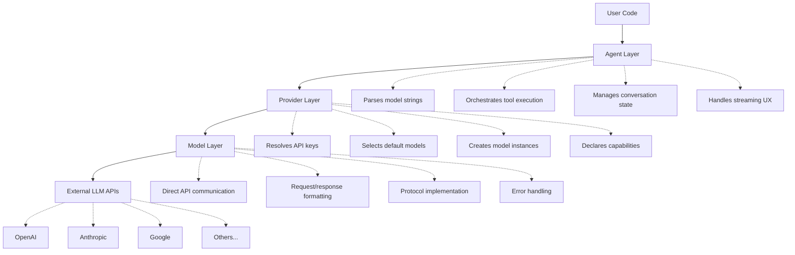
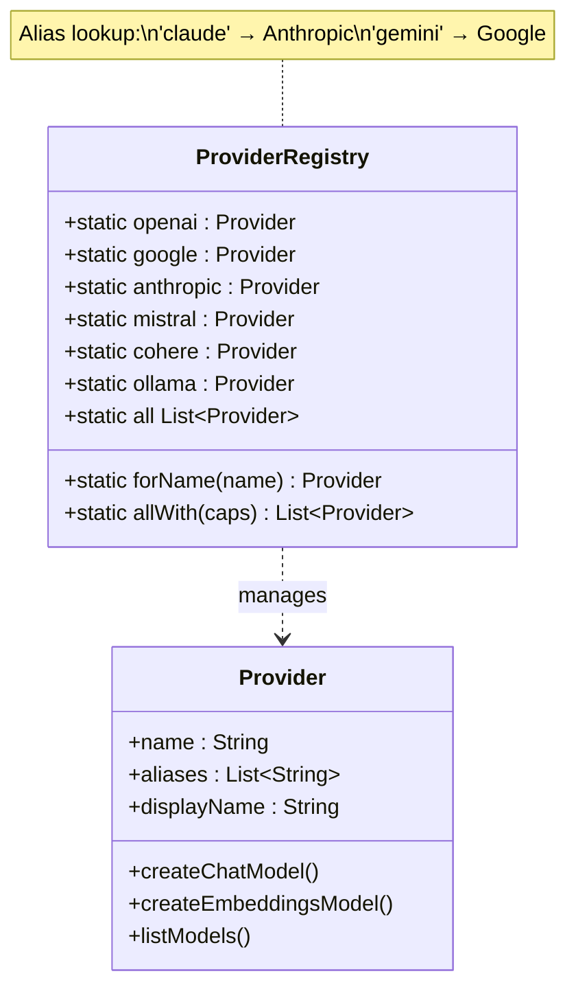
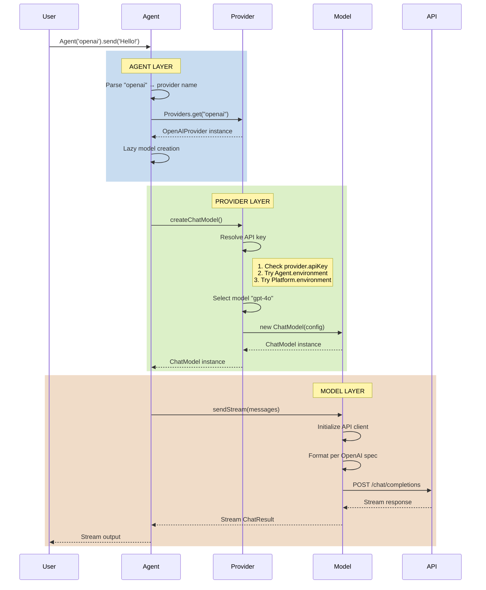

This document specifies the unified provider architecture in dartantic_ai (dartantic) that supports both chat and embeddings operations through a single, consistent interface.

## Overview

The unified provider architecture enables:
- Single provider interface for both chat and embeddings models
- Consistent API key and configuration management
- Provider capability discovery and filtering
- Clean separation of concerns between Agent, Provider, and Model layers

## Core Architecture

### Architecture Overview



### Provider Base Class

The `Provider` class serves as the unified interface for all LLM providers (see `lib/src/providers/provider.dart`).

Key characteristics:
- Generic type parameters for chat and embeddings options
- Required properties: name, displayName, defaultModelNames, capabilities
- Optional properties: apiKey, baseUrl, apiKeyName, aliases
- Factory methods: createChatModel() and createEmbeddingsModel()
- Discovery method: listModels() stream

The Provider base class unifies what were previously separate ChatProvider and EmbeddingsProvider types into a single interface that can create both model types.

### Model Kinds

The `ModelKind` enum (see `lib/src/providers/model_kind.dart`) defines the types of models a provider can support. Currently implemented kinds are `chat` and `embeddings`, with placeholders for future expansion (tts, image, audio, etc.).

This enum is used in the `defaultModelNames` map to specify different default models for each capability.

## Provider Capabilities

### Model-Level Capability Discovery

Provider capabilities vary by model, not by provider. Different models from the same provider have different capabilities. Runtime capability discovery is done via `provider.listModels()` which returns `ModelInfo` objects containing capability metadata.

For application code, use `listModels()` to discover what models are available and their capabilities:

```dart
final provider = Agent.getProvider('openai');
await for (final model in provider.listModels()) {
  print('${model.name}: ${model.kinds}');
}
```

### Test-Only Capability Filtering

For test infrastructure, `ProviderTestCaps` in `test/test_helpers/run_provider_test.dart` provides capability-based test filtering. This is test-only and describes what the **default model** of each provider supports - it is NOT a provider-wide guarantee and is NOT part of the public API.

### Important: No Provider-Level Capability Guarantees

**Capabilities are model-specific, not provider-wide**:
- Different models from the same provider have different capabilities
- Use `listModels()` and `ModelInfo` for runtime discovery
- Models themselves decide whether to throw errors for unsupported features
- Allows experimentation with undocumented features

### Provider API Boundaries

dartantic never re-exports raw SDK model types from the underlying vendor
packages (OpenAI, Anthropic, Google, etc.). Provider configuration that is
exposed through `dartantic_interface` must remain provider-agnostic or be
expressed with our own neutral data structures. When a vendor requires
additional parameters (for example OpenAI’s `tool_choice` payload), the
provider implementation adapts our neutral options into the SDK-specific
types internally and always passes vendor-specific handles (or `null`) on the
wire. This ensures:
- **Stable public API** – upstream SDK changes do not leak through the unified
  interface.
- **Pluggable providers** – callers do not need vendor dependency imports to
  configure a provider.
- **Testability** – fake or test providers can mirror the same neutral option
  contracts without pulling transitively on third-party SDKs.

## Provider Registry

The Provider class maintains a static registry of all available providers (see `lib/src/providers/provider.dart`):



- **Lazy instances**: Each provider has a lazy getter (e.g., `Providers.openai`) to avoid initialization errors
- **Name-based lookup**: `Providers.get(String)` with case-insensitive matching
- **Alias support**: Providers can have alternative names (e.g., 'claude' → 'anthropic')
- **Discovery methods**: `Providers.all` lists all providers, `Providers.allWith()` filters by capabilities

Providers are created lazily on first access to avoid initialization errors when API keys are missing. This allows users to use specific providers without needing all API keys configured.

## Separation of Concerns

### Request Flow Diagram



### 1. Agent Layer (lib/src/agent/agent.dart)
**Responsibilities:**
- Parse model strings via ModelStringParser
- Look up providers from registry
- Orchestrate tool execution
- Manage conversation state and message accumulation
- Handle streaming UX through orchestrators

**NOT Responsible For:**
- API key resolution
- Base URL configuration  
- Model instantiation details
- Direct API communication

The Agent creates models lazily when needed, allowing the Provider to handle all configuration concerns.

### 2. Provider Layer (lib/src/providers/)
**Responsibilities:**
- API key resolution from environment (via tryGetEnv helper - allows lazy initialization)
- Default model selection from defaultModelNames map
- Base URL configuration and defaults
- Model factory operations (createChatModel, createEmbeddingsModel)
- Capability declaration
- API key validation at model creation time (not constructor time)

**Key Pattern**: Providers use `tryGetEnv()` in constructors to allow lazy initialization without throwing errors. API key validation happens when creating models, not when creating providers. This allows users to access provider metadata and use specific providers without needing all API keys configured.

### 3. Model Layer (lib/src/chat_models/, lib/src/embeddings_models/)
**Responsibilities:**
- Direct API communication via provider-specific clients
- Request/response formatting per API specification
- Error handling for unsupported features
- Stream processing and message consolidation
- Protocol-specific implementation details

**Requirements:**
- Models receive non-null, non-empty configuration from providers
- Models validate their own capabilities and throw appropriate errors
- Models handle their underlying API client lifecycle (dispose pattern)

## Implementation Patterns

### Provider Implementation Pattern

See actual implementations in `lib/src/providers/`:
- `anthropic_provider.dart` - Example of chat-only provider
- `openai_provider.dart` - Full-featured provider with OpenAI-compatible pattern
- `ollama_provider.dart` - Local provider without API keys
- `google_provider.dart` - Native API provider with custom protocol

Key patterns:
1. Providers extend `Provider<TChatOptions, TEmbeddingsOptions>`
2. Constructor calls super with all required metadata, using `tryGetEnv()` for API keys
3. Factory methods validate API keys and throw if required but missing
4. Unsupported operations throw `UnsupportedError`
5. Providers are instantiated lazily via getters to avoid initialization errors

### OpenAI-Compatible Pattern

Many providers use OpenAI's API format. The `OpenAIProvider` class can be instantiated with different configurations to support multiple providers (OpenRouter, Together, etc.). See how `Providers.openrouter` and others are defined as configured OpenAIProvider instances.

### Custom Provider Pattern

For implementing new providers, follow the pattern in existing implementations:
1. Define provider-specific option classes
2. Extend Provider with appropriate type parameters
3. Implement factory methods with proper configuration resolution
4. Add static instance to Provider registry

## Usage Patterns

### Agent Creation Patterns
- **Provider name**: `Agent('openai')` - Uses all defaults
- **Model specification**: `Agent('openai?chat=gpt-4')` - Override specific models
- **Provider instance**: `Agent.forProvider(customProvider)` - Full control

See `example/bin/` for working examples of all patterns.

### Capability-Based Testing

Tests use capability filtering to ensure feature compatibility. See test files for patterns like:
- Running tool tests only on providers with `multiToolCalls`
- Testing embeddings only on providers with `embeddings` capability
- Validating typed output on supporting providers

### Direct Model Access

While Agent is the primary interface, direct model creation is supported for advanced use cases. Providers expose their factory methods for this purpose.

## Design Principles

### 1. Single Provider Interface
- One provider supports both chat and embeddings
- Consistent configuration across model types
- Simplified API surface

### 2. Deferred Validation Philosophy
- API key validation deferred to model creation time
- Allows provider access without all API keys configured
- Clear error messages when actually trying to use a provider
- No silent fallbacks that hide configuration errors

### 3. Capability as Information
- Capabilities inform but don't restrict
- Models enforce their own limitations
- Allows experimentation and discovery

### 4. Clean Separation
- Each layer has clear responsibilities
- No cross-layer dependencies
- Easy to test and maintain

### 5. Extensibility
- Easy to add new providers
- Support for custom implementations
- Future model kinds already considered

## Known Provider Limitations

### Provider Capability Matrix

| Provider         | Chat  | Embeddings | Tools | Typed Output | Tools+Typed | Vision | Media |
| ---------------- | :---: | :--------: | :---: | :----------: | :---------: | :----: | :----: |
| OpenAI           |   ✅   |     ✅      |   ✅   |      ✅       |      ✅      |   ✅    |   ❌   |
| OpenAI Responses |   ✅   |     ✅      |   ✅   |      ✅       |      ✅      |   ✅    |   ✅   |
| Google           |   ✅   |     ✅      |   ✅   |      ✅       |      ❌      |   ✅    |   ❌   |
| Anthropic        |   ✅   |     ❌      |   ✅   |      ✅       |      ✅      |   ✅    |   ❌   |
| Mistral          |   ✅   |     ✅      |   ❌   |      ❌       |      ❌      |   ✅    |   ❌   |
| Cohere           |   ✅   |     ✅      |   ✅   |      ✅       |      ❌      |   ❌    |   ❌   |
| Ollama           |   ✅   |     ❌      |   ✅   |      ✅       |      ✅      |   ✅    |   ❌   |
| OpenRouter       |   ✅   |     ❌      |   ✅   |      ✅       |      ❌      |   ✅    |   ❌   |
| Together         |   ✅   |     ❌      |   ❌   |      ✅       |      ❌      |   ✅    |   ❌   |

**Legend:**
- **Tools** = `multiToolCalls` capability
- **Typed Output** = `typedOutput` capability  
- **Tools+Typed** = `typedOutputWithTools` capability
- **Media** = `mediaGeneration` capability

### Chat-Only Providers
- **Anthropic**: No embeddings support
- **Ollama**: No embeddings in native API (use OpenAI-compatible endpoint)
- **Together**: No embeddings support

### Limited Tool Support
- **Mistral**: No tool calling support
- **Cohere**: Cannot use typed output with tools simultaneously

### Full-Featured Providers
- **OpenAI Responses**: Supports all capabilities including media generation.
- **OpenAI**: Supports all capabilities except `mediaGeneration`.
- **Google**: Supports all capabilities except `typedOutputWithTools` and
  `mediaGeneration`.

## Summary

The unified provider architecture simplifies the dartantic_ai API while maintaining flexibility and extensibility. By consolidating chat and embeddings support into a single provider interface, the system becomes easier to use and understand while still supporting the full range of LLM capabilities across 15+ providers.

Key benefits:
- **Simplified API**: One provider, multiple model types
- **Consistent Configuration**: Same patterns across all providers
- **Clear Architecture**: Well-defined separation of concerns
- **Capability Discovery**: Easy to find and filter providers
- **Future-Proof**: Ready for new model types and capabilities
